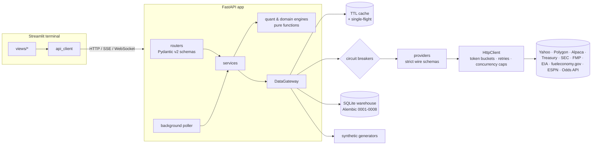

# QuantPulse Terminal

**QuantPulse Terminal** is a quantitative finance and executive intelligence platform. It has an
asynchronous **FastAPI** core, a **SQLite / SQLAlchemy 2** data warehouse with versioned **Alembic**
migrations, a **Streamlit** terminal front end, and live data pipelines to public and commercial APIs.
Every live feed sits behind one resilience layer: TTL caching, single-flight request coalescing,
rate limiting, circuit breakers, a fallback to the warehouse's last-known-good data, and finally
synthetic data with a visible status badge.

| Subsystem | What it does | Live sources |
|---|---|---|
| **Options & quant engine** | Quotes and OHLCV bars, live option chains, Black-Scholes-Merton pricing with first- and second-order Greeks, implied vol, smiles and a 3-D volatility surface | Polygon.io · Alpaca · Yahoo Finance · U.S. Treasury |
| **Corporate finance & DCF** | SEC XBRL statement ingestion, consensus estimates, live-input WACC, FCFF DCF, WACC × g sensitivity grid, Monte Carlo | SEC EDGAR · Financial Modeling Prep · Yahoo |
| **Portfolio risk lab** | Historical, parametric, Cornish-Fisher and Monte Carlo VaR/CVaR; Sharpe, Sortino, drawdown and beta; Ledoit-Wolf covariance; efficient frontier | Market providers · Treasury |
| **Asset lifecycle** | 2025 Hyundai Elantra Limited: regional fuel prices, telemetry and fill-up logs, realised MPG, depreciation curve, maintenance schedule, cost per mile | EIA · fueleconomy.gov |
| **Sports analytics** | Live NFL / FBS scoreboards and lines, Elo power ratings, pre-game and in-game win probability | ESPN · The Odds API |
| **Price forecasts** | Probability ranges for any ticker 1 week to 3 months out: earnings-aware GARCH-t volatility blended with options-implied volatility, the next **earnings jump** simulated from the stock's own past reactions, P(higher), P(above your target) and a walk-forward calibration test | Market providers · Treasury · option chains · SEC filings |
| **Stock model** | Ranks the **S&P 500 point-in-time** (former members included: no survivorship bias) on 28 price, earnings, industry and **point-in-time fundamental** features, compared within industries; ridge, gradient-boosted trees and an ensemble, all trained **walk-forward** with purged labels and compared on the same out-of-sample dates | Market providers · SEC EDGAR · Wikipedia |
| **Stock intelligence** | One page per ticker: forecast cone, model rank, technicals, options view, DCF and the ticker's prediction track record, summarised in plain English | All of the above |
| **Prediction ledger** | Logs every forecast and model call after the close from live data only, grades each on its target date, and keeps a Brier / hit-rate / coverage scorecard; a **point-in-time historical replay** fills it with years of graded predictions on day one | Market providers |
| **Daily picks** | Ranks a stock universe (factor rule, stock model, or both) with a **1-10 rating**, P(beat SPY), 1-month ranges, industry and an upcoming-earnings warning, plus an email digest | Market providers · SMTP |
| **Trading sandbox** | Paper-trading accounts with simulated money, run by a **self-learning agent** that re-weights its factors from its own results; walk-forward training on history | Market providers · Treasury |

> **Disclaimer.** Analytics, valuations, forecasts, model rankings, win probabilities, daily picks and the
> sandbox agent are model outputs for research and education. They are not investment, betting or
> mechanical advice. Nobody can reliably predict individual stock prices; the platform's job is to give
> honest probability ranges and to **measure** its own predictions against what happened (see the Track
> Record page). The trading sandbox is paper trading only: it cannot place a real order.

---

## Contents

1. [Quick start](#quick-start)
2. [Architecture](#architecture)
3. [Data provenance and fallbacks](#data-provenance-and-fallbacks)
4. [Live data sources](#live-data-sources)
5. [Configuration](#configuration)
6. [API reference](#api-reference)
7. [Methodology](#methodology)
8. [Predictions: forecasts, the stock model and the track record](#predictions-forecasts-the-stock-model-and-the-track-record)
9. [Daily picks and the email digest](#daily-picks-and-the-email-digest)
10. [Trading sandbox (paper trading)](#trading-sandbox-paper-trading)
11. [Vehicle module reference data](#vehicle-module-reference-data)
12. [Database and migrations](#database-and-migrations)
13. [Testing and quality gates](#testing-and-quality-gates)
14. [Project layout](#project-layout)
15. [Security and operations](#security-and-operations)
16. [Known limitations](#known-limitations)

---

## Quick start

### Local (Python 3.11+)

```bash
make install                 # creates .venv and installs pinned, tested versions
cp .env.example .env         # every key is optional; set QP_SEC_USER_AGENT at minimum
make api                     # FastAPI on http://127.0.0.1:8000 (migrations run automatically)
make ui                      # Streamlit terminal on http://localhost:8501 (second terminal)
```

Interactive API docs are at `http://127.0.0.1:8000/docs`. To run without any network access, set
`QP_ENABLE_LIVE_DATA=false`. Every screen then works on synthetic data, and each one is labelled as
such.

### Docker

```bash
cp .env.example .env
docker compose up --build    # api on :8000, ui on :8501; SQLite lives in the `quantpulse-data` volume
```

### Without make

```bash
python3 -m venv .venv && . .venv/bin/activate
pip install -e ".[frontend,dev]" -c constraints.txt
quantpulse-migrate                                   # optional; the API also migrates on start-up
uvicorn --factory quantpulse.api.app:app_factory --port 8000
streamlit run frontend/app.py
```

---

## Architecture



**Layering rules**

* `quant/` and `domain/` are pure numerical code with no I/O. They are unit-tested against textbook
  values, finite differences and reference implementations.
* `providers/` has one module per upstream API. Each one parses vendor payloads through typed
  `WireModel` schemas and raises typed `ProviderError`s, never partial data.
* `core/gateway.py` is the only code that decides *where* data comes from.
* `db/repositories.py` holds all SQL. Services never build queries.
* `services/container.py` is the composition root. `api/` contains only thin routers.

---

## Data provenance and fallbacks

Every single-source payload is returned as `{ "data": ..., "meta": Provenance }`. Analytics that combine
several feeds return `{ "data": ..., "meta": { "status", "computed_at", "sources": { name: Provenance } } }`,
and the overall status is the **worst** of the sources.

| Status | Badge | Meaning |
|---|---|---|
| `live` | 🟢 LIVE | Fetched from a provider for this request |
| `cached` | 🔵 CACHED | Served from the in-memory TTL cache; the original live timestamp is preserved |
| `stale` | 🟠 STALE | Live refresh failed, so the last good value (memory or warehouse) is served |
| `synthetic` | 🔴 SYNTHETIC | No live or stored data exists; deterministic simulated data is served |

**Resolution order** (`DataGateway.resolve`):

1. Fresh cache entry, returned as `cached`.
2. Live providers in priority order. Each one is skipped when it has no credentials or its
   **circuit breaker** is open. Concurrent identical requests are **coalesced** into one upstream call.
3. Expired cache entry within `QP_STALE_GRACE_SECONDS`, returned as `stale`.
4. **Warehouse** snapshot from SQLite, returned as `stale` with provider `warehouse:<source>`.
5. Synthetic generator, returned as `synthetic`. The value is memoised for 30 s under a separate key,
   so a recovered provider is used on the very next request.

`meta.attempts` records every provider tried, with its error and latency. The UI shows these trails in
the badge tooltips.

**Rate-limit management.** Each provider has a token bucket and an in-flight concurrency cap
(`core/http.py`). A request that would wait longer than `QP_RATE_LIMIT_MAX_WAIT_SECONDS` for a token
fails fast and fails over instead of stalling. An HTTP 429 blocks the bucket for the `Retry-After`
period and opens the breaker for at least that long. Transient failures (connection errors, 5xx) get
jittered exponential back-off.

**Asynchronous polling** (`workers/poller.py`) keeps hot data warm:

| Job | Interval |
|---|---|
| Watchlist quotes | `QP_POLL_QUOTES_MARKET_HOURS_SECONDS` during NYSE regular hours, otherwise `QP_POLL_QUOTES_OFF_HOURS_SECONDS` |
| Treasury curve | `QP_POLL_RATES_SECONDS` |
| NFL and FBS scoreboards | `QP_POLL_SPORTS_SECONDS` |
| Daily picks email | Checked every minute; sent once per trading day |
| Trading sandbox | Checked every minute; auto-trading agents run once per trading day after `QP_SANDBOX_TRADE_TIME`, and every account is marked to market after `QP_SANDBOX_MARK_TIME` |
| Prediction ledger | Checked every minute; logs predictions once per trading day after `QP_PREDICTIONS_LOG_TIME`, and grades due ones every 15 minutes |

Trading hours come from a full NYSE calendar (`core/market_calendar.py`). It covers holidays and
their Saturday/Sunday observance, including the New Year's exception, Good Friday via the Gregorian
Easter algorithm, 1 pm early closes, and known special closures.

---

## Live data sources

| Provider | Used for | Key | Notes |
|---|---|---|---|
| **Yahoo Finance** | Quotes, OHLCV (split- and dividend-adjusted), dividends, option chains, analyst trend | none | Chart data is keyless. Quote batches, options and `quoteSummary` use Yahoo's cookie and crumb handshake, done automatically. Yahoo aggressively rate-limits cloud and datacenter IPs (HTTP 429); expect failover there. |
| **Polygon.io** | Real-time snapshot quotes, aggregates, option-chain snapshots with OI and IV | `QP_POLYGON_API_KEY` | Endpoint access depends on your plan. A 403 `NOT_AUTHORIZED` fails over instead of mislabelling delayed data. `QP_POLYGON_BASE_URL` is configurable. |
| **Alpaca Market Data** | Snapshots, bars (all adjustments), **multi-symbol bars** for whole universes, option snapshots | `QP_ALPACA_API_KEY_ID` + `QP_ALPACA_API_SECRET_KEY` | IEX and `indicative` feeds by default. Option snapshots carry no open interest. With Alpaca configured the stock model covers the S&P 500 (`QP_MODEL_UNIVERSE=auto`): 50 symbols per paginated request. |
| **U.S. Treasury** | Daily par yield curve | none | Keyless CSV feed. It is slow (often 15-20 s), so it uses a 45 s timeout and is polled hourly. |
| **SEC EDGAR** | XBRL company facts, recent filings, ticker→CIK map; SIC industries and **earnings-release times** (8-K item 2.02) from submissions; cross-company **XBRL frames** for point-in-time fundamentals | none | You **must** set `QP_SEC_USER_AGENT` to a name and contact email (SEC fair-access policy). Rate-limited to 8 req/s. Profiles and frames are kept in the warehouse and refreshed weekly. |
| **Wikipedia** | S&P 500 constituents and the dated history of index changes (point-in-time membership) | none | Refreshed weekly. A snapshot of both tables ships with QuantPulse and is used (labelled STALE) when Wikipedia is unreachable. |
| **Financial Modeling Prep** | Consensus revenue/EPS estimates, price targets, scheduled earnings dates | `QP_FMP_API_KEY` | Accepts both `/stable` and legacy field names. Without it the next earnings date is estimated from the company's quarterly rhythm (and labelled "estimated"). |
| **EIA API v2** | Weekly regional retail gasoline and diesel prices | `QP_EIA_API_KEY` | Free key. Region codes are listed at `GET /api/v1/fuel/regions`. |
| **fueleconomy.gov** | Official EPA MPG for the configured vehicle | none | |
| **ESPN site API** | NFL / FBS scoreboards, game state, lines, FBS membership | none | Unofficial public endpoints; the CDN may block some networks. |
| **The Odds API** | Consensus spreads and de-vigged moneylines across US books | `QP_ODDS_API_KEY` | Quota headers are surfaced in `/system/status`. |

---

## Configuration

Settings are read from environment variables prefixed `QP_`, or from `.env`.
`src/quantpulse/config.py` is the source of truth, and `.env.example` lists every commonly used key.
Secrets are held as `SecretStr` and are never logged or returned by the API. `httpx` request logging,
which would include query-string API keys, is suppressed.

| Group | Key settings |
|---|---|
| Runtime | `QP_DATABASE_URL`, `QP_AUTO_MIGRATE`, `QP_API_TOKEN`, `QP_CORS_ORIGINS`, `QP_LOG_LEVEL`, `QP_LOG_JSON` |
| Live data | `QP_ENABLE_LIVE_DATA` (master switch), `QP_MARKET_PROVIDERS` (failover order), provider keys |
| Resilience | `QP_HTTP_TIMEOUT_SECONDS`, `QP_HTTP_MAX_RETRIES`, `QP_CIRCUIT_FAILURE_THRESHOLD`, `QP_CIRCUIT_COOLDOWN_SECONDS`, `QP_RATE_LIMIT_MAX_WAIT_SECONDS`, `QP_POLYGON_REQUESTS_PER_MINUTE` |
| Cache TTLs | `QP_TTL_QUOTE`, `QP_TTL_BARS_INTRADAY`, `QP_TTL_BARS_DAILY`, `QP_TTL_OPTIONS_CHAIN`, `QP_TTL_YIELD_CURVE`, `QP_TTL_FUNDAMENTALS`, `QP_TTL_FUEL_PRICES`, `QP_TTL_SCOREBOARD_LIVE`, `QP_TTL_SCOREBOARD_IDLE`, …, `QP_STALE_GRACE_SECONDS`, `QP_CACHE_MAX_ENTRIES` |
| Polling | `QP_POLLING_ENABLED`, `QP_WATCHLIST`, `QP_POLL_*` |
| Finance | `QP_EQUITY_RISK_PREMIUM`, `QP_DEFAULT_CREDIT_SPREAD`, `QP_DEFAULT_TAX_RATE`, `QP_BENCHMARK_SYMBOL` |
| Vehicle | `QP_FUEL_REGION`, `QP_FUEL_GRADE` |
| Sports | `QP_SPORTS_INCLUDE_PRIOR_SEASON`, `QP_ODDS_BOOKMAKER_REGIONS` |
| Picks / email | `QP_PICKS_UNIVERSE`, `QP_PICKS_TOP_N`, `QP_PICKS_EMAIL_ENABLED`, `QP_PICKS_RECIPIENTS`, `QP_PICKS_SEND_TIME`, `QP_PICKS_ALLOW_SYNTHETIC_EMAIL`, `QP_SMTP_*`, `QP_EMAIL_FROM` |
| Trading sandbox | `QP_SANDBOX_SCHEDULER_ENABLED`, `QP_SANDBOX_TRADE_TIME` (default 10:00 ET), `QP_SANDBOX_MARK_TIME` (default 16:05 ET); per-account strategy settings are set through the API or UI |
| Stock model | `QP_MODEL_UNIVERSE` (`auto`, `sp500`, `picks` or a ticker list), `QP_MODEL_TYPE` (`ensemble`, `ridge` or `gbm`), `QP_MODEL_SECTOR_NEUTRAL` (default on), `QP_MODEL_SYNC_WAIT_SECONDS` (how long a request waits before the run continues in the background, default 25), `QP_MODEL_WARMUP` (the poller keeps the latest close's run computed), `QP_TTL_MODEL` |
| Forecasts | `QP_FORECAST_IV_WEIGHT` (weight of options-implied volatility, default 0.5), `QP_FORECAST_VARIANCE_PREMIUM` (implied variance is divided by this, default 1.1), `QP_FORECAST_EARNINGS_JUMPS` (default on) |
| Reference data | `QP_TTL_REFERENCE` (S&P membership, SEC profiles and earnings dates, default 7 days), `QP_TTL_FUNDAMENTALS_FRAMES` (SEC XBRL frames, default 7 days) |
| Predictions | `QP_PREDICTIONS_ENABLED`, `QP_PREDICTIONS_LOG_TIME` (default 16:20 ET), `QP_PREDICTIONS_ALLOW_SYNTHETIC` (default off) |

The Streamlit app reads `QP_API_URL` (default `http://127.0.0.1:8000`) and `QP_API_TOKEN`. Both can
also be changed in the sidebar.

---

## API reference

Every route is under `/api/v1` except `/health`. When `QP_API_TOKEN` is set, every request must send
`X-API-Key`. WebSocket clients may pass `?api_key=` instead. Errors always use the same shape:
`{"error": "...", "detail": ..., "request_id": "..."}`. Validation errors return 422, unknown entities
404, a refusal to act on synthetic prices (emailing picks, filling a paper order) 409, missing SMTP
settings 503, and SMTP delivery failures 502. Long computations (a model run over the S&P 500, the
historical replay) answer **202 Accepted** with the background job's progress and a `Location` header;
poll `GET /jobs/{id}` and ask again when it is done.
Every response carries `X-Request-ID` and `X-Response-Time-ms` headers.

| Method & path | Purpose |
|---|---|
| `GET /health` | Liveness (no auth) |
| `GET /system/status` · `GET /system/ingestions` | Provider health and breakers, cache and limiter stats, poller, DB revision · recent warehouse writes |
| `GET /market/session` | NYSE session state and next open |
| `GET /market/quote/{symbol}` · `GET /market/quotes?symbols=` | Live quotes with provenance |
| `GET /market/history/{symbol}?interval=1d&lookback_days=365` | OHLCV bars (`1m 5m 15m 30m 1h 1d 1wk 1mo`) |
| `GET /market/stream?symbols=AAPL,MSFT&interval=5` | **Server-Sent Events** quote stream |
| `WS /market/ws?symbols=AAPL,MSFT&interval=5` | **WebSocket** quote stream |
| `GET /rates/curve` · `GET /rates/at?years=0.5` | Treasury curve · interpolated BEY and continuous rate |
| `GET /options/{symbol}/chain?max_expirations=4` | Chain enriched with model IV, delta, gamma, theta and vega |
| `GET /options/{symbol}/surface` | Smiles, ATM term structure, 90/110 skew, IV grid |
| `POST /options/price` | BSM price and Greeks; any omitted input is sourced live |
| `GET /fundamentals/{symbol}` · `…/estimates` | SEC statements and filings · consensus |
| `POST /valuation/{symbol}/dcf` | DCF, WACC breakdown, sensitivity grid, Monte Carlo |
| `GET/POST /portfolios` · `GET/PUT/DELETE /portfolios/{id}` · `POST /portfolios/{id}/risk` | Portfolio CRUD and risk report |
| `POST /portfolio/analyze` | Risk report for ad-hoc holdings |
| `GET /vehicle/profiles/{id}` · `…/epa` | Vehicle profile · live EPA ratings |
| `GET /fuel/regions` · `GET /fuel/prices?region=SFL&grade=regular` | EIA regions · weekly prices |
| `GET/POST /vehicles` · `GET/DELETE /vehicles/{id}` · `GET /vehicles/{id}/dashboard` | Vehicles and the cost dashboard |
| `GET/POST /vehicles/{id}/telemetry` · `…/fuel-logs` · `…/maintenance` · `DELETE /vehicles/{id}/{kind}/{record_id}` | Telemetry and logs |
| `GET /sports/{nfl|college-football}/scoreboard` · `…/ratings` | Scores with win probability · Elo ratings |
| `GET /picks/daily?top_n=10&method=auto` · `POST /picks/email` | Daily picks (`auto`, `factors`, `model` or `blend` ranking) with 1-10 ratings, P(beat benchmark) and 1-month ranges · email digest |
| `GET /forecast/{symbol}?horizons=5,21,63&target=&options=true&calibrate=false` | Price ranges and probabilities per horizon, options-implied view, optional walk-forward calibration |
| `GET /stocks/{symbol}/report` | Stock intelligence: technicals, forecast, model rank (overall and within its industry), options view, DCF, track record, plain-English summary |
| `GET /stocks/{symbol}/earnings` | Earnings releases from SEC filings, the price reaction to each, the typical move and the next expected date |
| `GET /model/report?horizon=21&top_k=5&symbols=&wait=` · `GET /model/research` | Walk-forward stock models (out-of-sample skill, model comparison, within-industry IC, backtest, calibration, universe and data coverage, live ranks) · signal IC research (202 while training) |
| `GET /model/universe` · `GET /model/job` | Which stocks the model covers (S&P 500 membership status) · progress of today's model run |
| `GET /jobs` · `GET /jobs/{id}` | Background jobs (model runs, research, the historical replay) and their progress |
| `GET /market/regime` | Trend, volatility, breadth and yield-curve regime with historical context |
| `GET /predictions?origin=` · `GET /predictions/scorecard?origin=live\|backfill\|all` · `POST /predictions/log` · `POST /predictions/resolve` | The prediction ledger and its scorecard (live record, historical replay, or both) |
| `POST /predictions/backfill?sources=forecast&sources=model&replace=` · `GET /predictions/backfill` | Replay history point-in-time into the ledger (202 with a job) · progress and ledger size |
| `GET/POST /sandbox/accounts` · `GET/PATCH/DELETE /sandbox/accounts/{id}` | Paper accounts · summary marked to live prices |
| `POST /sandbox/accounts/{id}/step?force=` · `…/train` · `…/orders` · `…/reset?keep_learning=` | Run the agent · walk-forward training · manual paper order · start over |
| `GET /sandbox/accounts/{id}/trades` · `…/equity` · `…/journal` | Fills · equity snapshots · what the agent did and learned |

Examples:

```bash
curl -s localhost:8000/api/v1/market/quote/AAPL | jq '.meta.status, .data.price'

# BSM with live spot, Treasury rate, trailing dividend yield and the live smile's IV at this strike:
curl -s -X POST localhost:8000/api/v1/options/price -H 'content-type: application/json' \
  -d '{"symbol":"AAPL","kind":"call","strike":250,"expiration":"2026-12-18"}' | jq '.data.greeks'

# Fully specified inputs (no live data): Hull's textbook example, call ≈ 4.76
curl -s -X POST localhost:8000/api/v1/options/price -H 'content-type: application/json' \
  -d '{"kind":"call","strike":40,"days_to_expiry":182.5,"spot":42,"volatility":0.2,"rate":0.1,"dividend_yield":0}'

curl -s -X POST localhost:8000/api/v1/valuation/MSFT/dcf -H 'content-type: application/json' \
  -d '{"years":5,"terminal_growth":0.025,"monte_carlo":{"paths":20000,"seed":7}}' | jq '.data.dcf.value_per_share'

curl -N 'localhost:8000/api/v1/market/stream?symbols=SPY,QQQ&interval=5'
```

---

## Methodology

### Options (`quant/black_scholes.py`, `quant/vol_surface.py`, `quant/rates.py`)

* **BSM with continuous dividend yield `q`.** Analytic delta, gamma, vega, theta and rho, plus the
  second-order vanna, vomma and charm. The API reports vega and rho per 1 point, and theta and charm
  per calendar day. At expiry or zero volatility the value is the discounted forward intrinsic value.
* **Implied volatility.** Brent's method for single contracts; vectorised bisection for whole chains.
  Prices outside no-arbitrage bounds return no IV rather than a fabricated one.
* **Rates.** Treasury par yields are bond-equivalent (semi-annual) and are converted with
  `r_c = 2·ln(1 + y/2)`. The curve is linearly interpolated in maturity with flat extrapolation.
* **Surface.** Each contract uses its mid price (or last trade if the quote is one-sided). Time to
  expiry is ACT/365 to the 16:00 New York cut-off, and `F = S·e^{(r−q)T}`. Only **out-of-the-money**
  quotes are used, because in-the-money and penny options give ill-conditioned IVs. Wide, one-sided and
  expired quotes are rejected. Output includes per-expiry smiles with a quadratic fit in `ln(K/F)`,
  ATM term structure and 90/110 skew. The grid interpolates each smile onto a common K/S axis and never
  extrapolates past the quoted strikes.
* **Volatility for `POST /options/price`.** When no vol is supplied, the price uses the live smile of
  the expiry nearest to T, interpolated at the strike. It falls back to 3-month realised volatility.
* US single-stock options are American. BSM is the market-standard quoting approximation.

### Valuation (`quant/dcf.py`, `quant/monte_carlo.py`, `services/valuation.py`)

* **FCFF:** `FCFF = EBIT·(1−t) + D&A − CapEx − ΔNWC`. Tax is charged on positive EBIT only.
* **Terminal value:** Gordon growth, `TV = FCFF_N·(1+g)/(WACC−g)`. g must sit at least 0.5 pp below
  WACC. The mid-year convention discounts flows at `t−0.5` and the terminal value at `N−0.5`.
* **Statement ingestion.** SEC XBRL facts are keyed by **period end**, because a fact's `fy` field is
  the *filing's* year and FY2025 10-Ks re-report 2023 and 2024. Duration facts must span about a year,
  since 10-K "FY" facts include quarters. The latest filing wins, to pick up restatements. Concept
  aliases are merged per period. Share count is the most recent of the cover-page DEI figure (summed
  across share classes) and the balance-sheet `CommonStockSharesOutstanding`.
* **Assumptions.** Consensus revenue estimates are chained after the last reported fiscal year, then
  growth fades linearly to g. If no estimates are available, the 3-year CAGR is used. Starting margin,
  tax, D&A, capex and non-cash NWC ratios come from the latest 10-K. Every derived value is returned
  with its source.
* **WACC.** Cost of equity is CAPM: the live 10-year Treasury yield plus beta times the ERP. Beta is a
  2-year weekly regression against `QP_BENCHMARK_SYMBOL`, with the provider's beta as fallback.
  Pre-tax cost of debt is interest expense divided by debt, clamped to `[rf, rf+10%]`; if not reported,
  it is rf plus a spread. Weights use market-value equity and book debt.
* **Monte Carlo.** Each path draws WACC, terminal g (capped below WACC), a persistent revenue-growth
  shock and a margin shock. Output is seeded and reproducible: percentiles, P(value > price), and a
  histogram with outliers clipped into the edge bins.

### Risk (`quant/risk.py`, `quant/optimization.py`)

* **VaR/CVaR** are positive loss fractions of portfolio value:
  * historical, using overlapping compounded h-day returns;
  * parametric (Gaussian, √h scaling);
  * Cornish-Fisher (skew and kurtosis adjusted);
  * Monte Carlo (multivariate normal, Cholesky, seeded).
* **Ratios.** Sharpe and Sortino are annualised over 252 days against the live 3-month Treasury.
  Sortino uses downside deviation below the risk-free rate. Also reported: max drawdown including the
  initial peak, beta, and risk contributions (which sum to 1).
* **Covariance.** Ledoit-Wolf (2004) shrinkage toward a scaled identity. It matches scikit-learn to
  machine precision.
* **Frontier.** Long-only, with an optional max weight, solved with SLSQP using analytic gradients.
  Returns the global minimum-variance portfolio, the maximum-Sharpe portfolio (multi-start), and target-return
  frontier points up to the highest attainable return (from a linear program), plus a random-portfolio
  cloud.

### Sports (`domain/sports.py`)

* **Elo.** Margin-of-victory Elo in the FiveThirtyEight style: `K·ln(|MOV|+1)·2.2/(0.001·ΔElo_w+2.2)`.
  Home field is worth 48 Elo in the NFL and 55 in college. Ratings regress toward the mean each
  season. In college, FCS opponents start at 1200 (FBS membership comes from ESPN's group listing),
  and only FBS teams are ranked.
* **Win probability.** Uses Stern's (1994) Brownian-motion model,
  `P = Φ((L + μτ)/(σ√τ))`, where L is the current lead and τ the fraction of regulation remaining.
  μ blends the market spread (60%) with the Elo spread (40%). σ is 13.45 points (NFL) or 15.5 (FBS).
  The model ignores possession and field position and is intended as a transparent baseline. ESPN's
  own live probability is shown alongside when available.

### Vehicle (`domain/vehicle.py`)

* **Fuel economy.** Realised MPG uses the full-tank method (partial fills roll into the next full
  interval). Until two full fills are logged, the EPA city/highway ratings are blended by your
  driving mix. The blend is calibrated so a 55% city mix reproduces the published combined rating
  exactly, since label values are rounded.
* **Depreciation.** Declining balance with a first-year step and a mileage adjustment, floored at a
  salvage fraction. The parameters are editable assumptions.
* **Maintenance.** Each item recurs at whichever interval (miles or months) triggers first. Status
  is overdue, due soon (within 30 days or max(500 mi, 10% of the interval)), or OK. Projected due dates
  use your average daily miles, computed as a least-squares slope of odometer over time.
* **Cost per mile** = fuel + forward 12-month depreciation + expected annual maintenance.

---

## Predictions: forecasts, the stock model and the track record

This part of the platform answers three questions for any stock: *what range of prices is plausible*,
*how does it rank against other stocks*, and *has any of this actually worked*. In the UI it is the
**Predictions** group: Stock Intelligence, Daily Picks, Model Lab, Track Record and the Trading Sandbox.

### Price forecasts (`quant/volatility.py`, `quant/forecasting.py`, `GET /forecast/{symbol}`)

1. **Volatility.** A GARCH(1,1) model with Student-t shocks is fitted by maximum likelihood to five years
   of daily log returns, with variance targeting (the long-run variance is pinned to the sample
   variance). It captures volatility clustering (calm and turbulent periods persist) and fat tails.
   With under 250 returns the model falls back to EWMA (RiskMetrics, λ = 0.94).
2. **Earnings are jumps, not volatility.** Release times come from SEC 8-K filings (item 2.02); a release
   before the close is priced that day, otherwise the next session. On those reaction days the GARCH
   recursion is fed the typical variance of normal days instead of the squared earnings move, and the
   days are left out of the likelihood and of the bootstrap residuals. Without this, every quarterly 8%
   earnings move would inflate the forecast volatility for weeks afterwards.
3. **Simulation.** 5,000 price paths are simulated with *filtered historical simulation*. Each day draws
   one of the stock's own standardised historical shocks, scales it by the GARCH volatility, and updates
   the variance. Skew and fat tails therefore come from the stock's history rather than an assumption.
   On the next earnings reaction day (a vendor's scheduled date, or the company's quarterly rhythm) the
   diffusive step is replaced by a **jump** drawn from the stock's own past earnings reactions (size
   bootstrapped, sign random: the size of a surprise is predictable, its direction is not).
4. **Options-implied volatility.** When an option surface is available, the diffusive variance term
   structure is blended with the options' ATM implied variance:
   `w × (σ²_IV·T / premium − earnings jumps inside the option's life) + (1 − w) × GARCH`, per expiry,
   turned into bounded daily multipliers (0.25×–4×). Taking out the variance risk premium
   (`QP_FORECAST_VARIANCE_PREMIUM`, options usually overprice risk) and the earnings jumps (added by the
   simulation itself) avoids counting them twice. `QP_FORECAST_IV_WEIGHT` sets `w` (default 0.5); options
   are never blended into a forecast built on live prices if the options themselves are synthetic.
5. **Drift.** The expected return is CAPM: `r_f + β × ERP − dividend yield`. Beta is two-year daily beta,
   Blume-adjusted towards 1. Optionally the stock model's calibrated view is added as a tilt. Each
   horizon is shifted so the *mean* simulated price matches that drift exactly. Direction is a weak
   signal, so ranges barely lean up or down; that is deliberate.
6. **Outputs** per horizon (default 1 week, 1 month and 3 months):
   * the 5/25/50/75/95% price quantiles (the cone on the Stock Intelligence chart);
   * P(price higher) and, if you give a target, P(price above target);
   * 5% value-at-risk and expected shortfall;
   * the volatility components (GARCH, options, blended) and the earnings view (next date, sessions
     ahead, typical move, how many past releases the jump is drawn from).
7. **Options view** (`quant/implied.py`). For the expiry nearest each horizon, the ATM implied
   volatility gives the market's ±1σ move, and the whole smile gives a risk-neutral distribution by
   Breeden-Litzenberger (`P(S_T > K) = −∂C/∂K / DF`). This includes the skew, so crash insurance
   priced into puts shows up. These are *risk-neutral* probabilities: they embed risk premia and are
   not unbiased forecasts.
8. **Calibration** (`calibrate=true`, or the button on Stock Intelligence). The forecaster, earnings jumps
   included, is replayed over the stock's history with no look-ahead: it is refitted every 63 days
   (warm-started from the previous fit), a forecast is made every 5 days, and each forecast is scored
   against the realised price. It reports:
   * how often outcomes fell inside the 50% and 90% bands;
   * a PIT histogram (flat means the ranges were honest);
   * the ratio of realised to forecast volatility;
   * the Brier skill of P(up) against the base rate (expect about 0).

   On simulated GARCH data the unit tests require 90% ± 4% coverage and an unbiased volatility ratio;
   on simulated data with quarterly earnings jumps they require the jump-aware forecaster to be at least
   as well calibrated as a naive one.

### The stock model (`domain/features.py`, `domain/alpha_model.py`, `services/model.py`, `GET /model/report`)

* **Universe: the S&P 500, point-in-time** (`QP_MODEL_UNIVERSE=sp500`, or `auto` when Alpaca is
  configured). Membership is rebuilt for every date by replaying the dated index changes backwards from
  today's constituents (`domain/universe.py`). The model covers **every stock that was a member at any
  time in the window**, and each stock is ranked, trained on and scored **only on the dates it was a
  member**. Companies that were later acquired, went bankrupt or were demoted stay in the history, and a
  stock delisted inside a prediction horizon is cashed out at its last price rather than silently
  disappearing. This removes the survivorship bias that flatters any backtest on today's winners. With
  `picks` or a ticker list the report says plainly that the backtest is survivorship-biased.
* **Prices for ~600 stocks** come from the warehouse first (`MarketService.daily_panel`): only missing
  pieces are downloaded — the full window for new symbols, the last sessions for the rest — through
  Alpaca's multi-symbol endpoint. A tail whose overlap no longer matches the stored bars (a split or
  dividend re-based the vendor's adjusted history) is re-downloaded in full, so two price bases never
  mix. Symbols no vendor knows are reported, never invented.
* **Features (28, point-in-time).**
  * *Price (18):* 12-1, 6-1 and 3-month momentum; 1-month and 5-day returns; 50/200-day trend; price vs
    50-day average; distance from the 52-week high; 3-month and relative volatility; 6-month Sharpe;
    RSI(14); Bollinger %B; one-year beta; idiosyncratic volatility; the largest daily gain in the last
    month (lottery effect); skewness; volume trend.
  * *Earnings (1):* the abnormal two-day reaction to the latest release in volatility units, carried for
    a quarter (post-earnings-announcement drift).
  * *Industry (2):* the industry's average 6-1 momentum and 1-month return (industry momentum).
    Industries are the Fama-French 12, mapped from each company's SEC SIC code.
  * *Fundamentals (7):* earnings yield, free-cash-flow yield, book-to-market, gross profitability
    (Novy-Marx), ROE, asset growth and accruals (Sloan), from SEC XBRL frames. A figure is only used
    **90 days after its period end** (270 for the public float), so a backtest never trades on a number
    that had not been filed yet, and it expires after 550 days. Market value is the public float rolled
    forward with split-adjusted prices, which is immune to splits and share classes. Missing reports
    never drop a stock: the feature is simply neutral for it.
* **Sector-relative comparisons** (`QP_MODEL_SECTOR_NEUTRAL`, on by default). Every stock-level feature
  is measured against the stock's industry average that day (groups of at least three), so "cheap" means
  cheap for a bank, and momentum means beating the industry. Each feature is then z-scored across the
  eligible universe and winsorised at ±3.
* **Target.** The rank of each stock's next-21-day return within the eligible universe, mapped to normal
  scores. The models predict *relative* performance, not market direction.
* **Models, all walk-forward.**
  * *Ridge regression*, refitted every 21 trading days on a rolling three-year window; the penalty is
    chosen on a purged hold-out made of the last quarter of each window.
  * *Gradient-boosted trees* (histogram GBM), refitted quarterly on at most 150,000 sampled rows; the tree
    size is chosen on the same purged hold-out. Trees can learn interactions (for example, value only
    working among profitable companies).
  * *Ensemble* (the default, `QP_MODEL_TYPE`): the average of both models' per-date z-scores.
  * **Purging.** To predict on day *t* a model uses only samples from days *s ≤ t − 21*, whose labels
    are fully known by *t*. A unit test perturbs future labels and checks that past predictions do not
    change. Other tests check that a planted signal is found and that pure noise is **not** reported as
    skill.
* **Out-of-sample evaluation**, for every model on the same dates (the **model comparison** table):
  * the information coefficient (IC), with a t-statistic on non-overlapping dates;
  * the IC **within industries** (realised returns minus the industry average): stock picking, as
    opposed to industry bets;
  * the hit rate against the median and the average return of each prediction quintile;
  * a top-5 long-only portfolio rebalanced every 21 days, net of 10 bps per trade, against an
    equal-weight universe and SPY;
  * the hand-set Daily Picks factor rule as a baseline to beat.
* **Verdict.** Plain English. "Evidence of skill" needs t ≥ 2 on out-of-sample ICs. Otherwise the page
  says there is no reliable evidence, and Daily Picks in `auto` mode keep using the factor rule.
* **Probabilities.** Out-of-sample predictions are bucketed. In each bucket, the observed frequency of
  beating SPY over 21 days (and the mean excess return) is shrunk towards the base rate and made
  monotone (pool-adjacent-violators). Live scores are mapped through that table, so a model without
  skill reports probabilities near the base rate instead of confident-sounding numbers.
* **Explanations.** The average linear weight of each feature (and how often its sign held across
  refits), and the permutation importance of each feature in the live tree model.
* **Runs.** The model ranks at the close: a run is keyed by the last settled session and reused until
  the next close. The first S&P 500 run downloads five years of prices and SEC data (several minutes);
  later runs take about a minute. Runs are background jobs: the API answers 202 with progress, the UI
  shows a live progress bar, the previous close's run keeps serving rankings meanwhile, and the poller
  starts each new close's run on its own (`QP_MODEL_WARMUP`).
* **Signal research** (`GET /model/research`). Each feature's IC at 1, 5, 21 and 63 days (IC decay),
  its quintile spread, and the feature correlation matrix, on the same universe and inputs.
* **Market regime** (`GET /market/regime`, shown on the Command Center). SPY is labelled Uptrend,
  Volatile uptrend, Downtrend or Stress, from its 200-day average and the percentile of its current
  volatility. The panel adds breadth (share of the index members above their 200-day average), the
  10-year minus 3-month yield spread, and what followed historically in the same trend state.

### Stock Intelligence (`GET /stocks/{symbol}/report`)

It combines everything above for one ticker:
* a one-year chart with 50/200-day averages, continued by the 63-day forecast cone;
* a horizon table with model and options views side by side;
* volatility-model and drift details, including the GARCH / options / blended volatility;
* the earnings section: the next reaction day, the typical move and every past reaction (stock and
  market-relative);
* the stock model's rank overall and within its industry (tickers outside the universe are scored
  against the universe's latest cross-section with the same features);
* technicals, a DCF summary, and the ticker's graded predictions.

A short plain-English summary ties each takeaway to a number.

### The prediction ledger and Track Record (`GET /predictions/scorecard`)

After each close (`QP_PREDICTIONS_LOG_TIME`, 16:20 ET) the poller logs:
* for every stock in `QP_PICKS_UNIVERSE`, the 5- and 21-day price forecasts (P(up) and the 5-95%
  quantiles, options and earnings included);
* for every stock the model ranks, its rank and P(beat SPY).

Every prediction is anchored on that day's official close. On its target date's close it is graded
automatically:
* did the price rise;
* did it beat SPY;
* did it land in the 50% and 90% bands.

The scorecard reports:
* the Brier score (0 is perfect, 0.25 is a coin flip);
* Brier skill against always predicting the base rate;
* the hit rate;
* band coverage;
* a reliability chart (predicted vs observed);
* for the model, the excess return of its top-5 names against the rest.

Predictions are never logged from synthetic prices (unless `QP_PREDICTIONS_ALLOW_SYNTHETIC=true`), so
the record only ever reflects real markets. Expect a few weeks of results to be mostly noise.

**Historical replay** (`POST /predictions/backfill`, or *Run the replay* on the Track Record page). A live
record needs months before it means anything, so the ledger can be filled with the predictions the
platform *would* have made, graded against what happened next (`services/backfill.py`):
* *forecasts* every 5 sessions for the picks universe, by the same earnings-aware forecaster refitted
  walk-forward on each stock's history, with a drift from a beta estimated on the prior two years;
* *model rankings* every 5 sessions from the walk-forward out-of-sample predictions, with probabilities
  from an **expanding calibration** that only uses predictions whose outcomes were known by that date.

Replayed rows are stored with `origin="backfill"` and scored separately from the live record (the Track
Record page switches between *Live record*, *Historical replay* and *Both*). Two inputs are not
point-in-time and the page says so: today's risk-free rate and dividend yield (a small part of the
drift), and no options blend (historical option prices are not available). Live predictions always take
precedence over replayed ones for the same stock and day.

---

## Daily picks and the email digest

`GET /api/v1/picks/daily` screens `QP_PICKS_UNIVERSE` (30 liquid large caps by default) on daily closes:

| Factor | Definition | Weight |
|---|---|---|
| 12-1 momentum | `close[t−21] / close[t−252] − 1` | 20% |
| 3-month momentum | `close[t] / close[t−63] − 1` | 10% |
| Trend | mean of `close/SMA50 − 1` and `SMA50/SMA200 − 1` | 25% |
| Risk-adjusted return | annualised mean / s.d. of the last 126 daily returns | 25% |
| Low volatility | −(annualised 63-day volatility) | 10% |
| Short-term pullback | `50 − RSI(14)` | 10% |

Each factor is z-scored across the universe and winsorised at ±3. The composite is standardised again
and mapped to **`rating = round(1 + 9·Φ(z))` on a 1-10 scale**. The top-ranked name is the
"best stock for the day". Ratings are *relative to the screened universe*. After the close, picks are
labelled for the next trading session.

**Ranking method** (`method=`):
* `factors` is the hand-set rule above.
* `model` uses the walk-forward [stock model](#the-stock-model-domainfeaturespy-domainalpha_modelpy-get-modelreport).
* `blend` averages the two standardised scores.
* `auto` (the default) uses `blend` only when the stock model has shown out-of-sample skill (t ≥ 2).
  Otherwise it uses the factor rule and says so.

Every pick also shows the model's calibrated P(beat SPY over 21 days), its model rank, and the
forecaster's 21-day 90% price range and P(higher).

**Email.** Configure SMTP. For Gmail, use an app password with `smtp.gmail.com:587` and STARTTLS:

```env
QP_SMTP_HOST=smtp.gmail.com
QP_SMTP_PORT=587
QP_SMTP_SECURITY=starttls
QP_SMTP_USERNAME=you@gmail.com
QP_SMTP_PASSWORD=<app password>
QP_EMAIL_FROM=you@gmail.com
QP_PICKS_RECIPIENTS=recipient@example.com
QP_PICKS_EMAIL_ENABLED=true        # send automatically each trading day at QP_PICKS_SEND_TIME (ET)
```

The digest (plain text and HTML) lists rank, symbol, rating/10, price, day change, P(beat SPY), the
1-month 90% range and drivers, and
includes the methodology and disclaimer. You can also send it on demand with
`POST /api/v1/picks/email` or from the **Daily Picks** screen.

**Synthetic-data policy.** If live prices are unavailable, the picks would be computed from synthetic
data. The platform **refuses to email them** (HTTP 409; the scheduler skips that day) unless
`allow_synthetic` / `QP_PICKS_ALLOW_SYNTHETIC_EMAIL` is set. In that case the subject is prefixed
`[SYNTHETIC DATA]` and the body carries a warning banner. The scheduler sends at most one digest per
trading day, deduplicated across restarts through the ingestion log. It stops after 3 delivery
failures in a day.

---

## Trading sandbox (paper trading)

The sandbox is a place for a trading agent to practise with **simulated money**. There is no brokerage
integration anywhere in the code base, so nothing in it can place a real order. Each account keeps its
cash, positions, fills, equity snapshots and a plain-English journal in the warehouse (migration
`0007`), so its track record and what it has learned survive restarts. In the UI it is under
**Markets → Trading Sandbox**.

**Accounts.** `POST /api/v1/sandbox/accounts` opens an account (default $100,000). In `agent` mode the
learning agent trades it; in `manual` mode you place the orders yourself.

**Simulated fills.** Market orders fill at the live quote adjusted by `slippage_bps` against you (buys
higher, sells lower), plus an optional `commission_per_trade` and `commission_bps`. Trading is long-only
with no margin, and fractional shares are kept to 6 decimals. Cost basis is the average fill price.
Realised P&L is `(fill − avg cost) · qty − commission`.

**The agent's daily loop.** It runs once per trading day at `QP_SANDBOX_TRADE_TIME`, or on demand
with `POST …/step`:

1. **Learn.** For every factor, measure the *information coefficient* (IC): the Spearman rank
   correlation between the z-scores recorded at the previous decision and the returns realised since.
   Update `w_f ← w_f · exp(η · IC_f)`, shrink the weights by `prior_shrink` towards the defaults, floor
   them at `weight_floor` so noise never switches a factor off, and renormalise. Factors that ranked
   future winners gain weight; factors that ranked losers lose it.
2. **Decide.** Re-rank the universe with the six [Daily Picks](#daily-picks-and-the-email-digest)
   factors, using the *learned* weights. Hold the top `top_k` names that have a positive composite, in
   equal weight capped at `max_position`, and keep `cash_buffer` in cash.
3. **Trade.** Sell first, fully exiting names that left the target list, then buy. Rebalancing trades
   smaller than `min_trade_value` are skipped.
4. **Explain.** Write journal entries: a *lesson* (IC per factor and weights before → after) and a
   *decision* (targets, the top-ranked names and the trades).

| Strategy setting | Default | Meaning |
|---|---|---|
| `signal` | `factors` | `factors`: the self-weighting factor rule described above. `model`: hold the walk-forward stock model's top names (the model retrains itself monthly; the IC re-weighting step is skipped) |
| `universe` | `QP_PICKS_UNIVERSE` | Tickers the agent may trade (at least 3) |
| `top_k` · `max_position` · `cash_buffer` | 5 · 25% · 2% | Portfolio construction |
| `learning_rate` (η) · `prior_shrink` · `weight_floor` | 0.5 · 5% · 2% | Learning speed and guard rails (η = 0 disables learning) |
| `slippage_bps` · `commission_per_trade` · `commission_bps` · `min_trade_value` | 5 · $0 · 0 · $50 | Execution model |

**Walk-forward training.** `POST …/train` replays up to 10 years of daily closes one day at a time,
with no look-ahead. Signals use closes up to day *t*. Orders fill at day *t+1*'s close with the account's
slippage and fees. Learning uses only returns that were observable at the time. The first 253 trading
days warm up the 12-month factors, and symbols with less than 90% of the benchmark's history are left
out. The report compares the agent with the benchmark on total and annualised return, volatility,
Sharpe (against the 3-month Treasury), maximum drawdown, turnover and fees. It also includes the equity
curve, the path of the weights, and the mean IC per factor. With `apply=true` the learned weights replace
the account's. Every run starts from the default weights, so retraining never compounds on itself.

**Synthetic-data policy.** By default an account never trades on synthetic prices:

* Symbols without live data are left out of the ranking.
* The agent sits out if a holding has no live price or if fewer than 3 names can be ranked. It
  journals this once per day, and the scheduler retries 15 minutes later.
* Manual orders return 409.
* Training on synthetic history still runs, so the mechanics can be shown offline, but its weights are
  not applied.

Setting `allow_synthetic` on an account overrides all of this, and the UI flags such accounts.

**Scheduler.** The poller checks every minute. Auto-trading agent accounts run once per trading day
after `QP_SANDBOX_TRADE_TIME` (10:00 ET). Every account is marked to market once after
`QP_SANDBOX_MARK_TIME` (16:05 ET). `QP_SANDBOX_SCHEDULER_ENABLED=false` turns both off.

```bash
# Open an agent account, train it on 3 years of history, then let it trade today.
curl -s -X POST localhost:8000/api/v1/sandbox/accounts -H 'content-type: application/json' \
  -d '{"name": "Learner", "strategy": {"top_k": 5}}' | jq .id
curl -s -X POST localhost:8000/api/v1/sandbox/accounts/1/train -H 'content-type: application/json' \
  -d '{"lookback_days": 1095}' | jq '.data | {applied, strategy, benchmark_metrics, learned_weights}'
curl -s -X POST localhost:8000/api/v1/sandbox/accounts/1/step | jq '{executed, skipped_reason, targets}'
```

**What "learning" means here.** The agent is a deliberately simple, transparent online learner. It
adapts how much it trusts each of six known factors. It does not discover new strategies. ICs measured
over a few days are noisy. Learned weights describe what worked in the recent window, and a good replay
does not predict future returns.

---

## Vehicle module reference data

The packaged profile (`src/quantpulse/data/elantra_2025_limited.json`) was verified when it was built:

* **EPA ratings: 30 city / 39 highway / 34 combined MPG.** Source: fueleconomy.gov vehicle **48019**
  (2025 Elantra, 2.0 L, AV-S1, without stop-start), which covers the SEL and Limited trims. Vehicle
  48020 (32/41/36) is the SE with stop-start. The ratings are re-fetched live, and the packaged values
  are only an offline fallback, labelled STALE. Tank: 12.4 gal. Engine: 147 hp, 132 lb-ft.
* **Price.** MSRP **$26,525** plus a **$1,150** delivery charge, per Hyundai Motor America's 2025
  Elantra pricing release. You can override it with your actual purchase price.
* **Maintenance intervals** are a **conservative normal-conditions template**. Verify them against the
  Maintenance section of your Owner's Manual and edit the JSON if needed.
* **Depreciation rates** (16% in the first year, then 11% a year) are model assumptions. Calibrate them
  to local used-car comparables.

---

## Database and migrations

SQLite by default, via async SQLAlchemy 2 and `aiosqlite`, with WAL, foreign keys and a busy timeout.
Timestamps are stored as UTC and returned timezone-aware. Naive datetimes are rejected.

| Revision | Tables |
|---|---|
| `0001_market_core` | `price_bars`, `quote_snapshots`, `ingestion_events` |
| `0002_rates_and_options` | `yield_curve_points`, `option_snapshots` |
| `0003_fundamentals` | `companies`, `financial_statements`, `sec_filings`, `analyst_estimate_snapshots` |
| `0004_portfolio` | `portfolios`, `holdings` |
| `0005_vehicle_lifecycle` | `vehicles`, `telemetry_readings`, `fuel_logs`, `maintenance_records`, `fuel_price_observations` |
| `0006_sports` | `sports_games`, `team_ratings` |
| `0007_trading_sandbox` | `sandbox_accounts`, `sandbox_positions`, `sandbox_trades`, `sandbox_equity`, `sandbox_journal` |
| `0008_prediction_ledger` | `predictions` |
| `0009_reference_data` | `company_profiles`, `earnings_events`, `reference_blobs` (S&P membership snapshot, download bookkeeping), `fundamental_facts` (SEC XBRL frames); `predictions.origin` |

```bash
quantpulse-migrate                 # upgrade to head (the API also does this on start-up)
quantpulse-migrate 0004 --downgrade
alembic current                    # plain Alembic works too (uses QP_DATABASE_URL)
alembic revision --autogenerate -m "describe change"
```

The test suite checks four things:

* the revision chain is linear;
* `alembic upgrade head` produces **exactly** the ORM metadata (autogenerate diff is empty);
* every step upgrades and downgrades cleanly;
* `downgrade base` leaves no tables behind.

---

## Testing and quality gates

```bash
make check     # ruff lint + format check, mypy, pytest
```

**313 tests.** No test touches the network. Every outbound request is mocked with `respx`, and
unmocked requests fail.

| Suite | Covers |
|---|---|
| `tests/unit` | BSM against Hull's textbook values, put-call parity, every Greek vs finite differences, IV round trips, rates; DCF by hand; Monte Carlo reproducibility; VaR/CVaR closed forms; Ledoit-Wolf; frontier optimality vs the analytic tangency portfolio; vol-surface recovery; vehicle and sports models; GARCH-t parameter recovery and likelihood vs SciPy, forecast calibration on simulated data and no look-ahead, Breeden-Litzenberger vs Black-Scholes; the feature library (earnings reactions, industry averages and neutralisation, membership masks, delisting cash-outs), the walk-forward models (planted signal found by ridge, trees and the ensemble; noise not over-claimed; future labels cannot leak), signal research and regime; earnings-aware GARCH, earnings-jump simulation, the options-implied variance blend and calibration with earnings; point-in-time S&P 500 membership replay, the SIC → Fama-French mapping, earnings reaction timing and point-in-time fundamentals; the daily-picks screener; the paper broker (fills, slippage, no shorting or margin) and the learning agent (IC direction, walk-forward without look-ahead); cache, single-flight, token bucket, circuit breaker; the gateway fallback chain ("no data" never opens a breaker); background jobs; the NYSE calendar |
| `tests/providers` | Parsers validated against **real captured payloads** (SEC EDGAR for Apple and Alphabet, Treasury CSV, fueleconomy.gov, ESPN scoreboards) and documented vendor shapes (Yahoo crumb flow and chart adjustment, Polygon pagination and plan errors, Alpaca (including paginated multi-symbol bars) and OCC symbols, FMP field variants, EIA, Odds API); HTTP retries, 429 back-off, concurrency caps |
| `tests/integration` | Every API endpoint through ASGI: provenance transitions (live → cached → warehouse-stale → synthetic), validation errors, auth, SSE, WebSocket, portfolio, vehicle, picks (all ranking methods), forecast, stock-model, stock-report and regime endpoints, the prediction ledger (logging, grading a week later, scorecard, scheduler, intraday and synthetic refusals, the point-in-time historical replay), the S&P 500 universe end to end (former members, membership masks, SEC industries, earnings and XBRL fundamentals, 202 progress, the previous close serving while the next run trains), warehouse-first price panels (incremental tails, split re-adjustments, delisted and unknown tickers), trading-sandbox flows (orders, the agent learning across days, trading on the model, training, the synthetic-data refusals), the email policy, poller scheduling, migrations, repositories |
| `tests/frontend` | API client error handling, and **every Streamlit page** plus its interactive forms run with `AppTest` against a real in-process API server |

CI (`.github/workflows/ci.yml`) runs lint, format, mypy, the migration round trip and tests on
Python 3.11 and 3.12. It then builds the Docker image and smoke-tests it.

---

## Project layout

```
src/quantpulse/
  config.py              settings (pydantic-settings, SecretStr)
  core/                  cache · rate limiter · circuit breaker · HTTP client · gateway · NYSE calendar · background jobs
  quant/                 black_scholes · rates · vol_surface · dcf · monte_carlo · risk · optimization · volatility (GARCH) · forecasting · implied
  domain/                vehicle · sports · screener · paper_broker · trading_agent · features · alpha_model · research · regime · universe (point-in-time S&P 500) · sectors (SIC → FF12) · earnings · fundamental_factors
  providers/             yahoo · polygon · alpaca · treasury · sec_edgar · sp500 (Wikipedia) · fmp · eia · fueleconomy · espn · odds_api · synthetic
  schemas/               Pydantic v2 request/response/ingestion models
  db/                    models · repositories · session · migrate · migrations/versions/0001-0009
  services/              market · rates · options · fundamentals · valuation · portfolio · vehicle · sports · picks · sandbox · forecast · model · reference · facts · stocks · predictions · backfill · notifications · container
  workers/poller.py      market-hours-aware refresh, scheduled email, sandbox scheduler, prediction ledger, model warm-up
  api/                   app factory · middleware · error handlers · routers/*
  data/                  packaged vehicle profile · S&P 500 constituents and change-history snapshot
frontend/                Streamlit app (app.py, api_client.py, components.py, charts.py, views/*)
tests/                   unit · providers · integration · frontend · fixtures (real captured payloads)
```

---

## Security and operations

* **Auth.** Set `QP_API_TOKEN` to require `X-API-Key` (compared in constant time). `/health` stays open
  for probes.
* **Secrets.** Stored as `SecretStr`; never logged or returned. `/system/status` reports only whether
  each credential is configured. `httpx` URL logging is suppressed because some vendors take keys in
  query strings.
* **Error handling.** Provider failures never produce a 500: the gateway absorbs them. Unexpected
  errors return a generic 500 with a `request_id` for log correlation.
* **Logging.** Human-readable by default. Set `QP_LOG_JSON=true` for JSON lines that include the
  request ID, method, path, status and duration.
* **Container.** Runs as a non-root user with an HTTP health check. Data lives in a named volume.

---

## Known limitations

* **Fundamentals** support US-GAAP filers only. IFRS and foreign filers fall back, and the fallback is
  labelled. Price adjustment differs slightly by provider: Yahoo and Alpaca adjust for splits and
  dividends, Polygon for splits only.
* **Options:** BSM is a European-exercise model applied to American options, which is the
  market-standard quoting convention.
* **Sports:** the in-game model ignores possession, down and field position. ESPN's endpoints are
  unofficial and can change without notice.
* **Vehicle:**
  * "Telemetry" means odometer readings, fill-ups and service logs that you record through the API or
    UI. There is no vehicle OEM API integration.
  * Depreciation is a parametric model, not live used-car pricing.
  * When no telemetry exists, a simulated odometer is used and labelled.
* **Picks:** ratings are relative to the universe and are **not** a forecast of absolute returns or
  investment advice.
* **Forecasts and the stock model:**
  * The price forecast is a volatility model with a CAPM drift. It says how *wide* the range is, and
    deliberately almost nothing about direction.
  * Point-in-time membership depends on the completeness of Wikipedia's change log (it goes back to the
    1990s and is consistent with 495-510 members every year since 2014). Former members need price
    history from the vendor: Alpaca serves most delisted US stocks; a few very old tickers or reused
    symbols may be missing, and the Model Lab lists them. Removed members whose ticker is no longer on
    SEC's ticker map have no industry or fundamentals (their features are neutral).
  * Fundamentals are annual (10-K) figures with a conservative publication lag, not quarterly updates;
    SEC frames report the latest restated value, so a small amount of restatement look-ahead remains.
  * No news, estimates revisions or intraday data. Past out-of-sample skill can vanish.
  * When a company re-registers under a new holding company (ExxonMobil in 2026, for example), SEC data
    restarts with the new registrant: its earnings history and fundamentals are short until new filings
    accumulate, and the model treats the missing values as neutral.
  * Options-implied probabilities are risk-neutral, and need a live option chain. The historical replay
    cannot blend options (no historical option data).
* **Trading sandbox:**
  * Fills are simulated at the quote ± slippage. There is no order book, partial fills, market impact
    beyond the slippage setting, dividends, or corporate actions on paper positions.
  * Scheduled runs need the API process to be running. A day the server was down is simply not traded,
    and the next run learns from the longer interval.
  * An agent-mode account rebalances to its own targets, so its next run sells manual positions that
    fall outside them.
