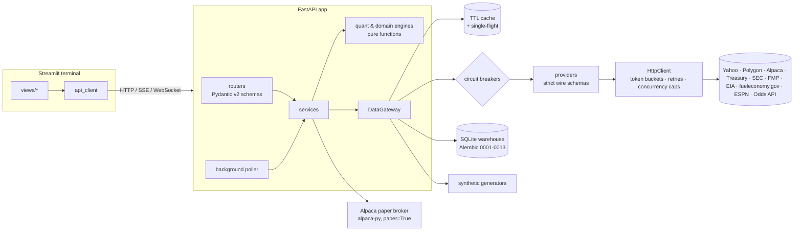

# QuantPulse Terminal

**QuantPulse Terminal** is a quantitative finance and executive intelligence platform. It has an
asynchronous **FastAPI** core, a **SQLite / SQLAlchemy 2** data warehouse with versioned **Alembic**
migrations, a **Streamlit** terminal front end, and live data pipelines to public and commercial APIs.
Every live feed sits behind one resilience layer: TTL caching, single-flight request coalescing,
rate limiting, circuit breakers, a fallback to the warehouse's last-known-good data, and finally
synthetic data with a visible status badge.

| Subsystem | What it does | Live sources |
|---|---|---|
| **Options & quant engine** | Quotes and OHLCV bars, live option chains, Black-Scholes-Merton pricing with first- and second-order Greeks, implied vol, smiles and a 3-D volatility surface | Polygon.io · Alpaca · Yahoo Finance · U.S. Treasury |
| **Corporate finance & DCF** | SEC XBRL statement ingestion, consensus estimates, live-input WACC, FCFF DCF, WACC × g sensitivity grid, Monte Carlo | SEC EDGAR · Financial Modeling Prep · Yahoo |
| **Portfolio risk lab** | Historical, parametric, Cornish-Fisher and Monte Carlo VaR/CVaR; Sharpe, Sortino, drawdown and beta; Ledoit-Wolf covariance; efficient frontier | Market providers · Treasury |
| **Asset lifecycle** | 2025 Hyundai Elantra Limited: regional fuel prices, telemetry and fill-up logs, realised MPG, depreciation curve, maintenance schedule, cost per mile | EIA · fueleconomy.gov |
| **Sports analytics** | Live NFL / FBS scoreboards and lines, Elo power ratings, pre-game and in-game win probability | ESPN · The Odds API |
| **Price forecasts** | Probability ranges for any ticker 1 week to 3 months out: earnings-aware GARCH-t volatility blended with options-implied volatility, the next **earnings jump** simulated from the stock's own past reactions, P(higher), P(above your target) and a walk-forward calibration test | Market providers · Treasury · option chains · SEC filings |
| **Stock model** | Ranks the **S&P 500 point-in-time** (former members included: no survivorship bias) on 28 price, earnings, industry and **point-in-time fundamental** features, compared within industries; ridge, gradient-boosted trees and an ensemble, all trained **walk-forward** with purged labels and compared on the same out-of-sample dates | Market providers · SEC EDGAR · Wikipedia |
| **Stock intelligence** | One page per ticker: forecast cone, model rank, technicals, options view, DCF and the ticker's prediction track record, summarised in plain English | All of the above |
| **Prediction ledger** | Logs every forecast and model call after the close from live data only, grades each on its target date, and keeps a Brier / hit-rate / coverage scorecard; a **point-in-time historical replay** fills it with years of graded predictions on day one | Market providers |
| **Daily picks** | Ranks a stock universe (factor rule, stock model, or both) with a **1-10 rating**, P(beat SPY), 1-month ranges, industry and an upcoming-earnings warning, plus an email digest | Market providers · SMTP |
| **Trading sandbox** | Paper-trading accounts with simulated money, run by a **self-learning agent** that re-weights its factors from its own results; walk-forward training on history | Market providers · Treasury |
| **Alpaca paper trading** | An automated strategy on your **Alpaca paper account**. It ranks a liquid universe on momentum, trend, volume, volatility, fundamentals, the stock model and the market regime. It sizes a concentrated portfolio by conviction and volatility and exits on stops, reversals and deteriorating signals. Every order passes a risk engine and duplicate-proof order management, and fills are reconciled against Alpaca. Dry run by default; paper only, with no live-money path | Alpaca paper API (alpaca-py) · market providers |

> **Disclaimer.** Analytics, valuations, forecasts, model rankings, win probabilities, daily picks and the
> sandbox agent are model outputs for research and education. They are not investment, betting or
> mechanical advice. Nobody can reliably predict individual stock prices; the platform's job is to give
> honest probability ranges and to **measure** its own predictions against what happened (see the Track
> Record page). The trading sandbox simulates its own fills and cannot place an order anywhere. Alpaca
> paper trading sends orders only to Alpaca's **paper** API (simulated money). QuantPulse has no
> live-money trading path.

---

## Contents

1. [Quick start](#quick-start)
2. [Architecture](#architecture)
3. [Data provenance and fallbacks](#data-provenance-and-fallbacks)
4. [Live data sources](#live-data-sources)
5. [Configuration](#configuration)
6. [API reference](#api-reference)
7. [Methodology](#methodology)
8. [Predictions: forecasts, the stock model and the track record](#predictions-forecasts-the-stock-model-and-the-track-record)
9. [Daily picks and the email digest](#daily-picks-and-the-email-digest)
10. [Trading sandbox (paper trading)](#trading-sandbox-paper-trading)
11. [Alpaca paper trading (automated strategy)](#alpaca-paper-trading-automated-strategy)
12. [The Brain (multi-agent portfolio manager, Alpaca PAPER only)](#the-brain-multi-agent-portfolio-manager-alpaca-paper-only)
13. [Options intelligence and market evolution](#options-intelligence-and-market-evolution)
14. [24/7 in the cloud](#247-in-the-cloud)
15. [Vehicle module reference data](#vehicle-module-reference-data)
16. [Database and migrations](#database-and-migrations)
17. [Testing and quality gates](#testing-and-quality-gates)
18. [Project layout](#project-layout)
19. [Security and operations](#security-and-operations)
20. [Known limitations](#known-limitations)

---

## Quick start

### Local (Python 3.11+)

```bash
make install                 # creates .venv and installs pinned, tested versions
cp .env.example .env         # every key is optional; set QP_SEC_USER_AGENT at minimum
make api                     # FastAPI on http://127.0.0.1:8000 (migrations run automatically)
make ui                      # Streamlit terminal on http://localhost:8501 (second terminal)
```

Interactive API docs are at `http://127.0.0.1:8000/docs`. To run without any network access, set
`QP_ENABLE_LIVE_DATA=false`. Every screen then works on synthetic data, and each one is labelled as
such.

### Docker

```bash
cp .env.example .env
docker compose up --build    # api on :8000, ui on :8501; SQLite lives in the `quantpulse-data` volume
```

### Windows (PowerShell)

```powershell
py -3.11 -m venv .venv
.\.venv\Scripts\Activate.ps1
pip install -e ".[frontend,dev]" -c constraints.txt
copy .env.example .env           # then edit .env (API keys, trading switches)
quantpulse-migrate
uvicorn --factory quantpulse.api.app:app_factory --host 127.0.0.1 --port 8000
# second PowerShell window (activate the venv again):
streamlit run frontend/app.py
python -m pytest                 # the test suite
```

### Windows desktop launcher (double-click, no Command Prompt)

After the one-time setup above (the `.venv` and `.env` must exist), double-click
**`launcher\install-shortcuts.bat`** once. It puts three shortcuts on your desktop:

| Shortcut | What it does |
|---|---|
| **QuantPulse Terminal** | Starts the API and the UI (unless they are already running), waits until both answer, opens the UI in your browser |
| **QuantPulse Trading Control** | The same, then opens the Alpaca **paper** trading page (account, positions, orders, risk, proposed trades, kill switch, reconciliation) |
| **Stop QuantPulse** | Stops the API and the UI the launcher started, cleanly (Ctrl+C first, forced only after 20 s) |

**The launcher never trades.** It only reads:

* it makes GET requests to `/health`, `/openapi.json`, `/api/v1/trading/status` and Streamlit's health check;
* it never runs a strategy cycle, sends a test order, or changes a setting;
* the strategy scheduler stays off unless `.env` says `QP_TRADING_SCHEDULER_ENABLED=true` (off by
  default). If it is on, the launcher warns you.
* The API it starts runs the Brain's supervisor. When the Brain owns the account **and** paper execution is
  on (`QP_ALPACA_TRADING_ENABLED=true`, `QP_TRADING_DRY_RUN=false`), the Brain trades the Alpaca **paper**
  account by itself during market hours (see [Autonomous paper execution](#autonomous-paper-execution));
  the launcher says so at start-up. **Stop QuantPulse** stops it; so do *STOP BRAIN ORDERS* on the Brain
  page and `QP_BRAIN_KILL_SWITCH=true`.

Details:

* **What runs.** Everything runs from the project's own `.venv`. It works without anything on your
  PATH and from any folder: paths come from the launcher's location.
* **Network.** Both servers listen on `127.0.0.1` only.
* **The API token.** The UI receives the API address and `QP_API_TOKEN` from `.env`, so you do not
  have to paste the token into the sidebar. Secrets are never written to a log.
* **Double-clicking again** opens the browser; it never starts a second copy.
* **Errors.** If something fails (missing `.venv`, a port used by another program, a server that stops
  while starting), a message box says what happened and how to fix it.
* **Logs.** Everything is logged under `logs\`:
  * `launcher.log` holds what the launcher did (secrets are scrubbed);
  * `api.log` and `ui.log` hold the servers' output;
  * `launcher-state.json` records what the launcher started.

From a Command Prompt, use `launcher\launch.bat`, `launcher\launch.bat status`, `launcher\stop.bat`, or
`.venv\Scripts\python.exe launcher\quantpulse_launcher.py start --no-splash` (it logs to the console).
The icons in `assets\` are original artwork, drawn by `launcher\make_icon.py`.

### Without make

```bash
python3 -m venv .venv && . .venv/bin/activate
pip install -e ".[frontend,dev]" -c constraints.txt
quantpulse-migrate                                   # optional; the API also migrates on start-up
uvicorn --factory quantpulse.api.app:app_factory --port 8000
streamlit run frontend/app.py
```

---

## Architecture


```mermaid
flowchart LR
    subgraph UI[Streamlit terminal]
        V[views/*] --> C[api_client]
    end
    C -- HTTP / SSE / WebSocket --> API
    subgraph API[FastAPI app]
        R[routers<br/>Pydantic v2 schemas] --> S[services]
        S --> Q[quant & domain engines<br/>pure functions]
        S --> G[DataGateway]
        P[background poller] --> S
    end
    G --> CACHE[(TTL cache<br/>+ single-flight)]
    G --> CB{circuit breakers}
    CB --> PR[providers<br/>strict wire schemas]
    PR --> HTTP[HttpClient<br/>token buckets · retries · concurrency caps]
    HTTP --> EXT[(Yahoo · Polygon · Alpaca · Treasury · SEC · FMP · EIA · fueleconomy.gov · ESPN · Odds API)]
    G --> WH[(SQLite warehouse<br/>Alembic 0001-0013)]
    S --> BRK[Alpaca paper broker<br/>alpaca-py, paper=True]
    G --> SYN[synthetic generators]
```

**Layering rules**

* `quant/` and `domain/` are pure numerical code with no I/O. They are unit-tested against textbook
  values, finite differences and reference implementations.
* `providers/` has one module per upstream API. Each one parses vendor payloads through typed
  `WireModel` schemas and raises typed `ProviderError`s, never partial data.
* `core/gateway.py` is the only code that decides *where* data comes from.
* `db/repositories.py` holds all SQL. Services never build queries.
* `services/container.py` is the composition root. `api/` contains only thin routers.

---

## Data provenance and fallbacks

Every single-source payload is returned as `{ "data": ..., "meta": Provenance }`. Analytics that combine
several feeds return `{ "data": ..., "meta": { "status", "computed_at", "sources": { name: Provenance } } }`,
and the overall status is the **worst** of the sources.

| Status | Badge | Meaning |
|---|---|---|
| `live` | 🟢 LIVE | Fetched from a provider for this request |
| `cached` | 🔵 CACHED | Served from the in-memory TTL cache; the original live timestamp is preserved |
| `stale` | 🟠 STALE | Live refresh failed, so the last good value (memory or warehouse) is served |
| `synthetic` | 🔴 SYNTHETIC | No live or stored data exists; deterministic simulated data is served |

**Resolution order** (`DataGateway.resolve`):

1. Fresh cache entry, returned as `cached`.
2. Live providers in priority order. Each one is skipped when it has no credentials or its
   **circuit breaker** is open. Concurrent identical requests are **coalesced** into one upstream call.
3. Expired cache entry within `QP_STALE_GRACE_SECONDS`, returned as `stale`.
4. **Warehouse** snapshot from SQLite, returned as `stale` with provider `warehouse:<source>`.
5. Synthetic generator, returned as `synthetic`. The value is memoised for 30 s under a separate key,
   so a recovered provider is used on the very next request.

`meta.attempts` records every provider tried, with its error and latency. The UI shows these trails in
the badge tooltips.

**Rate-limit management.** Each provider has a token bucket and an in-flight concurrency cap
(`core/http.py`). A request that would wait longer than `QP_RATE_LIMIT_MAX_WAIT_SECONDS` for a token
fails fast and fails over instead of stalling. An HTTP 429 blocks the bucket for the `Retry-After`
period and opens the breaker for at least that long. Transient failures (connection errors, 5xx) get
jittered exponential back-off.

**Asynchronous polling** (`workers/poller.py`) keeps hot data warm:

| Job | Interval |
|---|---|
| Watchlist quotes | `QP_POLL_QUOTES_MARKET_HOURS_SECONDS` during NYSE regular hours, otherwise `QP_POLL_QUOTES_OFF_HOURS_SECONDS` |
| Treasury curve | `QP_POLL_RATES_SECONDS` |
| NFL and FBS scoreboards | `QP_POLL_SPORTS_SECONDS` |
| Daily picks email | Checked every minute; sent once per trading day |
| Trading sandbox | Checked every minute; auto-trading agents run once per trading day after `QP_SANDBOX_TRADE_TIME`, and every account is marked to market after `QP_SANDBOX_MARK_TIME` |
| Prediction ledger | Checked every minute; logs predictions once per trading day after `QP_PREDICTIONS_LOG_TIME`, and grades due ones every 15 minutes |

Trading hours come from a full NYSE calendar (`core/market_calendar.py`). It covers holidays and
their Saturday/Sunday observance, including the New Year's exception, Good Friday via the Gregorian
Easter algorithm, 1 pm early closes, and known special closures.

---

## Live data sources

| Provider | Used for | Key | Notes |
|---|---|---|---|
| **Yahoo Finance** | Quotes, OHLCV (split- and dividend-adjusted), dividends, option chains, analyst trend | none | Chart data is keyless. Quote batches, options and `quoteSummary` use Yahoo's cookie and crumb handshake, done automatically. Yahoo aggressively rate-limits cloud and datacenter IPs (HTTP 429); expect failover there. |
| **Polygon.io** | Real-time snapshot quotes, aggregates, option-chain snapshots with OI and IV | `QP_POLYGON_API_KEY` | Endpoint access depends on your plan. A 403 `NOT_AUTHORIZED` fails over instead of mislabelling delayed data. `QP_POLYGON_BASE_URL` is configurable. |
| **Alpaca Market Data** | Snapshots, bars (all adjustments), **multi-symbol bars** for whole universes, option snapshots | `QP_ALPACA_API_KEY_ID` + `QP_ALPACA_API_SECRET_KEY` | IEX and `indicative` feeds by default; bars come from the all-exchange SIP feed even then (free once 15 minutes old). Option snapshots carry no open interest. With Alpaca configured the stock model covers the S&P 500 (`QP_MODEL_UNIVERSE=auto`): 50 symbols per paginated request. |
| **U.S. Treasury** | Daily par yield curve | none | Keyless CSV feed. It is slow (often 15-20 s), so it uses a 45 s timeout and is polled hourly. |
| **SEC EDGAR** | XBRL company facts, recent filings, ticker→CIK map; SIC industries and **earnings-release times** (8-K item 2.02) from submissions; cross-company **XBRL frames** for point-in-time fundamentals | none | You **must** set `QP_SEC_USER_AGENT` to a name and contact email (SEC fair-access policy). Rate-limited to 8 req/s. Profiles and frames are kept in the warehouse and refreshed weekly. |
| **Wikipedia** | S&P 500 constituents and the dated history of index changes (point-in-time membership) | none | Refreshed weekly. A snapshot of both tables ships with QuantPulse and is used (labelled STALE) when Wikipedia is unreachable. |
| **Financial Modeling Prep** | Consensus revenue/EPS estimates, price targets, scheduled earnings dates | `QP_FMP_API_KEY` | Accepts both `/stable` and legacy field names. Without it the next earnings date is estimated from the company's quarterly rhythm (and labelled "estimated"). |
| **EIA API v2** | Weekly regional retail gasoline and diesel prices | `QP_EIA_API_KEY` | Free key. Region codes are listed at `GET /api/v1/fuel/regions`. |
| **fueleconomy.gov** | Official EPA MPG for the configured vehicle | none | |
| **ESPN site API** | NFL / FBS scoreboards, game state, lines, FBS membership | none | Unofficial public endpoints; the CDN may block some networks. |
| **The Odds API** | Consensus spreads and de-vigged moneylines across US books | `QP_ODDS_API_KEY` | Quota headers are surfaced in `/system/status`. |

---

## Configuration

Settings are read from environment variables prefixed `QP_`, or from `.env`.
`src/quantpulse/config.py` is the source of truth, and `.env.example` lists every commonly used key.
Secrets are held as `SecretStr` and are never logged or returned by the API. `httpx` request logging,
which would include query-string API keys, is suppressed.

| Group | Key settings |
|---|---|
| Runtime | `QP_DATABASE_URL`, `QP_AUTO_MIGRATE`, `QP_API_TOKEN`, `QP_CORS_ORIGINS`, `QP_LOG_LEVEL`, `QP_LOG_JSON` |
| Live data | `QP_ENABLE_LIVE_DATA` (master switch), `QP_MARKET_PROVIDERS` (failover order), provider keys |
| Resilience | `QP_HTTP_TIMEOUT_SECONDS`, `QP_HTTP_MAX_RETRIES`, `QP_CIRCUIT_FAILURE_THRESHOLD`, `QP_CIRCUIT_COOLDOWN_SECONDS`, `QP_RATE_LIMIT_MAX_WAIT_SECONDS`, `QP_POLYGON_REQUESTS_PER_MINUTE` |
| Cache TTLs | `QP_TTL_QUOTE`, `QP_TTL_BARS_INTRADAY`, `QP_TTL_BARS_DAILY`, `QP_TTL_OPTIONS_CHAIN`, `QP_TTL_YIELD_CURVE`, `QP_TTL_FUNDAMENTALS`, `QP_TTL_FUEL_PRICES`, `QP_TTL_SCOREBOARD_LIVE`, `QP_TTL_SCOREBOARD_IDLE`, …, `QP_STALE_GRACE_SECONDS`, `QP_CACHE_MAX_ENTRIES` |
| Polling | `QP_POLLING_ENABLED`, `QP_WATCHLIST`, `QP_POLL_*` |
| Finance | `QP_EQUITY_RISK_PREMIUM`, `QP_DEFAULT_CREDIT_SPREAD`, `QP_DEFAULT_TAX_RATE`, `QP_BENCHMARK_SYMBOL` |
| Vehicle | `QP_FUEL_REGION`, `QP_FUEL_GRADE` |
| Sports | `QP_SPORTS_INCLUDE_PRIOR_SEASON`, `QP_ODDS_BOOKMAKER_REGIONS` |
| Picks / email | `QP_PICKS_UNIVERSE`, `QP_PICKS_TOP_N`, `QP_PICKS_EMAIL_ENABLED`, `QP_PICKS_RECIPIENTS`, `QP_PICKS_SEND_TIME`, `QP_PICKS_ALLOW_SYNTHETIC_EMAIL`, `QP_SMTP_*`, `QP_EMAIL_FROM` |
| Trading sandbox | `QP_SANDBOX_SCHEDULER_ENABLED`, `QP_SANDBOX_TRADE_TIME` (default 10:00 ET), `QP_SANDBOX_MARK_TIME` (default 16:05 ET); per-account strategy settings are set through the API or UI |
| Stock model | `QP_MODEL_UNIVERSE` (`auto`, `sp500`, `picks` or a ticker list), `QP_MODEL_TYPE` (`ensemble`, `ridge` or `gbm`), `QP_MODEL_SECTOR_NEUTRAL` (default on), `QP_MODEL_SYNC_WAIT_SECONDS` (how long a request waits before the run continues in the background, default 25), `QP_MODEL_WARMUP` (the poller keeps the latest close's run computed), `QP_TTL_MODEL` |
| Forecasts | `QP_FORECAST_IV_WEIGHT` (weight of options-implied volatility, default 0.5), `QP_FORECAST_VARIANCE_PREMIUM` (implied variance is divided by this, default 1.1), `QP_FORECAST_EARNINGS_JUMPS` (default on) |
| Reference data | `QP_TTL_REFERENCE` (S&P membership, SEC profiles and earnings dates, default 7 days), `QP_TTL_FUNDAMENTALS_FRAMES` (SEC XBRL frames, default 7 days) |
| Alpaca paper trading | `QP_ALPACA_TRADING_ENABLED` (default off), `QP_TRADING_DRY_RUN` (default on), `QP_ALPACA_PAPER` (must be true), `QP_TRADING_KILL_SWITCH`, `QP_TRADING_TIME`, `QP_TRADING_REBALANCE_INTERVAL_MINUTES`, `QP_TRADING_MAX_*` limits, `QP_TRADING_ORDER_TYPE`, `QP_TRADING_SIGNAL_WEIGHTS`, `QP_TRADING_REGIME_*` — see [Alpaca paper trading](#alpaca-paper-trading-automated-strategy) and `.env.example` |
| Brain research (24/7) | `QP_RESEARCH_ENABLED` (default on), `QP_RESEARCH_MAX_CONCURRENT` (1, at most 2), `QP_RESEARCH_MAX_MEMORY_PCT` (70: no new job above), `QP_RESEARCH_ABORT_MEMORY_PCT` (85: running jobs stop), `QP_RESEARCH_MAX_LOAD` (0.85 per core), `QP_RESEARCH_JOB_TIMEOUT_MINUTES` (30) — see [The 24/7 operating model](#the-247-operating-model-execution-and-research) |
| Predictions | `QP_PREDICTIONS_ENABLED`, `QP_PREDICTIONS_LOG_TIME` (default 16:20 ET), `QP_PREDICTIONS_ALLOW_SYNTHETIC` (default off) |

The Streamlit app reads `QP_API_URL` (default `http://127.0.0.1:8000`) and `QP_API_TOKEN`. Both can
also be changed in the sidebar.

---

## API reference

Every route is under `/api/v1` except `/health`. When `QP_API_TOKEN` is set, every request must send
`X-API-Key`. WebSocket clients may pass `?api_key=` instead. Errors always use the same shape:
`{"error": "...", "detail": ..., "request_id": "..."}`. Validation errors return 422, unknown entities
404, a refusal to act on synthetic prices (emailing picks, filling a paper order) 409, missing SMTP
settings 503, and SMTP delivery failures 502. Paper trading answers 503 without Alpaca keys, 422 for an
order Alpaca refuses and 502 for other broker failures. Long computations (a model run over the S&P 500, the
historical replay) answer **202 Accepted** with the background job's progress and a `Location` header;
poll `GET /jobs/{id}` and ask again when it is done.
Every response carries `X-Request-ID` and `X-Response-Time-ms` headers.

| Method & path | Purpose |
|---|---|
| `GET /health` | Liveness (no auth) |
| `GET /system/status` · `GET /system/ingestions` | Provider health and breakers, cache and limiter stats, poller, DB revision · recent warehouse writes |
| `GET /market/session` | NYSE session state and next open |
| `GET /market/quote/{symbol}` · `GET /market/quotes?symbols=` | Live quotes with provenance |
| `GET /market/history/{symbol}?interval=1d&lookback_days=365` | OHLCV bars (`1m 5m 15m 30m 1h 1d 1wk 1mo`) |
| `GET /market/stream?symbols=AAPL,MSFT&interval=5` | **Server-Sent Events** quote stream |
| `WS /market/ws?symbols=AAPL,MSFT&interval=5` | **WebSocket** quote stream |
| `GET /rates/curve` · `GET /rates/at?years=0.5` | Treasury curve · interpolated BEY and continuous rate |
| `GET /options/{symbol}/chain?max_expirations=4` | Chain enriched with model IV, delta, gamma, theta and vega |
| `GET /options/{symbol}/surface` | Smiles, ATM term structure, 90/110 skew, IV grid |
| `POST /options/price` | BSM price and Greeks; any omitted input is sourced live |
| `GET /fundamentals/{symbol}` · `…/estimates` | SEC statements and filings · consensus |
| `POST /valuation/{symbol}/dcf` | DCF, WACC breakdown, sensitivity grid, Monte Carlo |
| `GET/POST /portfolios` · `GET/PUT/DELETE /portfolios/{id}` · `POST /portfolios/{id}/risk` | Portfolio CRUD and risk report |
| `POST /portfolio/analyze` | Risk report for ad-hoc holdings |
| `GET /vehicle/profiles/{id}` · `…/epa` | Vehicle profile · live EPA ratings |
| `GET /fuel/regions` · `GET /fuel/prices?region=SFL&grade=regular` | EIA regions · weekly prices |
| `GET/POST /vehicles` · `GET/DELETE /vehicles/{id}` · `GET /vehicles/{id}/dashboard` | Vehicles and the cost dashboard |
| `GET/POST /vehicles/{id}/telemetry` · `…/fuel-logs` · `…/maintenance` · `DELETE /vehicles/{id}/{kind}/{record_id}` | Telemetry and logs |
| `GET /sports/{nfl|college-football}/scoreboard` · `…/ratings` | Scores with win probability · Elo ratings |
| `GET /picks/daily?top_n=10&method=auto` · `POST /picks/email` | Daily picks (`auto`, `factors`, `model` or `blend` ranking) with 1-10 ratings, P(beat benchmark) and 1-month ranges · email digest |
| `GET /forecast/{symbol}?horizons=5,21,63&target=&options=true&calibrate=false` | Price ranges and probabilities per horizon, options-implied view, optional walk-forward calibration |
| `GET /stocks/{symbol}/report` | Stock intelligence: technicals, forecast, model rank (overall and within its industry), options view, DCF, track record, plain-English summary |
| `GET /stocks/{symbol}/earnings` | Earnings releases from SEC filings, the price reaction to each, the typical move and the next expected date |
| `GET /model/report?horizon=21&top_k=5&symbols=&wait=` · `GET /model/research` | Walk-forward stock models (out-of-sample skill, model comparison, within-industry IC, backtest, calibration, universe and data coverage, live ranks) · signal IC research (202 while training) |
| `GET /model/universe` · `GET /model/job` | Which stocks the model covers (S&P 500 membership status) · progress of today's model run |
| `GET /jobs` · `GET /jobs/{id}` | Background jobs (model runs, research, the historical replay) and their progress |
| `GET /market/regime` | Trend, volatility, breadth and yield-curve regime with historical context |
| `GET /predictions?origin=` · `GET /predictions/scorecard?origin=live\|backfill\|all` · `POST /predictions/log` · `POST /predictions/resolve` | The prediction ledger and its scorecard (live record, historical replay, or both) |
| `POST /predictions/backfill?sources=forecast&sources=model&replace=` · `GET /predictions/backfill` | Replay history point-in-time into the ledger (202 with a job) · progress and ledger size |
| `GET/POST /sandbox/accounts` · `GET/PATCH/DELETE /sandbox/accounts/{id}` | Paper accounts · summary marked to live prices |
| `POST /sandbox/accounts/{id}/step?force=` · `…/train` · `…/orders` · `…/reset?keep_learning=` | Run the agent · walk-forward training · manual paper order · start over |
| `GET /sandbox/accounts/{id}/trades` · `…/equity` · `…/journal` | Fills · equity snapshots · what the agent did and learned |
| `GET /trading/status` · `/account` · `/positions` · `/orders` · `/proposed` · `/risk` · `/cycles` · `/events` · `/performance` | Alpaca **paper** trading: account (authoritative), strategy cycles, risk and records — see [Alpaca paper trading](#alpaca-paper-trading-automated-strategy) |
| `POST /trading/run` · `/reconcile` · `/kill-switch` · `/cancel-all` · `/close-all` | Run a cycle · reconcile · kill switch · cancel orders · close positions (confirmation required) |

Examples:

```bash
curl -s localhost:8000/api/v1/market/quote/AAPL | jq '.meta.status, .data.price'

# BSM with live spot, Treasury rate, trailing dividend yield and the live smile's IV at this strike:
curl -s -X POST localhost:8000/api/v1/options/price -H 'content-type: application/json' \
  -d '{"symbol":"AAPL","kind":"call","strike":250,"expiration":"2026-12-18"}' | jq '.data.greeks'

# Fully specified inputs (no live data): Hull's textbook example, call ≈ 4.76
curl -s -X POST localhost:8000/api/v1/options/price -H 'content-type: application/json' \
  -d '{"kind":"call","strike":40,"days_to_expiry":182.5,"spot":42,"volatility":0.2,"rate":0.1,"dividend_yield":0}'

curl -s -X POST localhost:8000/api/v1/valuation/MSFT/dcf -H 'content-type: application/json' \
  -d '{"years":5,"terminal_growth":0.025,"monte_carlo":{"paths":20000,"seed":7}}' | jq '.data.dcf.value_per_share'

curl -N 'localhost:8000/api/v1/market/stream?symbols=SPY,QQQ&interval=5'
```

---

## Methodology

### Options (`quant/black_scholes.py`, `quant/vol_surface.py`, `quant/rates.py`)

* **BSM with continuous dividend yield `q`.** Analytic delta, gamma, vega, theta and rho, plus the
  second-order vanna, vomma and charm. The API reports vega and rho per 1 point, and theta and charm
  per calendar day. At expiry or zero volatility the value is the discounted forward intrinsic value.
* **Implied volatility.** Brent's method for single contracts; vectorised bisection for whole chains.
  Prices outside no-arbitrage bounds return no IV rather than a fabricated one.
* **Rates.** Treasury par yields are bond-equivalent (semi-annual) and are converted with
  `r_c = 2·ln(1 + y/2)`. The curve is linearly interpolated in maturity with flat extrapolation.
* **Surface.** Each contract uses its mid price (or last trade if the quote is one-sided). Time to
  expiry is ACT/365 to the 16:00 New York cut-off, and `F = S·e^{(r−q)T}`. Only **out-of-the-money**
  quotes are used, because in-the-money and penny options give ill-conditioned IVs. Wide, one-sided and
  expired quotes are rejected. Output includes per-expiry smiles with a quadratic fit in `ln(K/F)`,
  ATM term structure and 90/110 skew. The grid interpolates each smile onto a common K/S axis and never
  extrapolates past the quoted strikes.
* **Volatility for `POST /options/price`.** When no vol is supplied, the price uses the live smile of
  the expiry nearest to T, interpolated at the strike. It falls back to 3-month realised volatility.
* US single-stock options are American. BSM is the market-standard quoting approximation.

### Valuation (`quant/dcf.py`, `quant/monte_carlo.py`, `services/valuation.py`)

* **FCFF:** `FCFF = EBIT·(1−t) + D&A − CapEx − ΔNWC`. Tax is charged on positive EBIT only.
* **Terminal value:** Gordon growth, `TV = FCFF_N·(1+g)/(WACC−g)`. g must sit at least 0.5 pp below
  WACC. The mid-year convention discounts flows at `t−0.5` and the terminal value at `N−0.5`.
* **Statement ingestion.** SEC XBRL facts are keyed by **period end**, because a fact's `fy` field is
  the *filing's* year and FY2025 10-Ks re-report 2023 and 2024. Duration facts must span about a year,
  since 10-K "FY" facts include quarters. The latest filing wins, to pick up restatements. Concept
  aliases are merged per period. Share count is the most recent of the cover-page DEI figure (summed
  across share classes) and the balance-sheet `CommonStockSharesOutstanding`.
* **Assumptions.** Consensus revenue estimates are chained after the last reported fiscal year, then
  growth fades linearly to g. If no estimates are available, the 3-year CAGR is used. Starting margin,
  tax, D&A, capex and non-cash NWC ratios come from the latest 10-K. Every derived value is returned
  with its source.
* **WACC.** Cost of equity is CAPM: the live 10-year Treasury yield plus beta times the ERP. Beta is a
  2-year weekly regression against `QP_BENCHMARK_SYMBOL`, with the provider's beta as fallback.
  Pre-tax cost of debt is interest expense divided by debt, clamped to `[rf, rf+10%]`; if not reported,
  it is rf plus a spread. Weights use market-value equity and book debt.
* **Monte Carlo.** Each path draws WACC, terminal g (capped below WACC), a persistent revenue-growth
  shock and a margin shock. Output is seeded and reproducible: percentiles, P(value > price), and a
  histogram with outliers clipped into the edge bins.

### Risk (`quant/risk.py`, `quant/optimization.py`)

* **VaR/CVaR** are positive loss fractions of portfolio value:
  * historical, using overlapping compounded h-day returns;
  * parametric (Gaussian, √h scaling);
  * Cornish-Fisher (skew and kurtosis adjusted);
  * Monte Carlo (multivariate normal, Cholesky, seeded).
* **Ratios.** Sharpe and Sortino are annualised over 252 days against the live 3-month Treasury.
  Sortino uses downside deviation below the risk-free rate. Also reported: max drawdown including the
  initial peak, beta, and risk contributions (which sum to 1).
* **Covariance.** Ledoit-Wolf (2004) shrinkage toward a scaled identity. It matches scikit-learn to
  machine precision.
* **Frontier.** Long-only, with an optional max weight, solved with SLSQP using analytic gradients.
  Returns the global minimum-variance portfolio, the maximum-Sharpe portfolio (multi-start), and target-return
  frontier points up to the highest attainable return (from a linear program), plus a random-portfolio
  cloud.

### Sports (`domain/sports.py`)

* **Elo.** Margin-of-victory Elo in the FiveThirtyEight style: `K·ln(|MOV|+1)·2.2/(0.001·ΔElo_w+2.2)`.
  Home field is worth 48 Elo in the NFL and 55 in college. Ratings regress toward the mean each
  season. In college, FCS opponents start at 1200 (FBS membership comes from ESPN's group listing),
  and only FBS teams are ranked.
* **Win probability.** Uses Stern's (1994) Brownian-motion model,
  `P = Φ((L + μτ)/(σ√τ))`, where L is the current lead and τ the fraction of regulation remaining.
  μ blends the market spread (60%) with the Elo spread (40%). σ is 13.45 points (NFL) or 15.5 (FBS).
  The model ignores possession and field position and is intended as a transparent baseline. ESPN's
  own live probability is shown alongside when available.

### Vehicle (`domain/vehicle.py`)

* **Fuel economy.** Realised MPG uses the full-tank method (partial fills roll into the next full
  interval). Until two full fills are logged, the EPA city/highway ratings are blended by your
  driving mix. The blend is calibrated so a 55% city mix reproduces the published combined rating
  exactly, since label values are rounded.
* **Depreciation.** Declining balance with a first-year step and a mileage adjustment, floored at a
  salvage fraction. The parameters are editable assumptions.
* **Maintenance.** Each item recurs at whichever interval (miles or months) triggers first. Status
  is overdue, due soon (within 30 days or max(500 mi, 10% of the interval)), or OK. Projected due dates
  use your average daily miles, computed as a least-squares slope of odometer over time.
* **Cost per mile** = fuel + forward 12-month depreciation + expected annual maintenance.

---

## Predictions: forecasts, the stock model and the track record

This part of the platform answers three questions for any stock: *what range of prices is plausible*,
*how does it rank against other stocks*, and *has any of this actually worked*. In the UI it is the
**Predictions** group: Stock Intelligence, Daily Picks, Model Lab, Track Record and the Trading Sandbox.

### Price forecasts (`quant/volatility.py`, `quant/forecasting.py`, `GET /forecast/{symbol}`)

1. **Volatility.** A GARCH(1,1) model with Student-t shocks is fitted by maximum likelihood to five years
   of daily log returns, with variance targeting (the long-run variance is pinned to the sample
   variance). It captures volatility clustering (calm and turbulent periods persist) and fat tails.
   With under 250 returns the model falls back to EWMA (RiskMetrics, λ = 0.94).
2. **Earnings are jumps, not volatility.** Release times come from SEC 8-K filings (item 2.02); a release
   before the close is priced that day, otherwise the next session. On those reaction days the GARCH
   recursion is fed the typical variance of normal days instead of the squared earnings move, and the
   days are left out of the likelihood and of the bootstrap residuals. Without this, every quarterly 8%
   earnings move would inflate the forecast volatility for weeks afterwards.
3. **Simulation.** 5,000 price paths are simulated with *filtered historical simulation*. Each day draws
   one of the stock's own standardised historical shocks, scales it by the GARCH volatility, and updates
   the variance. Skew and fat tails therefore come from the stock's history rather than an assumption.
   On the next earnings reaction day (a vendor's scheduled date, or the company's quarterly rhythm) the
   diffusive step is replaced by a **jump** drawn from the stock's own past earnings reactions (size
   bootstrapped, sign random: the size of a surprise is predictable, its direction is not).
4. **Options-implied volatility.** When an option surface is available, the diffusive variance term
   structure is blended with the options' ATM implied variance:
   `w × (σ²_IV·T / premium − earnings jumps inside the option's life) + (1 − w) × GARCH`, per expiry,
   turned into bounded daily multipliers (0.25×–4×). Taking out the variance risk premium
   (`QP_FORECAST_VARIANCE_PREMIUM`, options usually overprice risk) and the earnings jumps (added by the
   simulation itself) avoids counting them twice. `QP_FORECAST_IV_WEIGHT` sets `w` (default 0.5); options
   are never blended into a forecast built on live prices if the options themselves are synthetic.
5. **Drift.** The expected return is CAPM: `r_f + β × ERP − dividend yield`. Beta is two-year daily beta,
   Blume-adjusted towards 1. Optionally the stock model's calibrated view is added as a tilt. Each
   horizon is shifted so the *mean* simulated price matches that drift exactly. Direction is a weak
   signal, so ranges barely lean up or down; that is deliberate.
6. **Outputs** per horizon (default 1 week, 1 month and 3 months):
   * the 5/25/50/75/95% price quantiles (the cone on the Stock Intelligence chart);
   * P(price higher) and, if you give a target, P(price above target);
   * 5% value-at-risk and expected shortfall;
   * the volatility components (GARCH, options, blended) and the earnings view (next date, sessions
     ahead, typical move, how many past releases the jump is drawn from).
7. **Options view** (`quant/implied.py`). For the expiry nearest each horizon, the ATM implied
   volatility gives the market's ±1σ move, and the whole smile gives a risk-neutral distribution by
   Breeden-Litzenberger (`P(S_T > K) = −∂C/∂K / DF`). This includes the skew, so crash insurance
   priced into puts shows up. These are *risk-neutral* probabilities: they embed risk premia and are
   not unbiased forecasts.
8. **Calibration** (`calibrate=true`, or the button on Stock Intelligence). The forecaster, earnings jumps
   included, is replayed over the stock's history with no look-ahead: it is refitted every 63 days
   (warm-started from the previous fit), a forecast is made every 5 days, and each forecast is scored
   against the realised price. It reports:
   * how often outcomes fell inside the 50% and 90% bands;
   * a PIT histogram (flat means the ranges were honest);
   * the ratio of realised to forecast volatility;
   * the Brier skill of P(up) against the base rate (expect about 0).

   On simulated GARCH data the unit tests require 90% ± 4% coverage and an unbiased volatility ratio;
   on simulated data with quarterly earnings jumps they require the jump-aware forecaster to be at least
   as well calibrated as a naive one.

### The stock model (`domain/features.py`, `domain/alpha_model.py`, `services/model.py`, `GET /model/report`)

* **Universe: the S&P 500, point-in-time** (`QP_MODEL_UNIVERSE=sp500`, or `auto` when Alpaca is
  configured). Membership is rebuilt for every date by replaying the dated index changes backwards from
  today's constituents (`domain/universe.py`). The model covers **every stock that was a member at any
  time in the window**, and each stock is ranked, trained on and scored **only on the dates it was a
  member**. Companies that were later acquired, went bankrupt or were demoted stay in the history, and a
  stock delisted inside a prediction horizon is cashed out at its last price rather than silently
  disappearing. This removes the survivorship bias that flatters any backtest on today's winners. With
  `picks` or a ticker list the report says plainly that the backtest is survivorship-biased.
* **Prices for ~600 stocks** come from the warehouse first (`MarketService.daily_panel`): only missing
  pieces are downloaded — the full window for new symbols, the last sessions for the rest — through
  Alpaca's multi-symbol endpoint. A tail whose overlap no longer matches the stored bars (a split or
  dividend re-based the vendor's adjusted history) is re-downloaded in full, so two price bases never
  mix. Symbols no vendor knows are reported, never invented.
* **Features (28, point-in-time).**
  * *Price (18):* 12-1, 6-1 and 3-month momentum; 1-month and 5-day returns; 50/200-day trend; price vs
    50-day average; distance from the 52-week high; 3-month and relative volatility; 6-month Sharpe;
    RSI(14); Bollinger %B; one-year beta; idiosyncratic volatility; the largest daily gain in the last
    month (lottery effect); skewness; volume trend.
  * *Earnings (1):* the abnormal two-day reaction to the latest release in volatility units, carried for
    a quarter (post-earnings-announcement drift).
  * *Industry (2):* the industry's average 6-1 momentum and 1-month return (industry momentum).
    Industries are the Fama-French 12, mapped from each company's SEC SIC code.
  * *Fundamentals (7):* earnings yield, free-cash-flow yield, book-to-market, gross profitability
    (Novy-Marx), ROE, asset growth and accruals (Sloan), from SEC XBRL frames. A figure is only used
    **90 days after its period end** (270 for the public float), so a backtest never trades on a number
    that had not been filed yet, and it expires after 550 days. Market value is the public float rolled
    forward with split-adjusted prices, which is immune to splits and share classes. Missing reports
    never drop a stock: the feature is simply neutral for it.
* **Sector-relative comparisons** (`QP_MODEL_SECTOR_NEUTRAL`, on by default). Every stock-level feature
  is measured against the stock's industry average that day (groups of at least three), so "cheap" means
  cheap for a bank, and momentum means beating the industry. Each feature is then z-scored across the
  eligible universe and winsorised at ±3.
* **Target.** The rank of each stock's next-21-day return within the eligible universe, mapped to normal
  scores. The models predict *relative* performance, not market direction.
* **Models, all walk-forward.**
  * *Ridge regression*, refitted every 21 trading days on a rolling three-year window; the penalty is
    chosen on a purged hold-out made of the last quarter of each window.
  * *Gradient-boosted trees* (histogram GBM), refitted quarterly on at most 150,000 sampled rows; the tree
    size is chosen on the same purged hold-out. Trees can learn interactions (for example, value only
    working among profitable companies).
  * *Ensemble* (the default, `QP_MODEL_TYPE`): the average of both models' per-date z-scores.
  * **Purging.** To predict on day *t* a model uses only samples from days *s ≤ t − 21*, whose labels
    are fully known by *t*. A unit test perturbs future labels and checks that past predictions do not
    change. Other tests check that a planted signal is found and that pure noise is **not** reported as
    skill.
* **Out-of-sample evaluation**, for every model on the same dates (the **model comparison** table):
  * the information coefficient (IC), with a t-statistic on non-overlapping dates;
  * the IC **within industries** (realised returns minus the industry average): stock picking, as
    opposed to industry bets;
  * the hit rate against the median and the average return of each prediction quintile;
  * a top-5 long-only portfolio rebalanced every 21 days, net of 10 bps per trade, against an
    equal-weight universe and SPY;
  * the hand-set Daily Picks factor rule as a baseline to beat.
* **Verdict.** Plain English. "Evidence of skill" needs t ≥ 2 on out-of-sample ICs. Otherwise the page
  says there is no reliable evidence, and Daily Picks in `auto` mode keep using the factor rule.
* **Probabilities.** Out-of-sample predictions are bucketed. In each bucket, the observed frequency of
  beating SPY over 21 days (and the mean excess return) is shrunk towards the base rate and made
  monotone (pool-adjacent-violators). Live scores are mapped through that table, so a model without
  skill reports probabilities near the base rate instead of confident-sounding numbers.
* **Explanations.** The average linear weight of each feature (and how often its sign held across
  refits), and the permutation importance of each feature in the live tree model.
* **Runs.** The model ranks at the close: a run is keyed by the last settled session and reused until
  the next close. The first S&P 500 run downloads five years of prices and SEC data (several minutes);
  later runs take about a minute. Runs are background jobs: the API answers 202 with progress, the UI
  shows a live progress bar, the previous close's run keeps serving rankings meanwhile, and the poller
  starts each new close's run on its own (`QP_MODEL_WARMUP`).
* **Signal research** (`GET /model/research`). Each feature's IC at 1, 5, 21 and 63 days (IC decay),
  its quintile spread, and the feature correlation matrix, on the same universe and inputs.
* **Market regime** (`GET /market/regime`, shown on *Tools → Market overview* when running locally). SPY is labelled Uptrend,
  Volatile uptrend, Downtrend or Stress, from its 200-day average and the percentile of its current
  volatility. The panel adds breadth (share of the index members above their 200-day average), the
  10-year minus 3-month yield spread, and what followed historically in the same trend state.

### Stock Intelligence (`GET /stocks/{symbol}/report`)

It combines everything above for one ticker:
* a one-year chart with 50/200-day averages, continued by the 63-day forecast cone;
* a horizon table with model and options views side by side;
* volatility-model and drift details, including the GARCH / options / blended volatility;
* the earnings section: the next reaction day, the typical move and every past reaction (stock and
  market-relative);
* the stock model's rank overall and within its industry (tickers outside the universe are scored
  against the universe's latest cross-section with the same features);
* technicals, a DCF summary, and the ticker's graded predictions.

A short plain-English summary ties each takeaway to a number.

### The prediction ledger and Track Record (`GET /predictions/scorecard`)

After each close (`QP_PREDICTIONS_LOG_TIME`, 16:20 ET) the poller logs:
* for every stock in `QP_PICKS_UNIVERSE`, the 5- and 21-day price forecasts (P(up) and the 5-95%
  quantiles, options and earnings included);
* for every stock the model ranks, its rank and P(beat SPY).

Every prediction is anchored on that day's official close. On its target date's close it is graded
automatically:
* did the price rise;
* did it beat SPY;
* did it land in the 50% and 90% bands.

The scorecard reports:
* the Brier score (0 is perfect, 0.25 is a coin flip);
* Brier skill against always predicting the base rate;
* the hit rate;
* band coverage;
* a reliability chart (predicted vs observed);
* for the model, the excess return of its top-5 names against the rest.

Predictions are never logged from synthetic prices (unless `QP_PREDICTIONS_ALLOW_SYNTHETIC=true`), so
the record only ever reflects real markets. Expect a few weeks of results to be mostly noise.

**Historical replay** (`POST /predictions/backfill`, or *Run the replay* on the Track Record page). A live
record needs months before it means anything, so the ledger can be filled with the predictions the
platform *would* have made, graded against what happened next (`services/backfill.py`):
* *forecasts* every 5 sessions for the picks universe, by the same earnings-aware forecaster refitted
  walk-forward on each stock's history, with a drift from a beta estimated on the prior two years;
* *model rankings* every 5 sessions from the walk-forward out-of-sample predictions, with probabilities
  from an **expanding calibration** that only uses predictions whose outcomes were known by that date.

Replayed rows are stored with `origin="backfill"` and scored separately from the live record (the Track
Record page switches between *Live record*, *Historical replay* and *Both*). Two inputs are not
point-in-time and the page says so: today's risk-free rate and dividend yield (a small part of the
drift), and no options blend (historical option prices are not available). Live predictions always take
precedence over replayed ones for the same stock and day.

---

## Daily picks and the email digest

`GET /api/v1/picks/daily` screens `QP_PICKS_UNIVERSE` (30 liquid large caps by default) on daily closes:

| Factor | Definition | Weight |
|---|---|---|
| 12-1 momentum | `close[t−21] / close[t−252] − 1` | 20% |
| 3-month momentum | `close[t] / close[t−63] − 1` | 10% |
| Trend | mean of `close/SMA50 − 1` and `SMA50/SMA200 − 1` | 25% |
| Risk-adjusted return | annualised mean / s.d. of the last 126 daily returns | 25% |
| Low volatility | −(annualised 63-day volatility) | 10% |
| Short-term pullback | `50 − RSI(14)` | 10% |

Each factor is z-scored across the universe and winsorised at ±3. The composite is standardised again
and mapped to **`rating = round(1 + 9·Φ(z))` on a 1-10 scale**. The top-ranked name is the
"best stock for the day". Ratings are *relative to the screened universe*. After the close, picks are
labelled for the next trading session.

**Ranking method** (`method=`):
* `factors` is the hand-set rule above.
* `model` uses the walk-forward [stock model](#the-stock-model-domainfeaturespy-domainalpha_modelpy-get-modelreport).
* `blend` averages the two standardised scores.
* `auto` (the default) uses `blend` only when the stock model has shown out-of-sample skill (t ≥ 2).
  Otherwise it uses the factor rule and says so.

Every pick also shows the model's calibrated P(beat SPY over 21 days), its model rank, and the
forecaster's 21-day 90% price range and P(higher).

**Email.** Configure SMTP. For Gmail, use an app password with `smtp.gmail.com:587` and STARTTLS:

```env
QP_SMTP_HOST=smtp.gmail.com
QP_SMTP_PORT=587
QP_SMTP_SECURITY=starttls
QP_SMTP_USERNAME=you@gmail.com
QP_SMTP_PASSWORD=<app password>
QP_EMAIL_FROM=you@gmail.com
QP_PICKS_RECIPIENTS=recipient@example.com
QP_PICKS_EMAIL_ENABLED=true        # send automatically each trading day at QP_PICKS_SEND_TIME (ET)
```

The digest (plain text and HTML) lists rank, symbol, rating/10, price, day change, P(beat SPY), the
1-month 90% range and drivers, and
includes the methodology and disclaimer. You can also send it on demand with
`POST /api/v1/picks/email` or from the **Daily Picks** screen.

**Synthetic-data policy.** If live prices are unavailable, the picks would be computed from synthetic
data. The platform **refuses to email them** (HTTP 409; the scheduler skips that day) unless
`allow_synthetic` / `QP_PICKS_ALLOW_SYNTHETIC_EMAIL` is set. In that case the subject is prefixed
`[SYNTHETIC DATA]` and the body carries a warning banner. The scheduler sends at most one digest per
trading day, deduplicated across restarts through the ingestion log. It stops after 3 delivery
failures in a day.

---

## Trading sandbox (paper trading)

The sandbox is a place for a trading agent to practise with **simulated money**. There is no brokerage
integration anywhere in the code base, so nothing in it can place a real order. Each account keeps its
cash, positions, fills, equity snapshots and a plain-English journal in the warehouse (migration
`0007`), so its track record and what it has learned survive restarts. In the UI it is under
**Markets → Trading Sandbox**.

**Accounts.** `POST /api/v1/sandbox/accounts` opens an account (default $100,000). In `agent` mode the
learning agent trades it; in `manual` mode you place the orders yourself.

**Simulated fills.** Market orders fill at the live quote adjusted by `slippage_bps` against you (buys
higher, sells lower), plus an optional `commission_per_trade` and `commission_bps`. Trading is long-only
with no margin, and fractional shares are kept to 6 decimals. Cost basis is the average fill price.
Realised P&L is `(fill − avg cost) · qty − commission`.

**The agent's daily loop.** It runs once per trading day at `QP_SANDBOX_TRADE_TIME`, or on demand
with `POST …/step`:

1. **Learn.** For every factor, measure the *information coefficient* (IC): the Spearman rank
   correlation between the z-scores recorded at the previous decision and the returns realised since.
   Update `w_f ← w_f · exp(η · IC_f)`, shrink the weights by `prior_shrink` towards the defaults, floor
   them at `weight_floor` so noise never switches a factor off, and renormalise. Factors that ranked
   future winners gain weight; factors that ranked losers lose it.
2. **Decide.** Re-rank the universe with the six [Daily Picks](#daily-picks-and-the-email-digest)
   factors, using the *learned* weights. Hold the top `top_k` names that have a positive composite, in
   equal weight capped at `max_position`, and keep `cash_buffer` in cash.
3. **Trade.** Sell first, fully exiting names that left the target list, then buy. Rebalancing trades
   smaller than `min_trade_value` are skipped.
4. **Explain.** Write journal entries: a *lesson* (IC per factor and weights before → after) and a
   *decision* (targets, the top-ranked names and the trades).

| Strategy setting | Default | Meaning |
|---|---|---|
| `signal` | `factors` | `factors`: the self-weighting factor rule described above. `model`: hold the walk-forward stock model's top names (the model retrains itself monthly; the IC re-weighting step is skipped) |
| `universe` | `QP_PICKS_UNIVERSE` | Tickers the agent may trade (at least 3) |
| `top_k` · `max_position` · `cash_buffer` | 5 · 25% · 2% | Portfolio construction |
| `learning_rate` (η) · `prior_shrink` · `weight_floor` | 0.5 · 5% · 2% | Learning speed and guard rails (η = 0 disables learning) |
| `slippage_bps` · `commission_per_trade` · `commission_bps` · `min_trade_value` | 5 · $0 · 0 · $50 | Execution model |

**Walk-forward training.** `POST …/train` replays up to 10 years of daily closes one day at a time,
with no look-ahead. Signals use closes up to day *t*. Orders fill at day *t+1*'s close with the account's
slippage and fees. Learning uses only returns that were observable at the time. The first 253 trading
days warm up the 12-month factors, and symbols with less than 90% of the benchmark's history are left
out. The report compares the agent with the benchmark on total and annualised return, volatility,
Sharpe (against the 3-month Treasury), maximum drawdown, turnover and fees. It also includes the equity
curve, the path of the weights, and the mean IC per factor. With `apply=true` the learned weights replace
the account's. Every run starts from the default weights, so retraining never compounds on itself.

**Synthetic-data policy.** By default an account never trades on synthetic prices:

* Symbols without live data are left out of the ranking.
* The agent sits out if a holding has no live price or if fewer than 3 names can be ranked. It
  journals this once per day, and the scheduler retries 15 minutes later.
* Manual orders return 409.
* Training on synthetic history still runs, so the mechanics can be shown offline, but its weights are
  not applied.

Setting `allow_synthetic` on an account overrides all of this, and the UI flags such accounts.

**Scheduler.** The poller checks every minute. Auto-trading agent accounts run once per trading day
after `QP_SANDBOX_TRADE_TIME` (10:00 ET). Every account is marked to market once after
`QP_SANDBOX_MARK_TIME` (16:05 ET). `QP_SANDBOX_SCHEDULER_ENABLED=false` turns both off.

```bash
# Open an agent account, train it on 3 years of history, then let it trade today.
curl -s -X POST localhost:8000/api/v1/sandbox/accounts -H 'content-type: application/json' \
  -d '{"name": "Learner", "strategy": {"top_k": 5}}' | jq .id
curl -s -X POST localhost:8000/api/v1/sandbox/accounts/1/train -H 'content-type: application/json' \
  -d '{"lookback_days": 1095}' | jq '.data | {applied, strategy, benchmark_metrics, learned_weights}'
curl -s -X POST localhost:8000/api/v1/sandbox/accounts/1/step | jq '{executed, skipped_reason, targets}'
```

**What "learning" means here.** The agent is a deliberately simple, transparent online learner. It
adapts how much it trusts each of six known factors. It does not discover new strategies. ICs measured
over a few days are noisy. Learned weights describe what worked in the recent window, and a good replay
does not predict future returns.

---

## Alpaca paper trading (automated strategy)

QuantPulse can run an automated, fairly aggressive strategy against your **Alpaca paper account**
(Alpaca's paper-trading API: simulated money, real market data, real order handling). This is separate
from the [Trading sandbox](#trading-sandbox-paper-trading). The sandbox simulates its own fills inside
QuantPulse. Here, **Alpaca is authoritative** for equity, cash, buying power, positions, orders and fills,
and QuantPulse keeps a reconciled record of everything it did. In the dashboard it is the **Portfolio**
page.

**Paper only, by construction.**

* The broker (`providers/alpaca_trading.py`) always builds `TradingClient(key, secret, paper=True)` and
  never overrides the URL.
* After construction it checks that the client points at `https://paper-api.alpaca.markets` and refuses
  to work otherwise.
* `QP_ALPACA_PAPER` must be `true` (anything else stops the app at start-up).
* No setting, endpoint or UI control selects a live-money account.

### Turning it on

The defaults compute everything and send nothing:

| Setting | Default | Effect |
|---|---|---|
| `QP_ALPACA_API_KEY_ID` / `QP_ALPACA_API_SECRET_KEY` | — | Your Alpaca **paper** keys (also used for market data). `APCA_API_KEY_ID` / `APCA_API_SECRET_KEY` work too |
| `QP_ALPACA_TRADING_ENABLED` | `false` | QuantPulse may change the paper account (orders, cancels) |
| `QP_TRADING_DRY_RUN` | `true` | Signals, targets, trades and risk checks are computed and recorded; **nothing is submitted** |
| `QP_ALPACA_PAPER` | `true` | Must stay true |
| `QP_TRADING_KILL_SWITCH` | `false` | Refuses every new order (the dashboard has a runtime switch as well) |

To inspect the strategy first, set only the keys: **Run strategy now** records a **dry-run** cycle on
demand (and, with `QP_TRADING_SCHEDULER_ENABLED=true`, the scheduler does so every 30 minutes). When you are ready for the strategy to trade
the paper account:

```env
QP_ALPACA_TRADING_ENABLED=true
QP_ALPACA_PAPER=true
QP_TRADING_DRY_RUN=false
```

**Where settings come from.** Settings are read **once, at start-up**: after editing `.env`, restart the
API. The `.env` file is found the same way whatever folder the API is started from:

1. the file named by `QP_ENV_FILE`, if set;
2. otherwise `.env` in the project folder (next to `pyproject.toml`);
3. otherwise `.env` in the current folder.

Process environment variables **override** `.env` (a `QP_TRADING_DRY_RUN` left in your shell or your
Windows user environment wins over the file). `GET /trading/status` shows the file that was read, where
each trading switch came from (`environment`, `env_file` or `default`; keys only as *set / not set*), a
**restart-required** warning when `.env` changed after start-up, and `submit_blockers`: every reason
orders are not being sent right now.

**Scheduled cycles need arming.** With `QP_TRADING_SCHEDULER_REQUIRES_ARMING=true` (the default),
switching paper execution on never makes the scheduler fire a batch by itself: scheduled cycles stay dry
runs until you have used paper execution once by hand, with a manual **Run strategy now** (paper) or the
confirmed test order. The scheduler itself is off unless `QP_TRADING_SCHEDULER_ENABLED=true` (the
default is `false`: cycles run only when you start one).

### How one cycle works

```
Alpaca (reconcile orders, read account / positions / open orders / clock)
  → data: liquid universe, daily bars (warehouse-first), live snapshots, stock model, VIX, implied vol, earnings dates
  → market regime → opportunity scores → target portfolio → proposed trades (exits first)
  → risk engine (every order) → order manager (deterministic client order id) → Alpaca paper API
  → wait for sell fills → re-check buys against the new cash → reconcile fills → record the cycle
```

With `QP_TRADING_SCHEDULER_ENABLED=true` (default `false`), the scheduler starts a cycle at
`QP_TRADING_TIME` (10:00 New York) and then every
`QP_TRADING_REBALANCE_INTERVAL_MINUTES` (30) until 15 minutes before the close. Early closes are
handled. A slot that was missed (the app was down) is not run late. Each slot runs once, even across
restarts: the cycle key is unique in the database.

**Universe.** `QP_TRADING_UNIVERSE=auto` takes the stock model's universe (today's S&P 500 members when
Alpaca data is configured) plus the liquid ETFs in `QP_TRADING_ETFS`, and keeps the
`QP_TRADING_UNIVERSE_SIZE` (120) names with the highest 20-day dollar volume. Current holdings always
stay in. A comma-separated ticker list works too.

**Opportunity score.** Every symbol gets seven component scores. Each is a cross-sectional z-score
(winsorised at ±3), so no signal dominates because of its scale. The weighted average
(`QP_TRADING_SIGNAL_WEIGHTS`) is standardised again: +1 means one standard deviation better than the
average candidate.

| Component (default weight) | Built from |
|---|---|
| Momentum (25%) | 12-1 and 6-1 month returns, 3-month and 10-day returns, 3-month relative strength vs SPY, trend persistence (R² of a 63-day log-price fit × slope sign) |
| Trend & price structure (20%) | Price vs 50-day average, 50- vs 200-day average, closeness to the 52-week high, signed ADX(14), price vs today's VWAP, and the better of a 20-day breakout or an uptrend pullback (RSI < 55) |
| Volume (10%) | 20- vs 120-day volume, today's relative volume for the time of day, up-day vs down-day volume, ½ × log dollar volume |
| Volatility (10%) | Lower ATR%, contracting 21- vs 63-day volatility, 6-month Sharpe, lower implied-vs-realised volatility (event risk) |
| Fundamentals & earnings (10%) | Earnings and FCF yield, ½ book-to-market, gross profitability, ROE, low accruals, ½ low asset growth, the latest earnings reaction (post-earnings drift); point-in-time SEC data from the stock model |
| Stock model (20%) | The walk-forward model's live z-score (ridge + gradient-boosted trees), the latest completed run |
| Regime fit (5%) | Beta × the regime's tilt: high-beta names score higher in bullish markets, defensive ones in bearish markets |

A missing component counts as neutral (0). ETFs have no model or fundamental score, for example, and
the cycle notes say why a component was missing.

**Market regime** (`domain/trading_regime.py`). The regime is built from:

* SPY and QQQ versus their 200-day averages;
* SPY's 50/200-day cross and 3-month return;
* breadth (the share of the universe above its 200-day average);
* SPY's realised-volatility percentile, the VIX when a live quote exists, and SPY's drawdown from its
  52-week high.

The possible labels are *bullish*, *neutral*, *high volatility*, *bearish* and *risk-off*. Each label sets
the share of maximum exposure deployed (`QP_TRADING_REGIME_EXPOSURE`: 100/80/60/40/15%) and an extra
score new positions need (`QP_TRADING_REGIME_ENTRY_PENALTY`: 0/0.15/0.3/0.5/1.0). Nothing assumes
markets rise.

**Portfolio construction** (`domain/trading_portfolio.py`).

1. **Risk exits first.**
   * Stop-loss: a holding down `QP_TRADING_MAX_POSITION_LOSS_PCT` (8%) is sold.
   * Take-profit: a holding up `QP_TRADING_TAKE_PROFIT_PCT` (25%) has half sold, once per entry price.
   * In a risk-off market, holdings below the entry bar are sold.
2. **Strategy exits.** A holding is sold when:
   * its trend reverses (below its 20- and 50-day averages with a negative 10-day return);
   * its score falls below `QP_TRADING_EXIT_THRESHOLD` (0);
   * the stock model turns from clearly positive to clearly negative since entry; or
   * a clearly stronger name displaces it.
3. **Selection.** Holdings get a head start of `QP_TRADING_INCUMBENT_BONUS` (0.35), which limits churn.
   A new name needs all of the following:
   * a score of `QP_TRADING_ENTRY_THRESHOLD` (0.75) plus the regime penalty;
   * an intact trend (above its 50-day average, positive 3-month return);
   * enough liquidity and a live quote;
   * no earnings release within `QP_TRADING_EARNINGS_BLACKOUT_DAYS` (2).

   The best `QP_TRADING_MAX_POSITIONS` (8) are held.
4. **Sizing: conviction ÷ volatility.**
   * Conviction grows with the score.
   * Volatility is the largest of realised (21 and 63 days), ATR-based and implied volatility, floored at
     12%.
   * Weights are scaled to the regime's share of 95% gross exposure and capped per name by three limits:
     30% of equity; a volatility budget (weight × volatility ≤ 12%, so a 60%-volatility stock gets at
     most 20%); and 1% of its average dollar volume.
   * Excess is redistributed. Weights under 3% are dropped: the book is a concentrated handful of names,
     not dozens of tiny positions.
5. **Turnover controls.**
   * A position is only traded when its target weight changes by at least 2%, and each order is at
     least $100.
   * Buys are capped at `QP_TRADING_MAX_ORDER_NOTIONAL` ($15,000) per order. Larger targets are reached
     over the next cycles without fragmenting orders.
   * No direction reversal within `QP_TRADING_COOLDOWN_MINUTES` (120): no buy right after a sell, and no
     sell right after a buy. Scaling in is allowed.
   * Discretionary trades share a per-cycle turnover budget (60% of equity). Exits are never deferred.

**Orders.** `QP_TRADING_ORDER_TYPE` sets the order type:

* `marketable_limit` (the default): a DAY limit order priced `QP_TRADING_LIMIT_OFFSET_BPS` (10 bp)
  through the live ask or bid;
* `limit`: at the last price;
* `market`.

Close-all and the daily-loss flatten use market orders, and so do fractional quantities. Unfilled
QuantPulse orders older than `QP_TRADING_ORDER_TIMEOUT_MINUTES` (20) are canceled at the next cycle,
before it re-plans. Orders you place yourself in Alpaca are never touched by that clean-up.

### Risk controls (`services/trading_risk.py`)

Every order passes the risk engine; each decision records every named check (shown per trade on the
dashboard). The book is *projected*: each approved order counts against the limits for the rest of the
cycle, and open orders count from the start.

| Check | Rule |
|---|---|
| `kill_switch` | No order while the kill switch is on (`QP_TRADING_KILL_SWITCH` or the runtime switch), except an explicit flatten |
| `account` | Alpaca has not blocked the account |
| `market_open` | Alpaca's clock says the market is open |
| `live_data` | A live quote no older than `QP_TRADING_MAX_QUOTE_AGE_SECONDS` (600 s). **Synthetic prices are never traded**; stale ones only if `QP_TRADING_REQUIRE_LIVE_DATA=false` |
| `no_working_order` | No other order for the symbol is still working (no stacking, no duplicates) |
| `no_short` | A sell never exceeds the shares held (`QP_TRADING_ALLOW_SHORTS` must stay false) |
| `order_size` | $100 ≤ notional ≤ $15,000; an order that closes a whole position is exempt from the cap so a stop-loss can always execute |
| `daily_loss` | Buys stop once today's loss (equity vs Alpaca's previous-close equity) reaches `QP_TRADING_MAX_DAILY_LOSS_PCT` (4%). With `QP_TRADING_DAILY_LOSS_ACTION=flatten` every position is also sold |
| `position_limit` | A position stays within `QP_TRADING_MAX_POSITION_PCT` (30%) of equity |
| `total_exposure` | Long exposure stays within `QP_TRADING_MAX_TOTAL_EXPOSURE_PCT` (95%) |
| `max_positions` | At most `QP_TRADING_MAX_POSITIONS` (8) names, held plus pending |
| `buying_power` | The order fits in buying power and in cash above the `QP_TRADING_CASH_BUFFER_PCT` (2%) reserve: no margin |
| `liquidity` | Price ≥ $5, 20-day dollar volume ≥ `QP_TRADING_MIN_DOLLAR_VOLUME` ($25M), spread ≤ `QP_TRADING_MAX_SPREAD_BPS` (30 bp) measured on a validated quote; a spread that cannot be measured fails while `QP_TRADING_REQUIRE_LIVE_DATA=true` |
| `quote_quality` | Buys only: the price agrees with the price history (no bad tick, split or mis-mapped symbol) |

**Quotes are validated before their spread is believed** (`services/trading_data.py`, `assess_quote`).
Alpaca's free data plan streams the **IEX** feed: one exchange with a few percent of the volume. Its
bid/ask is IEX's own book, not the national best bid and offer. For names IEX trades thinly it can be
one-sided or 5–10% wide (the source of "spreads" such as 1,000 bp on large caps). So:

* a one-sided, crossed, stale (bid/ask older than `QP_TRADING_MAX_QUOTE_AGE_SECONDS`) or off-market
  bid/ask (midpoint more than 3% from the last trade) is never read as a spread, and never prices a
  limit order;
* the spread comes from the **consolidated SIP quote** (all exchanges) when your data subscription
  allows it. It uses the real-time SIP feed, or else Alpaca's 15-minute-delayed SIP feed (a spread from
  15 minutes ago is a fair measure of a stock's liquidity; the order price still comes from the live
  quote). Without either, the IEX spread is used as is, and wide names are simply not bought;
* **price history** (daily bars: volume, highs, lows) comes from the consolidated SIP bars even on the free
  plan, which may read them once they are 15 minutes old: IEX bars hold only IEX's own few percent of the
  volume, which the $25M-a-day liquidity floor and the 1%-of-volume position cap would misread. Today's bar
  is read up to 16 minutes ago (the live snapshot carries the current price); intraday charts stay on IEX
  in real time. Stored IEX-only histories are downloaded again in full once, never mixed with SIP bars; if
  Alpaca refuses SIP history, IEX bars are used and data health says so (`history_feed`);
* a live price more than 25% from the last close, or stored history that disagrees with the vendor's
  previous close by more than 15%, blocks new buys in that name (exits are never blocked);
* the 30 bp limit itself is unchanged. `GET /trading/diagnostics?symbols=DELL,MPC` shows each quote's
  bid/ask, feed, ages, IEX and SIP spreads, the spread used, and why a part was not trusted.

### Duplicate protection and reconciliation (`services/order_manager.py`)

* **Deterministic client order ids.** Each order's id is `qp-<cycle slot>-<symbol>-<b|s>`, for example
  `qp-20260925T1030-AAPL-b`. Re-running a slot produces the same ids, so a double click, a second
  poller pass or a restart mid-cycle cannot send the same order twice.
* **Write-ahead record.** The order is stored as `pending_submit` (unique on the client id) *before* the
  request leaves. A second attempt fails on that constraint and sends nothing.
* **No blind resubmission.** After a timeout or a dropped connection the order is looked up by its
  client id. If Alpaca never saw it, the order is marked `submit_unknown`, never resent, and closed out
  as `submit_failed` after a grace period. The SDK's own retry is limited to 429 responses, and Alpaca
  itself rejects a repeated client id.
* **Reconciliation.** This runs at start-up, before every cycle, every 5 minutes during the session, and
  on demand. It reads open and recent orders from Alpaca and updates every local record (status, filled
  quantity, average fill price, timestamps). It adds orders placed elsewhere (marked `external`) and
  logs every change. Partial fills are tracked; a symbol with a working order is never traded again
  until that order is done.

### Records, dashboard and performance

Three tables come from migration `0010`:

* `trading_cycles`: one row per cycle, holding the regime, account equity, cash, positions, the top
  signals with their components, targets, proposed trades with risk decisions and order status, and
  notes.
* `broker_orders`: every order with its Alpaca id, client id, strategy, score, reason and error.

Every proposed trade records how far it got (`stage`) and, once Alpaca acknowledged it, its
`alpaca_order_id`:

* `risk_rejected` means it failed a risk check;
* `risk_approved` means it passed but was not sent (dry run, kill switch);
* `submitting`, then `submitted` / `accepted`, `partially_filled`, `filled`, `canceled` or `expired`;
* or `rejected` (by Alpaca), `failed` (never reached Alpaca) or `unknown` (sent, no answer yet;
  looked up by client id, never resent).

The views show each trade's *current* state, since orders are reconciled with Alpaca. A cycle's "sent"
count only includes orders Alpaca acknowledged.
* `trading_events`: the audit trail. It records signals generated, trades proposed, risk
  approved/rejected, orders submitted, partially filled, filled, canceled and rejected, the kill switch,
  the daily loss limit, and reconciliation.

**Performance** (`GET /trading/performance`) is computed **only from recorded data**. It uses daily
equity (the last cycle of each day) and FIFO round trips of filled orders, and reports:

* Sharpe and Sortino ratios, maximum drawdown, best and worst day;
* win rate, average winner and loser, profit factor;
* turnover, average exposure, daily and monthly P/L;
* realised P/L by symbol and by exit type.

A statistic without enough data is empty, with a note saying why.

**Dashboard.**

* **Banners:** the page always shows **ALPACA PAPER TRADING — SIMULATED MONEY ONLY**, plus either
  **DRY RUN — NO ORDERS WILL BE SUBMITTED** or the execution-active warning.
* **Account:** equity, cash, buying power, today's and total P/L.
* **Views:**
  * Portfolio: shares, entry, price, value, weight, P/L, target weight, score, stop-loss.
  * Strategy: regime, top opportunities with every component, target vs current portfolio, proposed
    trades with each risk check.
  * Orders (with Alpaca order ids), Risk (limits and usage), Activity (cycles and the audit trail) and
    Performance.
  * Diagnostics: the read-only connection check, quote inspection, the configuration in use, and the
    one-order test.
* **Status:** mode, broker and endpoint, trading enabled, dry run, kill switch, scheduler (and whether
  it is armed), market, last cycle (sent / proposed), next cycle, and why orders are not sent.
* **Controls:**
  * Run strategy now (optionally forced to a dry run).
  * Kill switch (optionally cancelling working orders).
  * Reconcile.
  * Cancel all open orders (needs a confirmation tick).
  * Close all positions (needs the exact phrase `CLOSE ALL`; a preview in dry-run mode).

### API

| Method & path | Purpose |
|---|---|
| `GET /trading/status` | Paper-only flag and endpoint, mode (dry run / paper), kill switch, Alpaca market clock, next cycle, last cycle, warnings |
| `GET /trading/account` · `/positions` · `/orders?status=all\|open\|closed` | The Alpaca paper account (authoritative), with QuantPulse's targets, scores and reasons attached |
| `GET /trading/proposed` · `/cycles` · `/cycles/{id}` | Latest cycle (regime, opportunities, targets, trades and risk decisions) · cycle history |
| `GET /trading/risk` · `/events?kind=` · `/performance` · `/job` | Risk snapshot · audit trail · recorded performance · cycle progress |
| `POST /trading/run?dry_run=&wait=` | Run a cycle now (202 with progress if it takes longer than `wait`) |
| `POST /trading/reconcile` | Reconcile with Alpaca now |
| `POST /trading/kill-switch` `{"active": true, "reason": "...", "cancel_open_orders": true}` | Kill switch on/off (the env switch can only be released in `.env`) |
| `POST /trading/cancel-all` `{"confirm": true}` | Cancel every open order on the paper account |
| `POST /trading/close-all` `{"confirm": "CLOSE ALL"}` | Sell every position (a preview in dry-run mode) |
| `GET /trading/diagnostics?symbols=` | **Read-only** connection check: settings and their sources, keys (presence only), the SDK client's paper endpoint, account, clock, positions, open orders, and quote quality for `symbols`. Never places or cancels an order |
| `POST /trading/test-order` `{"confirm": "SUBMIT ONE PAPER TEST ORDER", "symbol": "SPY", "mode": "rest_and_cancel"}` | Send exactly **one** small paper order to prove the path end to end (see below) |

The order endpoints (`run`, `test-order`, `kill-switch`, `cancel-all` and `close-all`) require either `QP_API_TOKEN`
(sent as `X-API-Key`) or a request from the same machine. A missing broker returns 503, an order Alpaca
refuses returns 422, and other broker failures return 502. API keys never appear in a response, a log
line or the UI; account numbers are masked.

### First paper-trading session, step by step

Commands are PowerShell (Windows); `curl` works the same elsewhere. If `QP_API_TOKEN` is set, add
`-Headers @{ "X-API-Key" = $env:QP_API_TOKEN }` to each call.

1. `python -m pytest -q` runs the tests. Everything is mocked; no test touches Alpaca.
2. `quantpulse-migrate` creates the trading tables.
3. Put the paper keys in `.env` (project folder). Leave `QP_ALPACA_TRADING_ENABLED=false` and
   `QP_TRADING_DRY_RUN=true`, and keep `QP_TRADING_SCHEDULER_ENABLED=false` (the default).
   Start the API and the UI (see [Quick start](#quick-start)).
4. Run the read-only check. Each step should show `ok: True`, and `endpoint_verified: True`:

   ```powershell
   $d = Invoke-RestMethod http://127.0.0.1:8000/api/v1/trading/diagnostics?symbols=AMD,MSFT,DELL
   $d.checks | Format-Table name, ok, detail -Wrap
   $d.quotes | Format-Table symbol, price, bid, ask, venue_spread_bps, consolidated_spread_bps, spread_source, spread_ok
   ```

5. Run a dry cycle (`Invoke-RestMethod -Method Post http://127.0.0.1:8000/api/v1/trading/run?dry_run=true`)
   and review the proposed trades under **Strategy**. They show `Risk approved — not sent`; nothing
   reaches Alpaca.
6. Enable paper execution in `.env` (`QP_ALPACA_TRADING_ENABLED=true`, `QP_TRADING_DRY_RUN=false`) and
   **restart the API**. `GET /trading/status` must now say `mode: paper` with empty `submit_blockers`.
   The scheduler stays off (and would stay unarmed anyway).
7. Send **one** test order. By default it is a 1-share limit buy priced 10% below the bid; it cannot
   fill and is canceled at once. It works while the market is closed too.

   ```powershell
   $body = @{ confirm = "SUBMIT ONE PAPER TEST ORDER"; symbol = "SPY"; mode = "rest_and_cancel" } | ConvertTo-Json
   $t = Invoke-RestMethod -Method Post http://127.0.0.1:8000/api/v1/trading/test-order -ContentType application/json -Body $body
   $t | Format-List sent, alpaca_order_id, statuses_seen, final_status, message
   ```

8. Verify it:
   * `Invoke-RestMethod "http://127.0.0.1:8000/api/v1/trading/orders?status=all&limit=5" | Format-Table client_order_id, alpaca_order_id, symbol, status, source`
     shows the `qp-test-…` order with the same Alpaca order id and status `canceled`;
   * the order also appears in Alpaca's paper dashboard.
9. When you are ready, during market hours, run **one** manual paper cycle: **Run strategy now**, or
   `Invoke-RestMethod -Method Post http://127.0.0.1:8000/api/v1/trading/run`. Every trade then shows its
   stage and Alpaca order id.
10. Re-enable the scheduler (`QP_TRADING_SCHEDULER_ENABLED=true`, restart) when you want it to trade on
    its own.

## The Brain (multi-agent portfolio manager, Alpaca PAPER only)

The brain (`src/quantpulse/brain/`) is a set of small, specialised agents that look at the market and the
Alpaca paper portfolio, argue from evidence, and decide portfolio actions. By default
(`QP_BRAIN_MODE=paper_execution`) **the Brain owns the Alpaca paper account**: its decisions are executed —
by the trading service, never by the Brain itself — through the same reconciliation, fresh quotes, risk
engine (`services/trading_risk.RiskBook`), order manager and trading switches as every order. Nothing is
sent while `QP_ALPACA_TRADING_ENABLED=false` or `QP_TRADING_DRY_RUN=true` (the defaults), and the Brain
kill switch stops new Brain orders at once. The Brain itself has no broker access beyond a read-only view
(account, positions, open orders, clock). There is no path to a live-money account.

**Status (built and tested):** the agent interface, registry and orchestrator; nineteen deterministic
agents and one optional model-backed agent; working memory; opportunity detection; consensus with visible
disagreement and an adversarial debate; proposed actions with a risk preview; grading of predictions
against real prices, reflection and measured track records; a supervisor that runs by session and by
event; ownership of the Alpaca paper account with **autonomous execution** through the trading service (a
final execution audit that arms it, a last check before every submission, an execution ledger, a
near-close review), the Brain kill switch and automatic entry halts; position theses; pre-market checks and daily closes; a per-trade audit
trail; the market-data/SIP report; the Brain's own paper book (when it does not own the account); the
replaced strategy as a comparison shadow; the scorecard and the 60-session evaluation; a strategy lab;
self-improvement proposals; a provider-agnostic language-model layer (no provider is built in);
persistence of every cycle; and the **Brain** page in the UI (under *Alpaca Paper Trading*). What is not built is listed under
[Known limitations](#known-limitations).

### One cycle

1. **Perceive.** Reads the paper account and Alpaca's market clock, loads daily prices for the trading
   universe (the same `TradingDataLoader` the strategy uses), appends today's live row while the market is
   open, computes indicators (`raw_signals` plus trend, MACD, Bollinger, breakout, correlation and tail
   statistics), picks the **focus** (holdings, requested symbols and the best of a pre-screen), then
   enriches the focus (fundamentals, model scores, implied volatility, earnings dates), classifies the
   regime with the strategy's own classifier, and grades each symbol's data: `fresh`, `live`, `stale`,
   `market_closed`, `unavailable` or `provider_error`.
2. **Select and run agents.** Each skip is recorded with its reason (disabled, not enough data, nothing
   to analyse). Agents run concurrently by dependency level. A failing or slow agent is recorded as
   `failed` or `timeout`, and the cycle goes on.
3. **Consensus** per subject from the *forecasting* agents. Each vote is weighted by the agent's
   confidence × data quality × measured reliability. Reliability stays **unproven** (weight 1.0) until an
   agent has `QP_BRAIN_MIN_RELIABILITY_OBSERVATIONS` evaluated predictions, so no track record is
   invented. Supporting, neutral, opposing and abstaining counts, a disagreement measure (0 unanimous …
   1 split) and the strongest voice on each side are kept. The answer is **unknown** (no action) when
   there is one unsure voice, heavy disagreement or low combined confidence. Vetoes from the
   *constraint* agents stay attached.

   **Agents that share a source of information count once.** Each agent declares its source (prices,
   fundamentals, the stock model, options, events, promoted strategies). The consensus score is a
   weighted mean over sources, and full confidence needs at least two independent sources. Technical,
   momentum, mean-reversion and statistical agreeing is one idea (prices) seen four ways, not four
   confirmations, so with prices alone the confidence is halved and new positions are rarely proposed.
   Disagreement is the larger of the split between agents and the split between sources, so a conflict
   inside one source stays visible.

   Each consensus also lists every forecasting agent that gave no view (skipped, failed or abstained,
   with the reason) and its **reasons for uncertainty**: one source only, all agents unproven, data not
   executable, partial disagreement, missing agents. The consensus is graded like an agent, and its
   version changed with this method (`2`), so its track record never mixes the two.

   **Checks fail closed.** If the data-quality agent does not run (failed, timed out or switched off),
   nothing is executable that cycle. If situational awareness does not run, the posture is *cautious*.
4. **Decide.** Holdings: CLOSE at a stop or a broken thesis; in the last half hour, DE_RISK half of a
   holding with an earnings release before the next session opens (once a day); REDUCE when overweight;
   take half the profit at the target of a *calibrated* thesis (once; no target is invented); REDUCE or
   CLOSE when confidently bearish; INCREASE when confidently bullish below target; otherwise HOLD. Then
   the book as a whole (each rule trims one HOLD per cycle and stops once the book is back inside): two
   holdings that are the same bet (return correlation ≥ 0.85) and together above the position limit give
   up the excess; a sector above 45% of equity gives up the excess; a book above 35% annualised
   volatility trims a quarter of its largest risk contributor. New names: BUY only on a confident bullish consensus with no
   veto, outside a risk-off market, with a free slot and unborrowed cash, sized by a volatility budget
   and within the per-order limit, at most `QP_BRAIN_MAX_NEW_POSITIONS_PER_CYCLE` per cycle. Everything
   else is WATCH or NO_ACTION, with the reason. Every cycle records **why it traded or why it did not**
   (`summary.decision`: the orders sent, or each reason nothing went — no clear bullish consensus, not
   enough evidence, a halt, a gate, the risk engine), shown at the top of the page's *Overview*.
5. **Risk preview.** Every proposed trade goes through `RiskBook` (sells first), which applies the same
   live-data, quote-age, spread and liquidity limits as real orders. The status is `recommended`
   (paper_recommendation mode), `dry_run_approved` (dry_run), `risk_rejected` (with the failed check),
   `blocked` (a data veto) or `not_checked` (the account could not be read). The cycle also records the
   trading controls as they stand (keys, `QP_ALPACA_TRADING_ENABLED`, dry run, kill switch): whether an
   order placed through the trading service would reach Alpaca now, and if not, why. This is read only.
6. **Remember.** Stores the cycle, every agent run (including skips and failures), every opinion with its
   evidence and invalidation level, the consensus, the decisions, **open predictions** for later grading
   (per agent and per consensus, with entry prices and due dates) and structured memory:
   * short term: the latest market and portfolio state;
   * working: this cycle's investigation;
   * long term: regime changes and proposed trades.

### Evaluation: the scorecard and 60 sessions

* **Execution quality** (`GET /brain/execution-quality`, from the execution ledger) — the Brain's real Alpaca
  paper orders: sent, filled, partly filled, canceled or expired, rejected, unknown; the fill rate; the time
  to fill; submission latency; the quote's age and spread as each order left; slippage against the price
  the decision assumed (positive: worse) by order type; and cost against the quote's midpoint, graded
  against half the spread (good ≤ half + 2bp, fair ≤ half + 10bp, else poor). Judged on its own: a good
  fill on a losing trade is still a good fill.
* **Scorecard** (`GET /brain/scorecard`) — learning measured separately, never blended: prediction accuracy
  (graded consensus calls against the benchmark, with a 95% interval), calibration (hit rate by
  confidence), decision quality (earned / unlucky / lucky / process failure), luck (outcomes that disagreed
  with the decision's quality), execution quality, risk outcomes (positions stopped out, halts, the deepest
  drawdown), benchmark-relative outcomes (closed positions against the benchmark since entry, win rate) and
  agent reliability (verdicts). Each carries its sample size and is *unproven* until it reaches
  `QP_BRAIN_MIN_RELIABILITY_OBSERVATIONS`; nothing changes a weight on a tiny sample.
* **The replaced strategy as a shadow** (`GET /brain/shadow`, `QP_BRAIN_STRATEGY_SHADOW=true`) — while the
  Brain owns the account, the supervisor runs the strategy's own plan (`TradingService.shadow_plan`: the
  same data, regime, signals and portfolio construction; read-only, no order, no trading record) on the
  strategy's schedule against a hypothetical portfolio that starts from the account's equity in cash. Every
  trade passes the same `RiskBook` limits and is filled like the paper book; it is marked at each close.
* **The 60-session evaluation** (`GET /brain/evaluation`, the page's *Evaluation* tab) — the Brain's trading
  days (`brain_sessions`) against the benchmark and against the shadow: total return, volatility, Sharpe,
  Sortino, maximum drawdown, excess return, tracking error, information ratio, beta, turnover, regime
  performance (daily excess return by the day's regime), sector exposure, and the scorecard. Until 60
  sessions it says *in progress — too few to judge*; at 60 it asks for the architecture to be reviewed with
  the results. It is a report for a person: nothing in the Brain optimises for it.

### Market data report and SIP

`GET /brain/data-report?days=20` (the page's *Market data & SIP* tab) counts, over a window, how often market
data stopped the Brain and what it stopped: in-session cycles with new positions halted (**TRADING
BLOCKED — DATA QUALITY INSUFFICIENT**) per day, trade decisions blocked by a data veto or refused by the risk
engine for quote age or spread, opportunities stopped at the data stage, the agents that worked on data that
was not executable, quote statuses and the IEX last-trade age (median and 90th percentile), and spreads that
could not be measured or were wide on IEX's own book. Its **SIP report** states the current limitation, what
real-time SIP would and would not solve, the expected benefit (a count of what would have passed the data
checks — never a claim about returns), the cost (a paid Alpaca market-data subscription; see Alpaca's
pricing page — QuantPulse has not verified the price and never buys it) and the decision, which is yours:
with the subscription, set `QP_ALPACA_STOCK_FEED=sip`. The quote-age and spread limits stay as they are.

### What the market data really is

Before any agent runs, every quote gets one precise status (`brain/data_health.py`), shown on the page and
kept with the cycle:

| Status | Meaning | Executable |
|---|---|---|
| `fresh` · `live` | A real-time price (a print, or a tight live bid/ask — see below) within `QP_BRAIN_FRESH_QUOTE_SECONDS` / `QP_TRADING_MAX_QUOTE_AGE_SECONDS` | yes |
| `stale` | The market is open but the price's freshest reliable observation is older than the limit | no |
| `no_trade_today` | The feed has not printed the symbol since the open: the price is the previous session's | no |
| `delayed` | The price feed itself is 15 minutes delayed | no |
| `missing` · `provider_error` · `subscription_unavailable` | No quote; the request failed; the vendor refused the feed for this subscription | no |
| `invalid_timestamp` | Stamped in the future: its age cannot be known | no |
| `market_closed` · `holiday` | Outside the regular session (weekend, holiday, pre-market, after hours, unscheduled closure) | no |
| `synthetic` | Simulated prices | no |

Each diagnosis also records what the price and the spread were measured on (IEX alone, real-time SIP, or
the 15-minute delayed SIP quote) and every problem the quote validation found. The cycle's **data report**
explains the causes in plain words, most important first. It covers refused feeds, the clock and the
free plan's IEX quotes. It also measures this computer's clock against Alpaca's server clock, because a
wrong system clock makes every quote age wrong. The data-quality agent vetoes everything while the clock
is more than 30 s off.

What was found while investigating stale quotes:

* **The age measured the wrong thing** (the `live_data: quote is 5886s old` refusals). A price's age was
  the age of the feed's last *trade* only. On the free plan that is IEX's last trade — one exchange with a
  few percent of US volume — so it can be an hour old while IEX's own book quotes the stock every second.
  A price is now as fresh as its most recent **reliable** real-time observation: the last trade, or the
  midpoint of IEX's bid/ask when that is newer, two-sided, not crossed, stamped by the vendor (never in the
  future) and no wider than `QP_TRADING_MAX_SPREAD_BPS` (30 bp) — a wider book is never a price. The
  quote-age limit (`QP_TRADING_MAX_QUOTE_AGE_SECONDS`, 600 s) and `QP_TRADING_REQUIRE_LIVE_DATA` are
  unchanged and apply to that observation. A fresh book far (more than 3%) from a *recent* print is still
  not believed, so its spread cannot be measured and nothing is bought on it. Every refusal now says what
  was measured and from where ("the last IEX trade (alpaca) is from Fri 08:21:54 New York", "IEX bid/ask
  midpoint (alpaca), 2s old"); the diagnostics' quote table shows the price's source and age beside the
  trade's and the bid/ask's.
* **Trading asked a possibly delayed vendor first.** `QP_MARKET_PROVIDERS` defaults to `polygon, alpaca,
  yahoo`, and trading prices followed that order: with a Polygon key on a 15-minute-delayed plan every
  price was at least 900 s old. Trading (the strategy, the Brain, the test order, the monitor) now asks the
  broker's own feed first — Alpaca, in `QP_ALPACA_STOCK_FEED` — and only then the others; the other pages
  keep your order.
* **Outside the session there is no live price.** A test order sent while the market is closed is refused
  with "the market is closed, so no live price exists; run the test during the regular session" instead
  of an unexplained age.
* **IEX is still one exchange.** A symbol whose IEX book is quiet or wider than 30 bp is still refused for
  new buys. Real-time SIP data (`QP_ALPACA_STOCK_FEED=sip` with a subscription that includes it) gives the
  whole market's trades and quotes; a longer quote-age limit is never the fix.
* **Two data-layer bugs were fixed.** Alpaca and Polygon snapshots that carried a price but no timestamp
  used to be stamped with the current time, so a price of unknown age looked brand new. They are now
  dropped (Alpaca falls back to the daily bar's own time).
* **Future timestamps are now caught.** A timestamp in the future used to read as "0 seconds old". It now
  blocks new entries and its bid/ask is not believed (exits still go).
* **Market-closed quotes are labelled correctly.** Quotes outside the session are reported as
  `market_closed` or `holiday` with the reason, not as stale data.

### Agents

All of them are deterministic except `briefing` (see [Language models](#language-models-optional-none-by-default)).
Each has a charter in its spec: its job, the inputs it reads, what it writes, its source of evidence,
the horizon it is graded on, and what happens when it cannot run. The charter is shown on the page's
*Agents* tab. New agents are added only for a distinct job with data that exists:

* **Liquidity.** The risk engine already enforces minimum dollar volume and the spread limit; position
  size against daily volume matters only at a larger size, so capacity is analysed in the strategy lab.
* **Sector momentum.** It would rest on the same prices as the others, so it adds no independent
  evidence.
* **Macro.** It needs historical rates and credit data that QuantPulse does not store (only today's
  yield curve).

| Agent | Role | What it looks at |
|---|---|---|
| `data_quality` | constraint | Quote freshness, spreads, price anomalies, history length, broker and provider health. Vetoes any action on data that cannot be trusted, and everything when the market is closed or the account is unreadable |
| `market_regime` | forecast (market) | The strategy's regime classifier, breadth, correlation regime, benchmark volatility, VIX |
| `technical` | forecast (5 days) | Trend (price vs 50/200-day), ADX, MACD, RSI, 20-day breakout/breakdown, VWAP, distance to support/resistance; gives invalidation levels |
| `momentum` | forecast (21 days) | Cross-sectional z-scores of 12-1, 6-1 and 3-month momentum, 1-month return, relative strength and persistence; acceleration or deterioration |
| `mean_reversion` | forecast (5 days) | Stretch from the 20-day mean (z-score, RSI, 5-day move in sigmas), filtered by trend strength: buys pullbacks in uptrends, damps fading a strong trend, flags falling knives |
| `intraday` | forecast (1 day) | Today's tape from the live quote: the move in daily sigmas, volume against normal for this time of day, the price against VWAP and in today's range. Heavy-volume moves tend to continue, quiet ones to partly reverse. Silent before the first 30 minutes and without a fresh quote; a "prices" vote (never an independent second source); graded at the next close, so its record grows every day |
| `volatility` | forecast (10 days, mostly context) | The existing GARCH(1,1)-t forecast, realised-vol regime, expansion/compression, tail shape, drawdown; a size scale the planner uses; VIX and benchmark vol for the market |
| `statistical` | forecast (5 days) | Lo–MacKinlay variance ratio and autocorrelation (trending vs mean-reverting), market-model beta and the last ten days' idiosyncratic move |
| `fundamental` | forecast (63 days) | The stock model's point-in-time SEC fundamentals: gross profitability, ROE, accruals, asset growth, latest earnings reaction, ranked against the universe |
| `valuation` | forecast (63 days) | Earnings, free-cash-flow and book yields vs the universe and sector peers; ignores earnings yield for loss-makers; value-trap and "expensive can stay expensive" checks |
| `factor` | forecast (21 days) | The walk-forward stock model's calibrated probability of beating the benchmark, with momentum, value, quality, low-vol and beta exposures; a stale model weighs less |
| `options` | forecast (21 days) | Live option chains only: ATM implied vol and its premium, term structure, put/call skew, put/call volume and open interest, unusual turnover, implied move |
| `catalyst` | forecast (21 days) | Earnings calendar and typical reaction (event risk, context only), post-earnings drift after a large surprise |
| `portfolio` | constraint | Position weights, concentration (HHI), sector weights, beta, average correlation, margin, positions at their stop; hints close / reduce / hold |
| `strategy_lab` | forecast (21 days) | Rankings of strategies a person promoted after validation and paper tracking (skipped when none is promoted) |
| `research` · `situational_awareness` | context (second stage) | The research checklist and the risk posture (below) |
| `position_monitor` | context (owned account only) | Each position against its thesis: distance to the stop, sessions held against the horizon, return against the benchmark, size against the limit (alerts for the page and the planner) |
| `execution_quality` | context (portfolio) | The Brain's own recent fills from the execution ledger: fill rate, slippage, cost against the quote, grades, quote age, spread, latency — *unproven* below 10 fills |
| `learning` | context (market) | What the measured record says and what it does not yet: graded calls, calibration, decision quality, agents with a verdict |
| `briefing` | context (runs last; model-backed) | A language model's short written summary of the findings on the strongest ideas; skipped unless a model is configured |

Agents that need data the cycle does not have (no stock-model run, no live option chain, no earnings
calendar) are skipped with the reason, never fed made-up inputs. An agent whose evidence is context rather
than a view (a volatility forecast without a signal, an upcoming release without a surprise) abstains from
the vote and keeps its facts for the planner: position size uses the larger of the strategy's risk vol and
the GARCH forecast, and no new position or increase is proposed within
`max(QP_BRAIN_EARNINGS_CAUTION_DAYS, QP_TRADING_EARNINGS_BLACKOUT_DAYS)` days of an earnings release.

### Opportunities, research and debate

The brain looks for ideas itself. Every cycle it scans the **whole universe** (the indicator table it
already computes, the stock model's features, sectors and pair statistics) for momentum shifts, breakouts
on volume, abnormal volume (judged intraday only after the first hour), valuation dislocations with
adequate quality, mean-reversion extremes, volatility events, sector rotation, relative-value pairs (highly
correlated same-sector names whose spread is ≥ 2σ from its 60-day relation), regime changes, and:

* **benchmark-relative strength or weakness:** a month's relative return ≥ 2σ, on the same side of the
  50-day trend;
* **factor rotation:** whether 12-1 momentum paid last month (its rank correlation with the last month's
  return), a warning for trend ideas when it reverses;
* **the book's own holdings:** near their stop, near the position limit, or lagging the market;
* **risk reduction:** high book beta in a stressed market, holdings that move together, or full exposure
  outside a bullish regime. This also makes the posture *cautious*. The
strongest ideas (`QP_BRAIN_MAX_OPPORTUNITIES`) join the focus; after their option chains and earnings
calendars are read, a second pass adds upcoming earnings, recent earnings surprises and unusual options
activity. Detection is not a recommendation: each idea is traced through **data validation → the
relevant agents → research → bull case → bear case → devil's advocate → consensus → portfolio fit → risk
preview**, and the trace records where and why it stopped.

Two second-stage agents read what the specialists found:

* **Research** answers a checklist per symbol from the cycle's data: is the move the stock's own or the
  market's, is volume confirming, is the sector confirming, is there an event ahead, is it extended, is it
  liquid enough, plus opportunity-specific questions (did a breakout hold on volume, is quality good
  enough to avoid a value trap, is the long-term trend on the side of a rebound). It casts no vote.
* **Situational awareness** sets a risk **posture**: *defensive* (kill switch on, risk-off regime, VIX ≥ 30
  in a bearish market, day P/L within 60% of the daily loss limit), *cautious* (bearish or high-volatility
  regime, VIX ≥ 22, weak breadth, day P/L past 30% of the limit, ≥ 90% invested, margin, degraded data)
  or *normal*.

Then every consensus is **debated**: the bull and bear cases are the strongest evidence each way from all
agents (plus risks such as an earnings release inside the horizon, an elevated volatility regime or a
value-trap flag), and a devil's advocate attacks the leading view with known failure modes — one idea
counted several times, a single voice, credible opposition, chasing an extended move, an event inside the
horizon, fighting the regime, stale data, a short-term view against a long-term one, a value trap. Each
objection cuts the confidence; a high-severity one marks the view *challenged*.

The decision step now also:

* opens no new position on a challenged view;
* halves new positions and scales size to 60% when cautious, and when defensive proposes no new risk and
  trims a third of every holding that is not confidently bullish (`DE_RISK`), at most once per holding
  every 30 minutes (the pace it had with 30-minute cycles; five-minute cycles do not make it six times
  faster);
* rejects a new position that is nearly the same bet as a holding (return correlation ≥ 0.85) or would
  push a sector over 45% (`portfolio fit`), and notes a high resulting beta;
* judges it against the **whole portfolio**: annualised volatility before and after (six months of daily
  returns and their covariance), the new name's share of the portfolio's risk (its marginal
  contribution), concentration (Herfindahl of the invested weights) and the momentum tilt. A good idea is
  still a poor fit when it would carry more than 40% of the portfolio's risk, or raise the portfolio's
  volatility by more than 30% to above 20% a year;
* trims a bullish holding that has grown to more than 1.5× its target weight (`REBALANCE`), and tops one up
  (`INCREASE`) only below 0.75× its target. In between it holds: a no-trade band, so five-minute cycles
  do not buy a share every time the price ticks;
* when no position slot is free, closes the weakest *fading* holding (a weakening thesis, or no bullish
  consensus) for a candidate at least 0.20 stronger (score × confidence) — one per cycle; the sale goes
  first and the buy is re-checked by the risk engine once it has filled.

`QP_BRAIN_MIN_CONFIDENCE` applies after the devil's advocate. Its default is 0.30 (it was 0.45): on a paper
account the trades a slightly lower bar adds are worth more as evidence than the edge it gives up — every
directional view is recorded and graded whether it is traded or not, so the calibration report (learning)
shows directly whether trades taken between 0.30 and 0.45 do worse, and the bar can move back. The
two-independent-sources rule, the per-cycle caps and every risk limit are unchanged.

### Learning from outcomes

Every directional call a forecasting agent makes, and every directional consensus, is recorded as a
**prediction**. A view repeated in later cycles of the same day is not a new claim: while an open
prediction from the same source on the same subject, horizon and direction exists from today, nothing is
added (a changed view is recorded). Each prediction carries:

* what it claims: direction, confidence, horizon, benchmark, and the **expected return**. The expected
  return is the mean relative return the source's past calls at that confidence actually earned. It
  stays empty until that bucket has enough independent graded calls; it is never invented;
* why: the thesis, top evidence and invalidation. For a consensus, the supporting and opposing agents,
  the score by source, the disagreement, the independent sources, the reasons for uncertainty and the
  devil's advocate's verdict;
* the circumstances: entry price, benchmark level, volatility at entry, regime, session, data state and
  quote age, and the portfolio context (held or not, weight, posture, number of positions).

A **learning pass** (`POST /brain/learn`, or the button on the page's *Learning* tab) then:

1. **grades** each prediction whose due date is a completed session against real closing prices only
   (the market service's daily history; synthetic prices are refused, like the prediction ledger).
   Symbols are graded on their return relative to the benchmark, `@market` calls on the benchmark's own
   return. A call whose close never arrives is voided after 10 days. The outcome is broken down so
   accuracy is never confused with other effects:
   * the benchmark's own return;
   * the relative return in units of the call's risk (*risk-adjusted*), marked as **noise** when it is
     within half a standard deviation (a hit or a miss that says little: luck);
   * the **timing** part, earned before the next close, when a decision could first be acted on (an
     execution effect, not capturable skill), and the part that remained;
   * whether it was made on **usable data**.
2. gives each **decision** the outcome of the consensus it was made on (same cycle, same subject);
3. writes a **reflection** per decision that judges **decision quality** from what was known at the time
   and **outcome quality** separately. Decision quality is *poor* if the data was not executable, the risk
   engine did not allow it, or the devil's advocate challenged it; otherwise *good* when most soft checks
   passed (confidence, agreement, no unresolved objection, evidence from more than one source, agents with
   a measured record) and *fair* otherwise. Outcome quality is *good* or *bad* beyond ±0.5% relative.
   The quadrants are kept apart:
   * *earned*: good decision, good outcome;
   * *unlucky*: good decision, bad outcome; do not change the rules because of it;
   * *lucky*: weak decision, good outcome; do not repeat it because it worked;
   * *process failure*: weak decision, bad outcome; the checks that failed are named.

   Blocked ideas (WATCH) are graded as counterfactuals: whether the block saved money or cost an
   opportunity. Lessons record which of the devil's advocate's objections were borne out and which agents
   were right.
4. **recomputes track records** per agent version (and for the consensus), per regime, all time and last
   90 days. The statistics are built so a small or repetitive sample cannot make a claim:
   * **Independent observations.** Calls on the same subject whose horizons overlap share one outcome
     and form one block; every statistic counts blocks (`n_effective`), not raw predictions. Otherwise
     an agent repeating a view all day would look significant.
   * **Hit rate** with a 95% Wilson interval and a p-value against a coin flip, adjusted across all
     agents, regimes and windows for the false-discovery rate (Benjamini–Hochberg), because with many
     slices some look good by chance.
   * **A verdict:** *unproven* (fewer than `QP_BRAIN_MIN_RELIABILITY_OBSERVATIONS` independent calls),
     *no evidence either way*, *evidence of skill*, or *evidence of harm* (only when q < 10%).
   * Brier score, rank IC, **mean excess** (benchmark-relative) and the same in **risk units**, the share
     of noise outcomes, the timing effect, and calibration by confidence bucket.
   * Calls made on unusable data are graded and counted but left out of the verdict and weight, which
     measure skill on valid inputs.
   * **The consensus weight** is 1.0 until a verdict is significant. It then moves to the conservative
     end of the interval, `1 + 4 × (bound − 0.5)` (the lower bound for skill, the upper for harm),
     bounded to 0.25–1.75.
5. runs **failure analysis** for agents with enough independent calls. A weakness is named only when
   the evidence supports it (the interval lies below a coin flip): weak regimes, confidently wrong calls,
   miscalibration, directional bias. Lessons and agent performance go to memory.
6. **slices** every track record by volatility environment and by horizon:
   * volatility environment: `vol:low`, `vol:normal` or `vol:high`, from the benchmark's 21-day
     volatility when the call was made;
   * horizon: every call is also graded at the standard horizons up to its own (`at:1d`, `at:5d`,
     `at:10d`, `at:21d`), which shows where a signal actually works.

   These slices share the same false-discovery adjustment, so more slices mean stricter verdicts.
7. **consolidates patterns** into memory (one entry per pattern, updated in place):
   * how often each devil's-advocate objection was borne out;
   * how trades on each kind of opportunity turned out (successful and failed hypotheses);
   * the mix of earned, unlucky, lucky and process-failure outcomes;
   * where the consensus has evidence of skill, by regime and volatility environment.

   Each pattern states its sample and interval and stays *tentative* until the evidence is established.
   Then it purges expired short-term and working memory.

**Memory holds lessons, not raw output.** Cycles keep their full record in their own tables. Memory
keeps:

* the latest market and book state (short term);
* each investigation for three days (working);
* regime changes, the book's actual trades, lessons and patterns (long term);
* agent performance (agent tier).

Every proposal of every cycle is no longer copied into memory. Before each decision is recorded, the
Brain **recalls** what memory says about it: past lessons on the symbol, and the patterns for the
objections raised, the kinds of opportunity involved and the current regime. This is stored with the
decision and shown on the page, as context; it never changes a vote or a rule.

The consensus **calibration** (hit rate by post-debate confidence) is the evidence for or against
`QP_BRAIN_MIN_CONFIDENCE`. Nothing is scored before it has matured, and nothing is graded twice.

### Continuous operation: supervisor, events and routing

While the server runs, the background poller ticks the **supervisor** about once a minute. It works by
market session and by event, and never runs every agent all the time:

| Session | What it does |
|---|---|
| Pre-market (from 08:30 New York) | Once a day. When the Brain owns the account, first **execution readiness** (see [The 24/7 operating model](#the-247-operating-model-execution-and-research)), which runs the **pre-market check**: the SDK client points at the paper API, Alpaca's view of the account (blocked?), reconciliation of orders and positions, the calendar (Alpaca's clock, an early close), market data (the vendors' feeds, a live benchmark quote), overnight changes against the last close, and orders still open before the bell — kept with the day (`GET /brain/sessions`). Then a learning pass and a full cycle to prepare the session. Nothing is executable while the market is closed |
| Market open | A full cycle every `QP_BRAIN_CYCLE_MINUTES` (5), studying the holdings plus `QP_BRAIN_FOCUS_CANDIDATES` (16) of the pre-screen's best and up to `QP_BRAIN_MAX_OPPORTUNITIES` (10) detected opportunities. A quote monitor for holdings and the last focus every `QP_BRAIN_MONITOR_MINUTES` (5): a move of ≥ 3 daily σ or a stale quote becomes an event. When the Brain owns the account, a reconciliation with Alpaca (and the execution ledger) every 5 minutes. It reads the trading service's audit trail for orders, fills and risk limits. Event wake-ups run focused cycles, at most `QP_BRAIN_MAX_EVENT_CYCLES_PER_HOUR` (4). From 30 minutes before the close, once a day: the **near-close review** — a portfolio cycle that de-risks what should not be held into an overnight earnings release, then records the day's decision state (each holding: held overnight or reduced, and why) |
| After hours (from 16:40) | Once a day. When the Brain owns the account, first the **close**: reconcile, then record the day — equity, the day's return and the benchmark's, exposure, positions, the Brain's orders sent and filled and their notional, cycles run and how many had new positions halted and why (`brain_sessions`, what the 60-session evaluation reads). Then a learning pass, **trade lessons** (every position closed since the last pass becomes a long-term memory: the thesis, how it ended, its return against the benchmark, and its execution grades — outcome and execution kept apart), a portfolio review, the strategy lab's paper portfolios and the improvement review (proposals only) |
| Weekends and holidays | Once a day: a learning pass, then a deep research cycle (twice the pre-screen and opportunity budget) |

**Events** are recorded in `brain_events` and served by `GET /brain/events`:
`MarketDataUpdated`, `QuoteBecameStale`, `PriceMoveDetected`, `VolumeSpikeDetected`,
`EarningsApproaching`, `MarketRegimeChanged`, `PortfolioChanged`, `PositionChanged`, `OrderSubmitted`,
`OrderFilled`, `OrderCanceled`, `RiskLimitTriggered`, `OpportunityDetected`, `AgentCompleted`,
`AgentFailed`, `PredictionMatured`, `TradeOutcomeAvailable`, and `NewsEventDetected`.

* **Repeats and failures:** repeats inside a cooldown are dropped, and one failing handler never stops the
  others.
* **What wakes what:**
  * a price move, a volume spike, a news item or earnings approaching for a holding wake an *event*
    cycle on that symbol;
  * position, portfolio and order changes and risk limits wake a *portfolio* review;
  * a regime change wakes a *full* cycle.
* **Rate limits:** wake-ups for the same thing are merged, and event cycles run only while the market is
  open.
* **News:** QuantPulse has no news provider yet. `NewsSource` is an interface only, and no news event is
  ever invented.

**Routing** (cost control) decides which agents a cycle asks and how wide it looks:

* *full*: every agent;
* *portfolio*: holdings only, with the position-management agents;
* *event*: the event's symbols plus holdings, with the agents that react to price, volume, positioning
  and earnings;
* *deep*: every agent and a wider focus.

Agents not needed are recorded as skipped "not needed for a … cycle".

The supervisor is on by default (`QP_BRAIN_SUPERVISOR_ENABLED=true`). When the Brain owns the account its
cycles' decisions are executed as **scheduled** cycles, armed by the Brain's own **final execution audit**
(see [Autonomous paper execution](#autonomous-paper-execution)) — no click is needed, and nothing is sent
unless every check passes. After a restart its first tick — never assuming the previous state was right —
closes the cycles the restart interrupted, reconciles with Alpaca, brings the execution ledger up to date
and runs the startup audit. Ticks never overlap (a duplicate tick does nothing). It can be paused and
resumed at runtime (`POST /brain/supervisor {"paused": true}` or the page), and its state survives
restarts.

### The 24/7 operating model: execution and research

The Brain works around the clock in three modes (`GET /brain/research/operating`; the change of mode is logged
and kept):

| Mode | When (New York) | Loop |
|---|---|---|
| **EXECUTION** | the regular session | EXECUTE → MONITOR → RECONCILE → LEARN: the supervisor above. It buys and sells the Alpaca **paper** account only when every existing gate passes. |
| **PRE_MARKET** | trading days, 08:00 to the open | PRE-MARKET AUDIT → DATA HEALTH → PORTFOLIO RECONCILIATION → WATCHLIST → STRATEGY STATUS → EXECUTION READINESS |
| **RESEARCH** | after the close, overnight, weekends, holidays | GRADE → ANALYZE → RESEARCH → TEST → LEARN → PREPARE: the research queue |

**Execution readiness** is one more gate in front of the existing ones; it never replaces or loosens any of
them. Before the first Brain order of a session, these steps must pass, and the result is kept for the day:

* the pre-market audit (paper endpoint, account, calendar);
* data health (live data for the benchmark, no refused feed);
* reconciliation with Alpaca;
* the watchlist (informational);
* strategy status: nothing is in production without a person's promotion.

The supervisor runs it from 08:30 and retries every 10 minutes until it passes. A process started mid-session
runs it before its first order, retrying at most every 5 minutes. Until it passes, Brain orders are held with
the reason `execution readiness has not passed today: …`. The final execution audit, the risk engine, both kill
switches, the stale-data and spread checks, reconciliation, duplicate-order prevention and paper-only
enforcement all still apply unchanged.

**Research while the market is closed.** The research scheduler works through a persistent queue
(`brain_research_jobs`). The poller ticks it once a minute, separately from the supervisor, so it never delays
a supervisor tick. It has 23 kinds of job (`GET /brain/research/catalog`):

* **Grade:** matured predictions and ideas.
* **Analyze:**
  * agent accuracy and calibration;
  * decision quality against outcome (skill, not luck);
  * winning against losing trades, with a post-mortem per loss;
  * rejected and missed opportunities;
  * execution cost and turnover;
  * the account against the benchmark (excess return, beta);
  * sector and size exposure;
  * pathological behaviour.
* **Research:**
  * new signals: the rank IC of every feature, in-sample, out-of-sample and in high volatility, corrected for
    multiple testing;
  * agent combinations (leave-one-out on graded calls);
  * redundant agents;
  * the strategy lab (backtests, walk-forward, random portfolios, stress);
  * the improvement engine's proposals.
* **Learn:** long-term memory.
* **Prepare:**
  * data quality;
  * database and schema integrity;
  * reconciliation (read only);
  * upcoming earnings for what is held and watched;
  * the next session's watchlist and priorities.

How the queue is run:

* **Priority** is the expected information value: `value × uncertainty × staleness ÷ cost`, plus a bonus for a
  person's question. Each job stores how its priority was computed. A question already queued is not asked
  twice; asking it again raises its priority. Standing questions come back when their answer is older than
  their refresh interval. Jobs can ask follow-up questions, such as a post-mortem for each losing trade.
* **Execution and safety first:**
  * no research starts in the session, or in pre-market after 09:15 (before then, light jobs only);
  * a job still running at those points is stopped and queued again, and so is one running when the supervisor
    is paused or the process stops;
  * research runs only in the process that holds the supervisor lease;
  * memory and CPU are read the way the kernel enforces them (the container's cgroup limit and the machine). A
    job starts only below `QP_RESEARCH_MAX_MEMORY_PCT` (70%; heavy jobs need 10 points more) and a load of
    `QP_RESEARCH_MAX_LOAD` per core. Running jobs stop above `QP_RESEARCH_ABORT_MEMORY_PCT` (85%);
  * at most `QP_RESEARCH_MAX_CONCURRENT` jobs run at once (1); each has a timeout and a heartbeat.
* **Restartable:** jobs live in the database. After a reboot or a crash, the next start queues again whatever
  was left running. Being stopped for the open, a pause or a shutdown costs a job nothing. An error, a timeout,
  a crash or a memory stop counts as one of its 3 attempts, and the job fails after those. Every job is kept,
  with its result, duration and peak memory: that is the experiment history.

**No fake learning.** Every conclusion in the learning ledger (`brain_learnings`, `GET
/brain/research/learnings`) records:

* the claim, the sample size against the minimum (`QP_BRAIN_MIN_RELIABILITY_OBSERVATIONS`) and the period;
* the market regime, the benchmark and the statistical method;
* the statistics, the confidence and the limitations.

The status is computed from that evidence; a job cannot assert it:

| Status | When |
|---|---|
| **UNPROVEN** | The sample is below the minimum, or no test was possible |
| **SUPPORTED** | p < 0.05 in the claim's direction |
| **REFUTED** | p < 0.05 in the opposite direction |
| **INCONCLUSIVE** | Enough data, but no detectable effect |

Confidence is 0 unless the claim is supported or refuted, and never more than 0.99. A finding without its
limitations is refused, not recorded. A newer conclusion on the same topic supersedes the older one, and both
are kept.

**Research never touches production.** An improvement (a feature, a strategy, an agent combination, a process
change) moves through `brain_hypotheses`:

`DISCOVERED → HYPOTHESIS → BACKTEST → WALK_FORWARD → STRESS_TEST → PAPER_SHADOW → EVALUATION → (a person) →
PRODUCTION`

* **One stage at a time.** Each move is one stage forward, needs evidence that the stage passed, and is
  recorded with that evidence. A failed stage rejects the improvement. There is no way to set a stage, and
  none to skip one.
* **Shadow tracking is forward-only.** A feature waits in PAPER_SHADOW for 30 days and is evaluated only on data
  that did not exist when the shadow began. A strategy is paper-tracked by the lab, which records the portfolio
  it *would* hold and never places an order. Only *promoted* strategies feed the Brain.
* **Only a person promotes.**
  * EVALUATION → PRODUCTION is `POST /brain/research/hypotheses/{id}/promote` with your name and a note. It
    needs the control token from another machine, and the Brain's own actors are refused.
  * Every check runs before anything changes.
  * A strategy then still has to pass the lab's own promotion gates: validated, paper-tracked long enough, not
    short of the benchmark.
  * Anything else is an approved change for a person to implement.
* **Protected controls are never a subject.** A discovery that names one is parked as PROTECTED_REVIEW and never
  advances. Protected controls are risk limits, kill switches, paper-only enforcement, market-data
  requirements and execution safeguards (the improvement engine's list).

Research writes only its own tables, the long-term memory, the lab's shadow tracking and its preparation notes
(the watchlist, upcoming events). It never sends an order or changes a setting, a limit, a switch, an agent
weight or a production strategy. Execution readiness checks each morning that nothing is in PRODUCTION without
a person's promotion. The tests run every research job with the Brain owning the paper account and trading
enabled, then check that no order was sent, no setting or switch changed, and nothing was promoted.

The **Research** page shows four things:

* the mode, today's readiness and the resources;
* the learning ledger, with the full evidence for each conclusion;
* the lifecycle, with what is waiting for your decision;
* the queue, its history and a box to ask the Brain a question.

`QP_RESEARCH_ENABLED=false` turns research off; execution is unaffected.

### Strategy lab

A safe place to develop strategies. A strategy is a **versioned, declarative rule** built only from
point-in-time price features (the stock model's feature library):

* it ranks the universe on a weighted sum of cross-sectional z-scores, with optional filters such as "only
  names in an uptrend";
* it holds the best `top_n` long-only, equal- or inverse-volatility-weighted;
* it rebalances every `rebalance_days`, with a one-session execution lag and per-trade costs.

A version never changes; a different rule is a new version. The brain proposes six templates (12-1
momentum, momentum in uptrends, short-term reversal, low volatility, steady trend, buying the dip in an
uptrend), and people can add versions with other parameters.

**Validation** (`POST /brain/lab/strategies/{id}/{version}/validate`) runs on real daily history only
(`QP_BRAIN_LAB_HISTORY_DAYS`, the `QP_BRAIN_LAB_UNIVERSE_SIZE` most liquid names). Synthetic prices are
refused. The universe is today's candidates, so results carry survivorship bias, and the report says
so. Validation has six parts:

* **Backtest.** Signals at the close of *t* are traded at the close of *t+1* and earn from *t+2*.
  Positions drift between rebalances and costs are paid on turnover.
* **Baselines:**
  * the benchmark;
  * the equal-weighted universe on the same schedule;
  * 100 portfolios of random names.
* **Walk-forward** (train 252, test 126 sessions). In each window the grid variant with the best train
  *active* Sharpe (versus equal weight, so market beta is not mistaken for skill) is run untouched on the
  next window. Only the stitched test windows count.
* **Overfitting checks:**
  * the deflated Sharpe ratio of the out-of-sample active returns, given the number of variants tried;
  * the out-of-sample / in-sample ratio;
  * the share of folds that beat equal weight;
  * the percentile against random portfolios.
* **Stress tests:**
  * the benchmark's worst drawdowns and worst 20-session windows;
  * doubled costs;
  * trading two sessions late.

* **Scrutiny: looking on purpose for reasons it does not work.**
  * *Costs:* the break-even cost, i.e. the cost per unit traded at which it stops beating equal
    weight (gross active return ÷ turnover), and its Sharpe at 1×, 2× and 4× the assumed costs.
  * *Capacity:* the portfolio size at which a rebalance would trade more than 5% of a holding's
    average daily dollar volume (conservative 10th percentile across rebalances).
  * *Regimes:* its active return in rising or falling and calm or volatile markets.
  * *Drawdowns:* depth, fall, recovery and time under water, against the benchmark's.
  * *Concentration:* the share of its gains from the five best names.
  * *Sensitivity:* the same rule with half or 1.5× the names, half or double the rebalance
    interval, or one more session of lag.

  Three of these are gates: robust to nearby parameters (≥ 60% still beat equal weight), the edge
  survives realistic costs (break-even ≥ 2× the assumed cost), and capacity covers the paper book.
  Every report, validated or not, lists the **reasons it may not work**: failed gates first, then
  scrutiny findings such as a thin edge, small capacity, a single-regime edge, an unrecovered drawdown,
  a few lucky names or fragile parameters.

A version is **validated** only if every gate passes. On generated data this promotes a planted
momentum effect and rejects a pure-noise universe whose single backtest looked attractive; both are
tests in the suite.

**Paper tracking.** A validated version can be paper-tracked: on its own schedule the lab records the
portfolio it would hold (a shadow portfolio; no orders) and measures it afterwards from real closes.

**Promotion** is a person's call (`POST .../status {"status": "promoted"}`). It is allowed only for a
validated version paper-tracked for `QP_BRAIN_LAB_PAPER_DAYS` sessions without falling short of the
benchmark. A promoted strategy becomes one voice in the consensus (the `strategy_lab` agent), and its
calls are graded like any agent's.

The supervisor updates paper portfolios after the close. At weekends it proposes untried templates and
validates up to two. It never promotes.

### Self-improvement (proposals only)

After each learning pass (and on demand, `POST /brain/improvements/review`) the brain reviews its own
record and writes **improvement proposals**. Each one has a problem, the evidence, a proposed change,
an expected improvement, and a validation plan. A proposal can never weaken a guardrail, and this is
enforced: one that names a protected control — the loss, position and order limits, the kill switches, the
data-quality requirements (`QP_TRADING_REQUIRE_LIVE_DATA`, the quote-age and spread limits), the paper-only
and execution switches, the Brain's mode — is never a suggestion: it is recorded with the status
**`protected_review`** and the control it touches, for a person to look at, and nothing ever applies it.
It looks for:

* weak agents (a significant *evidence of harm* verdict on enough independent calls);
* agents that fail in one regime or volatility environment (a routing proposal);
* agents that are right at another horizon than the one they are graded on;
* redundant agents (scores correlated ≥ 0.9 on the same subjects);
* missing capabilities (agents that keep skipping for lack of data);
* agents that fail or are slow;
* symbols whose quotes keep going stale;
* rejected lab strategies, and paper or promoted ones falling short;
* recurring process failures, blocks that mostly cost opportunities, and a consensus confidence that does
  not order outcomes (calibration);
* kinds of opportunity that keep failing the portfolio-fit check;
* data problems that recur across cycles:
  * IEX-only prices that are too often stale (the fix, a SIP subscription, costs money and is a
    person's decision);
  * a system clock that keeps drifting;
* established patterns: objections that are usually right (weigh them more) or usually wrong (soften
  them), and hypotheses that keep losing;
* poor execution (fills well beyond half the spread) and excessive turnover (positions closed within two
  sessions);
* from the weekly review: rejection reasons that have been costing opportunities, and behaviour alerts
  (round trips, repeated losses from the same agents, herding, concentration).

**Nothing is applied automatically.** A person records a decision (`POST /brain/improvements/{id}`:
testing, validated, rejected or applied). A change is built as a new version and follows
PROPOSE → VERSION → TEST → BACKTEST → WALK-FORWARD → PAPER EVALUATION → COMPARE → PROMOTE ONLY IF
VALIDATED. The strategy lab implements that pipeline for strategies; agent versions are compared on
graded calls because each version keeps its own record. Risk controls are never the subject of a
proposal.

### Language models (optional; none by default)

The brain works without a language model, and nothing pretends to be one. `brain/llm.py` defines the
interface a model provider would plug into:

* **What a model may do:** summarise, extract, classify, research questions, argue a case, synthesise
  findings and the relationships between them, and propose hypotheses (to be tested deterministically,
  never assumed).
  A request for a calculation — RSI, ATR, beta, correlation, volatility, returns, position weights or
  size, spreads, quote age, risk limits, the account, P/L, orders — is refused before it reaches any
  provider. Model output is context for people and the record: it casts no vote, is never graded as a
  forecast, and no number in it reaches sizing, the risk engine or an order.
* **Providers:** `ModelProvider` says why it cannot be used (a missing credential or package) and turns a
  request (system prompt, user/assistant messages, output cap, optional JSON schema) into a response
  (text, token usage, stop reason). The default provider is `none`. No vendor integration is included;
  one is registered by name in code (`register_provider`) and selected with `QP_BRAIN_LLM_PROVIDER`. It
  reads its own API key from the environment and must never log or return it.
* **Cost control** (`ModelRouter`):
  * *tiers*: fast tasks (summaries, extraction, classification) go to `QP_BRAIN_LLM_FAST_MODEL`, strong
    ones (research, debate, synthesis) to `QP_BRAIN_LLM_STRONG_MODEL`; an unset tier is unavailable;
  * *a daily token budget* (`QP_BRAIN_LLM_DAILY_TOKEN_BUDGET`, default **0 = no calls**), checked before
    each call with a high estimate and charged with the provider's reported usage (a failed call is
    charged its estimate); today's usage survives restarts;
  * *a cache*: identical requests are answered from it for `QP_BRAIN_LLM_CACHE_MINUTES`, at no cost;
  * *limits*: an output cap (`QP_BRAIN_LLM_MAX_OUTPUT_TOKENS`), a concurrency limit and a timeout;
  * *routing*: the model-backed agent runs only on full and deep cycles, for at most
    `QP_BRAIN_LLM_MAX_BRIEFINGS` symbols.
* **Failures are visible:** a structured answer must parse and match its schema, a refusal is recorded as
  a refusal, a cut-off answer is a failure, and each outcome is listed (without prompt or answer) by
  `GET /brain/models`. The cycle carries on without the model.

The one model-backed agent, **briefing**, runs after all the others and writes, for the strongest ideas,
a short summary of the findings with the points for and against, conflicts between agents and one thing
to watch. Without a provider, a model and a budget it is skipped with the reason. The tests use a
scripted fake provider and never reach a model.

### The dashboard

The dashboard is one calm layout on a desktop and on a phone (light or dark, following the device):

* **Navigation.** Six pages in the top bar: **Home**, **Portfolio**, **Brain**, **Options**, **Research** and
  **System**. On a phone the first five are a tab bar at the bottom of the screen, one tap each. The older
  analytics tools (market overview, stock intelligence, picks, the model lab, the options lab, valuation, the
  risk lab…) are listed under *Tools* only when the dashboard runs locally; market evolution is under
  *Research → Market changes*.
* **Every page** opens with the same header: its title, the **Paper** pill (Alpaca paper only) and one
  line saying what the page is for. A status line says what matters first, KPI cards hold the numbers (two
  per line on a phone), and details are folded away in expanders. Tabs compute only the tab that is open.
* **Home** is the page to open first: one status line (green: trading on its own; yellow: healthy but not
  trading now, and why; red: stopped or broken), equity and P&L, the positions, the Brain's latest decision,
  its recent trades and its learning so far (predictions graded, how often right, when the next are due),
  links to the details, and **STOP BRAIN TRADING**. Every part's health, the cloud, the
  switches and the alerts are under *System details* and *Recent alerts*. It refreshes itself every 30 s.
* **Portfolio:** positions, orders, performance, risk, history and controls (kill switch, reconcile, cancel and
  close all, the connection check and the guarded test order). The strategy's own view and its *Run strategy
  now* button appear only while the strategy, not the Brain, owns the account.
* **Settings** (auto-refresh, Sign out; locally also the API address and token) are in the side panel.
* **Sign-in.** In the cloud the dashboard server checks the password itself (`POST /auth/login`, served
  by `frontend/app.py`) and keeps the sign-in in a signed cookie that page scripts cannot read (HttpOnly,
  SameSite=Strict, Secure over HTTPS). Closing the tab or the browser does not sign you out: *Keep me signed
  in* (the default) lasts 30 days; without it, until the browser closes. The cookie holds no password, only
  an expiry and a random id signed with a key derived from the password hash, so `./qp password` signs every
  browser out. *Sign out* deletes the cookie and revokes it (until the dashboard restarts). Five wrong passwords lock the sign-in for
  everyone for a minute, doubling up to 15 minutes.

### The Brain page

*Brain* opens with one line saying whether the Brain owns the paper account and whether its orders go out,
*Run a cycle* and **STOP BRAIN ORDERS** (always one click away), and four cards. Then, for any recorded cycle,
six tabs:

* **Decision:** why the Brain traded or did not, regime, risk posture and the cycle's numbers; the proposed
  actions with the risk engine's preview, the checks behind it and the execution column (sent, filled, or
  why not); the ideas it found by itself and how far each got, stage by stage; what it studied.
* **Agents:** who ran, who was skipped and why, their run history and track record ("unproven" until
  predictions are graded; agents can be switched on or off here); then the consensus: each subject's
  combined view (supporting/neutral/opposing, disagreement, data quality, vetoes), the bull case, the bear
  case and the devil's advocate's objections, every vote with its weight, and each agent's own thesis,
  evidence and invalidation.
* **Positions:** the positions and their theses, and the Brain's hypothetical paper book.
* **Execution:** the latest final execution audit (every check, the endpoint, "live trading possible: no"),
  execution quality, the execution ledger (every Brain order from the decision to its final state), the
  near-close review; market data quality and the SIP report; the audit trail.
* **Learning:** the record (open and graded predictions, calibration, decision vs outcome, failure
  analyses), the 20/40/60-session evaluation, the experiment (checkpoints, daily and weekly reviews, what
  the record says, behaviour, when data stopped trading), the strategy lab, improvements, and memory.
* **Activity:** the supervisor (state, wake-ups, recent work, pause/resume), sessions, language models,
  the event stream, the cycle history, how the Brain decides, and the known limitations.

The page keeps four layers visibly apart: ① agent analysis, ② consensus, ③ risk preview, and ④ broker
execution — done by the trading service, never by the Brain itself.

An agent returns structured `Opinion`s: stance, score (−1…1), confidence, horizon, thesis, evidence,
data used and missing, data quality, invalidation and veto. A model-backed agent implements the same
`Agent` interface with a `model_tier` of `fast` or `strong`.

### Portfolio ownership

The Alpaca paper account has exactly one owner at a time, chosen by `QP_BRAIN_MODE`:

| `QP_BRAIN_MODE` | Alpaca paper account owned by | Who sets its targets | The other one |
|---|---|---|---|
| `paper_execution` (default) | **the Brain** | the Brain's decisions | the strategy runs as a **dry run only** (its cycles plan and are recorded; nothing is sent, manual or scheduled) |
| `paper_recommendation`, `dry_run`, `research_only` | the trading strategy | the strategy's signals and portfolio construction | the Brain proposes only, simulated in its **paper book** |

Either way **only the trading service sends orders**, and there is one risk layer, not two. When the
Brain owns the account, `TradingService.run_brain` executes its decisions exactly as a strategy cycle
would: reconcile with Alpaca, re-read the account, price every order from **fresh** quotes (the
consolidated check for buys; a protective exit may fall back to Alpaca's own mark, as close-all does, so a
data outage cannot trap a position), send each through `RiskBook` (position and order size, exposure,
positions count, cash reserve, daily loss, kill switch, live data, quote age, spread, liquidity) and the
order manager — sells first, then buys re-checked against the cash actually available. The strategy's
anti-churn cooldown and "never a symbol with a working or unresolved order" rules apply too, and the
daily-loss policy (`QP_TRADING_DAILY_LOSS_ACTION`) is honoured. Each Brain execution is a recorded trading
cycle (`trigger` `brain:manual` or `brain:scheduled`) with every trade, risk check, order, fill and event
on the *Paper Trading* page; Brain orders are tagged `brain` in the order records.

**What stops Brain orders** (`GET /brain/execution`, the Brain page's top panel):

* **nothing is sent** — another mode; the market closed; the **Brain kill switch** (`POST
  /brain/kill-switch`, the page's *STOP BRAIN ORDERS* button, or `QP_BRAIN_KILL_SWITCH=true`, which only
  the setting can release; activating it also cancels the Brain's working orders); every reason the
  trading service would not send (paper keys, `QP_ALPACA_TRADING_ENABLED`, `QP_TRADING_DRY_RUN`, the
  trading kill switch, arming for scheduled cycles); Alpaca unavailable; the SDK client not pointing at
  `https://paper-api.alpaca.markets` (checked before every Brain cycle: the cycle fails closed); an
  ambiguous environment — the `.env` file changed since the API started (restart it), or a key that does
  not look like a paper key (Alpaca's paper keys start with `PK`; the key itself is never shown);
* **no new positions or increases** (exits and trims still go) — the daily loss limit; **TRADING BLOCKED —
  DATA QUALITY INSUFFICIENT** (the data-quality agent's market veto, e.g. under half the universe has a
  usable live quote, or a fail-closed check); this computer's clock more than 10 s off Alpaca's; an account
  Alpaca reports blocked, short positions, non-positive equity, or positions that do not add up to the
  account; exposure above the limits;
* **per decision** — a buy needs the risk preview's approval and no veto; a discretionary sell needs no
  veto; a protective exit (at its stop) is always handed on and the risk engine decides.

**Positions and theses** (`GET /brain/positions`, the page's *Positions & theses* tab). Every position on
the account has a thesis per holding period (`brain_theses`), reconciled with Alpaca at the start of every
cycle — Alpaca is authoritative:

* a position the Brain bought (a filled Brain order in the order records, so a fill after the cycle or a
  restart is never lost) carries the thesis recorded with the decision: why, what would invalidate it, the
  stop, the expected return and target (only once the consensus is calibrated — empty until then, nothing
  is invented), the horizon, the confidence, the agents for and against, the regime, the sector and the
  benchmark's price at entry; it is marked every cycle (price, value, weight, P&L, return against the
  benchmark since entry);
* positions already there when the Brain took the account over are *inherited* (managed like the rest);
* any other position is **unexpected**: new positions stop (`unexpected_exposure`) until a person adopts it
  (`POST /brain/positions/{symbol}/adopt`, or the button on the page) or it is gone — the Brain still
  manages it meanwhile;
* a thesis whose position is gone is closed with the Brain's exit (price, reason, decision) or "closed
  outside the Brain".

Each open thesis is checked every cycle: **broken** below its stop, when most of the agents that supported
it now oppose it, when the consensus has turned confidently bearish, or when it has not worked in twice its
horizon (behind the benchmark) — a broken thesis is closed as a protective exit without waiting for a new
signal (it goes even while entries are halted); **weakening** when the evidence has faded (no bullish
consensus, past its horizon, behind the benchmark) — first in line to be replaced; otherwise **intact**.

**Audit trail.** Every decision can be followed end to end (`GET /brain/decisions/{id}/audit`, the page's
*Audit trail* tab; `GET /brain/trades` lists recent trade decisions): OPPORTUNITY → DATA (the symbol's quote
diagnosis) → AGENTS → OPINIONS → CONSENSUS → DEBATE → PORTFOLIO DECISION (reasons, fit, the entry thesis)
→ RISK CHECK (the preview *and* the checks at the moment of sending) → ORDER → ALPACA RESPONSE (the
order's events) → FILL (price and slippage against the estimate) → POSITION (the thesis) → OUTCOME (graded
predictions) → LEARNING (reflections and lessons). It is read from what was recorded at the time, never
recomputed; a stage that did not happen says so.

**Never twice.** Brain client order ids are `qp-brain-<slot>-<SYMBOL>-<b|s>`, the slot being New York time
floored to `QP_BRAIN_CYCLE_MINUTES`: however many cycles or restarts happen in a slot, at most one buy and
one sell per symbol can be sent in it (a repeat is refused by the order manager's write-ahead record and
recorded as `duplicate_prevented`).

### The long-term paper experiment

The Brain runs the paper account as an experiment: it should get better at recognising good opportunities,
avoiding bad ones and knowing when it lacks the evidence to act — not trade more. Everything below is built
from what was recorded at the time, carries its sample, and changes nothing by itself.

* **Every trade traceable** (`GET /brain/decisions/{id}/audit`, `GET /brain/traces`): opportunity →
  agents → opinions → evidence → disagreement → consensus → debate → portfolio fit → decision → risk check
  → order → Alpaca → execution ledger → fill → position → P&L → benchmark-relative outcome → prediction
  grade → decision quality → lesson. A stage is *done*, *pending* (it comes later), *none*, *n/a* or
  **missing** — a gap in the record, reported only once the pass that should have written it has run.
  `/traces` checks every sent order. Decisions made later the same day on a repeated consensus view are
  graded on that day's call (a claim is recorded once a day).
* **Ideas not taken** (`GET /brain/opportunity-outcomes`): every idea considered is kept once per day
  (kind, symbol, direction; repeats folded in) with whether a trade went out and, if not, why — the focus
  budget, data quality, no view, an unknown or opposing consensus, low confidence, earnings, a risk-off
  market, the posture, the devil's advocate, portfolio fit, the new-position limit, cash, the risk engine,
  an entry halt, the market being closed. After the kind's horizon it is graded against the benchmark:
  *missed*, *avoided* or *noise* (within half a standard deviation) — *worked* or *failed* when taken. Per
  rejection reason: has it been saving money or costing opportunities? *Unproven* until there are
  `QP_BRAIN_MIN_RELIABILITY_OBSERVATIONS` decisive ideas.
* **The learning report** (`GET /brain/learning-report`): each agent's record and how many independent
  calls it still needs; each agent against the consensus on the same calls (who is right when they
  disagree); calibration error and direction, not just the hit rate; every source in bullish, bearish,
  sideways, high- and low-volatility markets and on **event days** (a benchmark move ≥ 2 daily σ or VIX ≥ 30
  — detected from prices; there is no macro calendar), all cells adjusted together for the false-discovery
  rate; which consensus patterns work (independent sources, disagreement, challenge, confidence); calls on
  unusable data; failure modes; the Brain, the benchmark and the replaced strategy by regime.
* **Behaviour** (`GET /brain/behavior`): repeated buying and selling of one symbol, quick non-stop exits,
  turnover against the shadow, concentration and heavy sectors, correlated holdings, repeated losses on
  one symbol or from the same agents, kinds of idea never taken (and what they did), herding and agents in
  lockstep, the consensus flipping within a day, chasing or freezing after a losing streak.
* **Reviews** (`GET /brain/reviews`): after each close a **daily review** (the day against the benchmark and
  the shadow, why cycles traded or not, trades, closed positions, ideas and why not, what was graded,
  execution, data blockage, behaviour, traceability) and after the week's last session a **weekly review**
  (performance, turnover, execution, the learning report and what changed since last week, rejection
  reasons, behaviour, the week's lessons). Lessons are structured — topic, lesson, sample, *tentative* or
  *established*. The weekly review writes proposals; one that would touch a protected control is recorded
  as `protected_review`.
* **The 20/40/60-session evaluation** (`GET /brain/checkpoints`): the first 20, 40 and 60 sessions (fixed once
  reached), the last 20 and everything so far — the Brain, the benchmark and the shadow; realised and
  unrealised P&L; drawdown; volatility; turnover; execution quality; calibration; decision quality; risk
  behaviour; agent reliability; and the mean daily excess return's t-statistic and 95% interval. **The
  verdict is always "none"**: no window declares the Brain successful or unsuccessful.
* **When data stopped trading** (`GET /brain/data-blockage`, the data report's `blockage`): stale trade,
  stale quote, wide spread, missing quote, provider failure, market closed, delayed vendor, insufficient
  coverage (plus invalid timestamp, clock skew, broker unavailable, synthetic) — counted per symbol, per
  halt and per stopped decision, by day, by hour and as episodes, with what would address each. Never a
  looser quote-age or spread limit.

Agent weights still move only through the existing reliability rule — a significant verdict over enough
independent graded calls. Nothing in the experiment loosens a loss, position or order limit, a kill switch,
the paper-only protections, the data-freshness or spread requirements, or the account checks.

### Autonomous paper execution

With paper execution on, the Brain manages the Alpaca **paper** account by itself: the supervisor runs its
cycles, and every approved decision is executed by the trading service with no click anywhere. It never
sends an order of its own and never touches a live account.

**One decision, end to end:**

1. **Cycle.** Positions and theses are reconciled with Alpaca, the agents run, the consensus is built and
   debated, and the planner proposes actions (see [One cycle](#one-cycle)). Each proposed trade is
   previewed by the risk engine.
2. **Gate** (`BrainExecutor.gate`). Orders go only if the Brain owns the account, the market is open,
   Alpaca answers, and every trading switch allows them (paper keys, `QP_ALPACA_TRADING_ENABLED=true`,
   `QP_TRADING_DRY_RUN=false`, both kill switches off, `.env` unchanged, a `PK…` key). Entry halts (daily
   loss, data quality, clock skew, the last 15 minutes, unexpected positions, an inconsistent account,
   exposure) hold back buys and increases only; exits and trims still go.
3. **Final execution audit** — before the first order of each day and of each process start (and once at
   startup). It checks and prints: the Brain mode, `QP_ALPACA_PAPER`, the SDK client's endpoint (must be
   `https://paper-api.alpaca.markets`), the paper key, trading enabled, dry run off, both kill switches, the
   environment, the account (status, equity, cash, buying power), a fresh reconciliation, the market clock,
   this computer's clock against Alpaca's (±10 s), and a live benchmark quote (source and age); plus the
   positions, open orders, the risk limits, the agents, and each order about to go with its consensus,
   risk preview and reasons. **Only if every check passes** does it arm scheduled execution
   (`QP_TRADING_SCHEDULER_REQUIRES_ARMING`, event `paper_armed`) and let the orders go; otherwise **no
   order**, and each decision says which check failed. `GET /brain/execution-audit`, the page's *Execution*
   tab, the API log and the trading events keep every audit and its outcome.
4. **Trading service** (`TradingService.run_brain`). Reconcile, re-read the account, cancel stale orders,
   skip symbols with a working order or in the cooldown, fresh quotes, `RiskBook` for every order (sells
   first, then buys re-checked against the cash left) — the one risk engine; nothing is duplicated.
5. **The last check, immediately before each order leaves** (`pre_submit_blockers`): paper setting,
   trading enabled, dry run, the paper endpoint, the key, `.env` drift, the trading kill switch and the
   Brain kill switch, and that the Brain still owns the account. A switch thrown while the cycle ran stops
   the order here (`blocked_at_submit`, event `order_blocked_at_submit`).
6. **Order manager.** Deterministic client ids (`qp-brain-<slot>-<SYMBOL>-<b|s>`) and a write-ahead record:
   a repeat in the same slot, after a crash or a duplicate tick, is refused (`duplicate_prevented`).
7. **After the order.** The **execution ledger** (`brain_executions`, `GET /brain/executions`) records each
   order: proposal and Brain cycle, reason, consensus, the expected price, the submitted price, the quote as
   it left (price, bid/ask, spread, age, source), submission latency, fills (partial fills too), time to
   fill, final status, slippage and cost against the quote with a grade. Reconciliation every 5 minutes
   brings late fills, cancels and rejections in; theses open and close from the fills.
8. **Learning.** After the close: the day is recorded, predictions graded, trade lessons written, agent
   track records and the scorecard updated, and improvement proposals reviewed — proposals only; a
   protected control (loss, position and order limits, kill switches, paper-only, data freshness, spread,
   account and environment checks) is never the subject of one, and nothing is applied automatically.

**What the Brain manages:** stops and broken theses (protective exits), overnight earnings risk, oversized
positions, calibrated take-profits, bearish reversals, increases toward target, the same bet held twice,
sector concentration, portfolio volatility, and replacing a fading holding with a clearly stronger idea
when no slot is free. **It may do nothing for days**: when there is no clear bullish consensus from two
independent sources, the data is not live, or any gate fails, the answer is NO TRADE, and the cycle says
why.

**What stops trading** — at once: the Brain kill switch (*STOP BRAIN ORDERS*, `POST /brain/kill-switch`,
`QP_BRAIN_KILL_SWITCH=true`), the trading kill switch, `QP_ALPACA_TRADING_ENABLED=false`,
`QP_TRADING_DRY_RUN=true`, another `QP_BRAIN_MODE`, an edited `.env` (restart), a key that is not a paper
key, a client not pointing at the paper endpoint, Alpaca unreachable, the market closed, a failed audit,
pausing the supervisor, or stopping QuantPulse. New positions only: the daily loss limit, data quality,
clock skew, the last 15 minutes of the session, an unexpected position, an inconsistent account, exposure
above the limits. Per order: the risk engine.

**The first paper trade** comes from an ordinary supervisor cycle while the market is open: a confident
bullish consensus from at least two independent sources, a portfolio fit, a size within the limits, the
risk preview's approval, the audit passing, fresh quotes, the risk engine's approval at send time and the
last check. Nothing is manufactured to make a first trade happen; if nothing qualifies, nothing is sent.

**Restarts and outages.** The first tick after a start closes interrupted cycles, reconciles, refreshes the
ledger and runs the startup audit; the first order of the process waits for a passing pre-trade audit.
An Alpaca, data or network failure fails that cycle's orders closed and the next cycle starts again from
Alpaca's state; a failing or slow agent is recorded and the cycle goes on (a missing data-quality check
makes nothing executable). Orders whose fate is unknown are settled by reconciliation, never resent.

**Start and stop from Windows.** Double-click **QuantPulse Terminal** (or *QuantPulse Trading Control*):
the API starts, and with it the supervisor. The launcher reports the account's owner, whether Brain orders
are on, and the Brain kill switch. To stop Brain orders but keep watching: *STOP BRAIN ORDERS* on the Brain
page (it also cancels the Brain's working orders). To stop everything: **Stop QuantPulse**. To keep it off
across restarts: `QP_BRAIN_KILL_SWITCH=true` in `.env`.

**`.env` for autonomous paper execution** (keys come from `.env` only and are never shown):

```ini
QP_ALPACA_API_KEY_ID=PK...                # your Alpaca PAPER key id
QP_ALPACA_API_SECRET_KEY=...              # your Alpaca PAPER secret
QP_ALPACA_PAPER=true                      # must stay true (anything else refuses to start)
QP_ALPACA_TRADING_ENABLED=true
QP_TRADING_DRY_RUN=false
QP_TRADING_KILL_SWITCH=false
QP_BRAIN_MODE=paper_execution
QP_BRAIN_KILL_SWITCH=false
QP_BRAIN_SUPERVISOR_ENABLED=true
QP_POLLING_ENABLED=true                   # the background poller ticks the supervisor
QP_TRADING_SCHEDULER_ENABLED=false        # the strategy's own scheduler stays off (the Brain owns the account)
QP_TRADING_SCHEDULER_REQUIRES_ARMING=true # armed by the Brain's execution audit, never skipped
QP_ENABLE_LIVE_DATA=true
QP_TRADING_REQUIRE_LIVE_DATA=true
QP_ALPACA_STOCK_FEED=iex                  # or sip with a paid plan
QP_TRADING_MAX_QUOTE_AGE_SECONDS=600
QP_TRADING_MAX_SPREAD_BPS=30
QP_API_TOKEN=...                          # recommended once orders are enabled
```

### The paper book

`GET /brain/book` and the page's *Paper book* tab. Every trade the risk engine allows (`recommended` or
`dry_run_approved`) is simulated as follows:

* **Fills.** The price is the proposed price (the live last trade) plus half the spread the quote
  validation believed. That is the consolidated SIP quote when available, otherwise the single venue's,
  or `QP_BRAIN_BOOK_DEFAULT_HALF_SPREAD_BPS` when no spread could be believed (labelled as an
  assumption). `QP_BRAIN_BOOK_SLIPPAGE_BPS` is added, against the trade's direction, and fees are
  `QP_BRAIN_BOOK_COST_BPS` of notional.
* **Order and cash.** Sells go first. A buy never uses more than the book's cash (no margin).
* **Positions.** Each carries its entry, a stop (`QP_TRADING_MAX_POSITION_LOSS_PCT` below the average
  cost, the same stop the portfolio agent enforces), the thesis and invalidation it was bought on, the
  expected return (once the consensus is calibrated; otherwise empty), its horizon and a review date.
* **Tracking.** The book is marked to market after every cycle; the last mark of a day is that day's
  close. Performance comes only from these marks and fills: return against the benchmark over the same
  days, volatility, Sharpe, Sortino, information ratio, beta, maximum and current drawdown, turnover,
  slippage, fees, and closed trades' hit rate and holding time. It is flagged *too short to judge* below
  20 sessions.
* **Reset.** `POST /brain/book/reset {"confirm": "RESET BOOK"}` starts the book again from
  `QP_BRAIN_BOOK_CAPITAL` and deletes its history.

### Modes

`QP_BRAIN_MODE`:

* `research_only`: analysis, consensus, predictions and memory only; no proposed actions.
* `dry_run`: proposed actions previewed by the risk engine, and simulated in the paper book.
* `paper_recommendation`: the same, labelled as recommendations (the strategy owns the Alpaca account).
* `paper_execution` (default): the Brain owns the Alpaca **paper** account and its decisions are executed
  by the trading service (see *Portfolio ownership*). There is no live mode.

### API

| Method & path | Purpose |
|---|---|
| `GET /brain/status` | Mode, agents registered/enabled, last cycle, open predictions, learning status |
| `GET /brain/agents` · `/agents/{id}` | Agents with their spec, run statistics and measured performance (empty until predictions are evaluated) |
| `POST /brain/agents/{id}` `{"enabled": false}` | Switch an agent off or on |
| `POST /brain/run?wait=` `{"symbols": ["NVDA"], "kind": "full"}` (`full`, `portfolio`, `event`, `deep`) | Run one cycle now (202 with progress if it takes longer than `wait`); in `paper_execution` its decisions go to the trading service (a manual cycle: no arming needed) |
| `GET /brain/positions?closed=` · `POST /brain/positions/{symbol}/adopt` | The account's positions with their theses, checks and performance (open, recently closed, unexpected) · adopt a position the Brain did not open |
| `GET /brain/sessions?limit=` | Trading days of the Brain-owned account: the pre-market check and the close |
| `GET /brain/trades?limit=` · `GET /brain/decisions/{id}/audit` | Recent trade decisions · one decision's full audit trail |
| `GET /brain/evaluation` · `/scorecard` · `/execution-quality` · `/shadow` | The 60-session evaluation · learning measured separately · real fill quality · the replaced strategy's shadow |
| `GET /brain/data-report?days=` | How often market data stopped the Brain, and the SIP report |
| `GET /brain/execution` | Who owns the account, both kill switches, what would stop Brain orders (manual and scheduled), the last cycle's entry halts and orders sent |
| `GET /brain/execution-audit` · `POST /brain/execution-audit` | The latest final execution audits (every gate, what was about to go, the outcome) · run one now (reconciles; never sends an order) |
| `GET /brain/executions?limit=` | The execution ledger: every Brain order from the decision to its final state, with slippage, cost against the quote and a grade |
| `GET /brain/traces?limit=` | Is every sent Brain order traceable end to end? Gaps (missing links) and stages still to come |
| `GET /brain/opportunity-outcomes` · `/opportunity-outcomes/rows?verdict=&reason=` | Ideas considered, taken or not and why not, graded later: per rejection reason, kind and regime |
| `GET /brain/learning-report` | Agents vs the consensus, calibration, regimes (incl. event days), consensus patterns, data mistakes, failure modes, strategies by regime |
| `GET /brain/behavior?days=` | Pathological behaviour findings (nothing is changed) |
| `GET /brain/reviews?kind=` · `POST /brain/reviews/{daily\|weekly}` | The automatic daily and weekly reviews · write one now |
| `GET /brain/checkpoints` | The 20/40/60-session evaluation (never a verdict) |
| `GET /brain/data-blockage?days=` | When and why market data kept the Brain from trading |
| `GET /brain/kill-switch` · `POST /brain/kill-switch {"active": true, "reason": "…", "cancel_open_orders": true}` | The Brain kill switch: stop new Brain orders at once (or allow them again) |
| `GET /brain/cycles` · `/cycles/{id}` | Cycle history · one cycle in full (runs, opinions, consensus, decisions, predictions recorded) |
| `GET /brain/memory?tier=&kind=&subject=&text=` | Structured memory, newest first |
| `GET /brain/opportunities?kind=&status=` | Detected opportunities and their pipeline trace, newest first |
| `POST /brain/learn?wait=` | Grade matured predictions, reflect on decisions, recompute track records (202 while it runs) |
| `GET /brain/learning` · `/performance?window=` · `/reflections?category=` | Prediction counts, last pass and calibration · measured track records · reflections and failure analyses |
| `GET /brain/supervisor` · `POST /brain/supervisor {"paused": true}` | Supervisor state (session, schedule, queued wake-ups, recent work) · pause or resume |
| `GET /brain/events?type=&subject=` | Recorded events, newest first |
| `GET /brain/book?trades=` · `POST /brain/book/reset {"confirm": "RESET BOOK"}` | The Brain's paper book: positions, simulated fills, equity curve, performance · start it again |
| `GET /brain/models` | Language models: provider, tier models, today's token budget and usage, recent calls (never prompts, answers or keys) |
| `GET /brain/lab/templates` · `/lab/strategies?status=` · `/lab/strategies/{id}/{version}` · `/lab/compare?keys=` | Strategy templates · versions · one version with its runs · versions side by side |
| `GET /brain/improvements?status=` · `POST /brain/improvements/review` · `POST /brain/improvements/{id} {"status": …, "note": …}` | Improvement proposals · review the record now · record a person's decision (nothing is applied automatically) |
| `GET /brain/research/status` · `/operating` | The 24/7 operating model: mode, loop, today's execution readiness, the research queue, resources, ledger and lifecycle counts |
| `GET /brain/research/catalog` · `/jobs?status=&kind=` · `/jobs/{id}` · `POST /brain/research/questions {"kind": …}` · `POST /brain/research/jobs/{id}/cancel` | Research jobs · the queue and the experiment history · one job and its result · ask a question (queued; answered while the market is closed) · cancel a queued one |
| `GET /brain/research/learnings?status=&topic=&current=` | The learning ledger: conclusions with their evidence (UNPROVEN until enough) |
| `GET /brain/research/hypotheses?stage=&kind=` · `POST /brain/research/hypotheses/{id}/promote` · `/reject` `{"by": "your name", "note": "…"}` | The improvement lifecycle · a person's promotion to production (strategies also pass the lab's gates) or rejection |
| `POST /brain/lab/propose` · `/lab/strategies {"template": …}` · `/lab/strategies/{id}/{version}/validate` · `/lab/strategies/{id}/{version}/status {"status": "paper"\|"promoted"\|"retired"}` · `/lab/paper` | Propose templates · create a version · validate (202 while running) · paper / promote (gated) / retire · update paper portfolios |

The `POST` endpoints follow the trading order endpoints' rule: from another machine they need
`QP_API_TOKEN`.

## Options intelligence and market evolution

Options are a layer of the same Brain, not a second engine: the **full guide is [`OPTIONS.md`](OPTIONS.md)**
(the safety model, a cycle, how a strategy earns the right to trade, how QuantPulse learns, the Market Evolution
Monitor, the model registry, every setting).

* **Paper only, one path.** Option orders go through the existing trading service, risk engine, final execution
  audit and order manager to the Alpaca **paper** account — the same kill switches, the same single `broker.submit`,
  the same reconciliation and ledger. Defined-risk structures only (long calls/puts, debit and credit verticals,
  covered calls): never a naked short option, never 0DTE, never an exercise; positions are closed before expiration;
  an early assignment freezes the position (its remaining legs are the hedge) and alerts a person. Option limits
  (maximum loss per trade and per book, per-underlying risk, net delta and vega, contracts, DTE, spread, quote age,
  open interest) are protected: they can only be tightened.
* **Favoured, never forced.** `QP_OPTIONS_PRIORITY_WEIGHT` (0.15) tips close calls towards an option expression
  of the Brain's view; each candidate is compared with the equivalent share trade, and NO TRADE remains an
  answer.
* **Research, then shadow, then paper.** A population of strategy genomes is backtested on model-priced chains
  under five execution models, walk-forward validated, stress-tested and Monte-Carlo checked; survivors trade in
  a **shadow** book on live quotes before any paper order, and are demoted when they decay. Research, shadow and
  paper evidence are stored and reported apart and labelled.
* **Agents.** 18+ option agents (regime, implied volatility, skew, term structure, liquidity, Greeks, events,
  portfolio, decay, critic, devil's advocate, …) each answer one question; vetoes stop a candidate; every
  candidate carries a thesis, a debate and a plain-language explanation.
* **Market Evolution Monitor.** Every day it measures volatility (1-minute micro-volatility included),
  microstructure, options behaviour, correlations, liquidity, execution quality and strategy results at several
  timescales, detects structural changes under a false-discovery-rate control with autocorrelation-adjusted
  sample sizes, and attaches *competing* hypotheses — chance, data artefacts, macro regime, automated liquidity
  provision (marked unidentifiable from prices) — none assumed. Affected strategies are re-validated;
  relationship estimates are appended, never overwritten.
* **Model registry.** Every model is versioned; nothing becomes authoritative on in-sample results. A candidate
  must pass out-of-sample, walk-forward, stress and a live shadow record that beats the champion — and an AI
  model also needs a person's approval (`"I APPROVE THIS MODEL"`).

| Method & path | Purpose |
|---|---|
| `GET /options/status` | Switches, limits, the agents, the strategy population by stage, the last options pass |
| `GET /options/chains?underlying=` | A live option chain with data quality, IV term structure and skew (needs the paper keys) |
| `GET /options/candidates` · `/strategies` · `/strategies/{id}` | Candidates with thesis, debate and agents · every strategy version with its evidence and next gate |
| `GET /options/research` · `POST /options/research/run` | Sources and their claims (hypotheses, not facts) · start a budgeted research run |
| `GET /options/experiments` · `/learning` · `POST /options/learn` | The experiment queue · learned weights and lessons · run learning now |
| `GET /options/portfolio` · `/positions?mode=` · `/greeks` · `/performance` | Paper and shadow books (never mixed), net Greeks, results |
| `GET /options/counterfactuals` · `/missed-opportunities` | What the alternatives and the rejected candidates would have done |
| `GET /evolution/status` · `/changes` · `/relationships` · `POST /evolution/run` | The monitor: measured days, changes with hypotheses, relationship history · run it now |
| `GET /registry/models` · `POST /registry/models/{id}/advance` · `/approve` | Model versions and stages · advance on evidence · a person's approval |

`GET /brain/status` carries an options summary. Dashboard pages: **Options** and *Research → Market
changes*.

## 24/7 in the cloud

QuantPulse runs in the cloud so the Brain keeps supervising the Alpaca **paper** account with the PC turned off.

* **Render (the primary deployment): [`RENDER.md`](RENDER.md)** — `render.yaml` defines everything: the API with the
  Brain supervisor (always on, 1 CPU / 2 GB), a free dashboard for the phone, and a private PostgreSQL 16; about
  $32.50 a month; every push to the branch deploys itself once GitHub CI passes. `GET /api/v1/brain/cloud-status`
  and `quantpulse-cloud-check` say whether it is running, paper, alone, and allowed to trade — and why not.
* **$0 a month: Oracle Cloud Always Free (ARM, 2 OCPU · 6 GB): [`deploy/ORACLE.md`](deploy/ORACLE.md)** — the
  same Docker Compose stack.
  - GitHub CI gates every deploy: the server pulls only commits whose CI passed, the ARM64 image build
    included; each deploy is built and checked before the switch and rolled back by itself if it fails.
  - A watchdog restarts a stalled Brain supervisor, gracefully (it only ever reads the status: it cannot cause
    an order).
  - Nightly verified backups go to Object Storage through a write-only link, with a weekly restore test.
  - `./qp status` shows the whole server.
* A self-hosted server (Docker Compose, e.g. Hetzner CX23 at about €6 a month, reached through Tailscale):
  [`deploy/README.md`](deploy/README.md).

* **What runs:** Docker Compose on one server (`deploy/compose.yaml`) — PostgreSQL (all history, on a volume),
  the API with the Brain supervisor and background jobs, the dashboard (password login), a nightly backup, and
  optionally Caddy for HTTPS on your own domain. Everything restarts by itself after a crash or reboot.
  `deploy/qp` does setup, preflight, start, status, logs, restart, stop-trading, update, rollback, backup and
  restore; `quantpulse-transfer` (via `qp import-sqlite`) moves the PC's whole history into PostgreSQL.
* **Paper only, enforced:** `QP_DEPLOYMENT=cloud` makes the API refuse to start unless `quantpulse-preflight`
  passes — `QP_ALPACA_PAPER=true` set explicitly, no variable naming Alpaca's live or broker API, the SDK client
  verified on the paper endpoint, a paper (`PK`) key, Alpaca's own data URL, a 32+ character `QP_API_TOKEN`,
  a dashboard password hash, PostgreSQL, and every protected risk control at or stricter than the shipped limit.
* **One supervisor:** a database lease (`service_leases`) lets exactly one process supervise the Brain and send
  orders; it is checked again at the last pre-submit gate. QuantPulse orders on the account that this database
  never placed (a second installation, e.g. the PC left running) turn the kill switch on.
* **Fail closed:** after a start, no cycle and no order until startup recovery (reconciliation, positions,
  working orders, the safety-critical audit checks) passes; while the database or Alpaca fails, or after a
  failed reconciliation, new Brain orders are held; repeated rejected/failed/unknown Brain orders turn the Brain
  kill switch on. A kill switch always takes effect, even while Alpaca is unreachable (its cancellations are
  retried every minute).
* **Monitoring:** `GET /api/v1/system/health` (API, database, supervisor, scheduler, Alpaca, market data,
  reconciliation, last cycle, kill switches) and alerts on changes to ntfy, a webhook and a heartbeat
  (`QP_ALERT_NTFY_URL`, `QP_ALERT_WEBHOOK_URL`, `QP_HEARTBEAT_URL`). The dashboard's **Home** page shows it
  all on a phone, with one-tap STOP BRAIN TRADING.

## Vehicle module reference data

The packaged profile (`src/quantpulse/data/elantra_2025_limited.json`) was verified when it was built:

* **EPA ratings: 30 city / 39 highway / 34 combined MPG.** Source: fueleconomy.gov vehicle **48019**
  (2025 Elantra, 2.0 L, AV-S1, without stop-start), which covers the SEL and Limited trims. Vehicle
  48020 (32/41/36) is the SE with stop-start. The ratings are re-fetched live, and the packaged values
  are only an offline fallback, labelled STALE. Tank: 12.4 gal. Engine: 147 hp, 132 lb-ft.
* **Price.** MSRP **$26,525** plus a **$1,150** delivery charge, per Hyundai Motor America's 2025
  Elantra pricing release. You can override it with your actual purchase price.
* **Maintenance intervals** are a **conservative normal-conditions template**. Verify them against the
  Maintenance section of your Owner's Manual and edit the JSON if needed.
* **Depreciation rates** (16% in the first year, then 11% a year) are model assumptions. Calibrate them
  to local used-car comparables.

---

## Database and migrations

SQLite by default, via async SQLAlchemy 2 and `aiosqlite`, with WAL, foreign keys and a busy timeout;
PostgreSQL (`postgresql+asyncpg://…`, required in the cloud) with the same migrations — the suite runs on both
(`QP_TEST_POSTGRES_URL`), and on PostgreSQL migrations take an advisory lock so two instances never migrate at
once. `quantpulse-transfer --source <sqlite url> --target <postgres url>` copies every table into an empty
database and verifies the row counts. Timestamps are stored as UTC and returned timezone-aware. Naive datetimes
are rejected.

| Revision | Tables |
|---|---|
| `0001_market_core` | `price_bars`, `quote_snapshots`, `ingestion_events` |
| `0002_rates_and_options` | `yield_curve_points`, `option_snapshots` |
| `0003_fundamentals` | `companies`, `financial_statements`, `sec_filings`, `analyst_estimate_snapshots` |
| `0004_portfolio` | `portfolios`, `holdings` |
| `0005_vehicle_lifecycle` | `vehicles`, `telemetry_readings`, `fuel_logs`, `maintenance_records`, `fuel_price_observations` |
| `0006_sports` | `sports_games`, `team_ratings` |
| `0007_trading_sandbox` | `sandbox_accounts`, `sandbox_positions`, `sandbox_trades`, `sandbox_equity`, `sandbox_journal` |
| `0008_prediction_ledger` | `predictions` |
| `0009_reference_data` | `company_profiles`, `earnings_events`, `reference_blobs` (S&P membership snapshot, download bookkeeping), `fundamental_facts` (SEC XBRL frames); `predictions.origin` |
| `0010_alpaca_paper_trading` | `trading_cycles`, `broker_orders`, `trading_events`, `trading_state` (runtime kill switch, per-position memory, P/L baseline) |
| `0011_brain` | `brain_agents`, `brain_cycles`, `brain_agent_runs`, `brain_opinions`, `brain_consensus`, `brain_decisions`, `brain_predictions`, `brain_memory`, `brain_reflections`, `brain_agent_performance`, `brain_improvements`, `brain_events`, `brain_state` |
| `0012_brain_research` | `brain_opportunities` (with the pipeline trace), `brain_debates` |
| `0013_brain_strategy_lab` | `brain_strategies` (versioned specs, status, validation and paper results), `brain_strategy_runs` |
| `0015_brain_paper_book` | `brain_book_positions`, `brain_book_trades` (simulated fills), `brain_book_equity` (marks) |
| `0014_brain_prediction_quality` | `brain_predictions.expected_return`; `brain_agent_performance`: independent observations, Wilson interval, p- and q-values, verdict, mean excess (raw and in risk units) |
| `0016_brain_theses` | `brain_theses` (position theses for the account the Brain owns) |
| `0017_brain_sessions` | `brain_sessions` (one row per trading day: pre-market check and close) |
| `0018_brain_executions` | `brain_executions` (the execution ledger, one row per order) and the near-close review |
| `0019_brain_opportunity_outcomes` | ideas considered — taken or not, and why not — graded later |
| `0020_brain_reviews` | the automatic daily and weekly reviews |
| `0021_widen_for_postgres` | `brain_cycles.trigger` 96 and `reference_blobs.key` 160 characters (PostgreSQL enforces lengths) |
| `0022_service_leases` | `service_leases` (the single-supervisor lease) |
| `0023_options_layer` | the options layer: `options_contracts`, `options_quotes`, `options_greeks`, `options_chain_snapshots`, `options_iv_history`, the strategy research tables (`options_strategy_*`, `options_hypotheses`, `options_experiments`, …), candidates, theses, trades, positions, the execution ledger, assignment and exercise events, counterfactuals and missed opportunities (see `OPTIONS.md`) |
| `0024_market_evolution_and_model_registry` | `evolution_metrics`, `evolution_changes`, `evolution_hypotheses`, `evolution_relationships`, `model_registry`; option legs on `broker_orders` |
| `0025_research_subsystem` | the 24/7 research subsystem: `brain_research_jobs` (the research queue and experiment history), `brain_learnings` (the learning ledger), `brain_hypotheses` (the improvement lifecycle) |

```bash
quantpulse-migrate                 # upgrade to head (the API also does this on start-up)
quantpulse-migrate 0004 --downgrade
alembic current                    # plain Alembic works too (uses QP_DATABASE_URL)
alembic revision --autogenerate -m "describe change"
```

The test suite checks four things:

* the revision chain is linear;
* `alembic upgrade head` produces **exactly** the ORM metadata (autogenerate diff is empty);
* every step upgrades and downgrades cleanly;
* `downgrade base` leaves no tables behind.

---

## Testing and quality gates

```bash
make check     # ruff lint + format check, mypy, pytest
```

**409 tests.** No test touches the network. Every outbound `httpx` request is mocked with `respx`, and
unmocked requests fail. Real `requests` traffic (the Alpaca SDK) is refused outright, and Alpaca and
trading variables are cleared from the environment for the test run, so the suite can never reach a real
Alpaca account, even with your keys in `.env` or your shell.

| Suite | Covers |
|---|---|
| `tests/unit` | BSM against Hull's textbook values, put-call parity, every Greek vs finite differences, IV round trips, rates; DCF by hand; Monte Carlo reproducibility; VaR/CVaR closed forms; Ledoit-Wolf; frontier optimality vs the analytic tangency portfolio; vol-surface recovery; vehicle and sports models; GARCH-t parameter recovery and likelihood vs SciPy, forecast calibration on simulated data and no look-ahead, Breeden-Litzenberger vs Black-Scholes; the feature library (earnings reactions, industry averages and neutralisation, membership masks, delisting cash-outs), the walk-forward models (planted signal found by ridge, trees and the ensemble; noise not over-claimed; future labels cannot leak), signal research and regime; earnings-aware GARCH, earnings-jump simulation, the options-implied variance blend and calibration with earnings; point-in-time S&P 500 membership replay, the SIC → Fama-French mapping, earnings reaction timing and point-in-time fundamentals; the daily-picks screener; the paper broker (fills, slippage, no shorting or margin) and the learning agent (IC direction, walk-forward without look-ahead); the paper-trading strategy (scale-free component scores, ranking, live-row intraday signals, implied-volatility risk, fundamentals orientation, regime labels and breadth, water-filled conviction × inverse-volatility sizing with position, volatility and liquidity caps, stop-loss, one-time take-profit, trend / signal / model exits, displacement with an incumbent head start, rebalance band, direction-reversal cooldown, turnover budget), every risk-engine rule, FIFO round trips and recorded-data performance, and the trading settings guards (paper-only, long-only, dry-run defaults); cache, single-flight, token bucket, circuit breaker; the gateway fallback chain ("no data" never opens a breaker); background jobs; the NYSE calendar |
| `tests/providers` | Parsers validated against **real captured payloads** (SEC EDGAR for Apple and Alphabet, Treasury CSV, fueleconomy.gov, ESPN scoreboards) and documented vendor shapes (Yahoo crumb flow and chart adjustment, Polygon pagination and plan errors, Alpaca (including paginated multi-symbol bars) and OCC symbols, the **Alpaca paper broker through the real alpaca-py SDK** against a stateful fake of the paper API (paper URL guard, account/positions/orders, submit, cancel, close, duplicate client ids, rejections, timeouts as ambiguous outcomes), FMP field variants, EIA, Odds API); HTTP retries, 429 back-off, concurrency caps |
| `tests/integration` | Every API endpoint through ASGI: provenance transitions (live → cached → warehouse-stale → synthetic), validation errors, auth, SSE, WebSocket, portfolio, vehicle, picks (all ranking methods), forecast, stock-model, stock-report and regime endpoints, the prediction ledger (logging, grading a week later, scorecard, scheduler, intraday and synthetic refusals, the point-in-time historical replay), the S&P 500 universe end to end (former members, membership masks, SEC industries, earnings and XBRL fundamentals, 202 progress, the previous close serving while the next run trains), warehouse-first price panels (incremental tails, split re-adjustments, delisted and unknown tickers), trading-sandbox flows (orders, the agent learning across days, trading on the model, training, the synthetic-data refusals), the email policy, poller scheduling, migrations, repositories; the order manager (fills, partial fills, rejections, stale-order cancels, duplicate prevention, both restart crash windows, timeouts never resent, adopting external orders); **Alpaca paper trading end to end** (dry run sends nothing, paper execution with fills and reconciliation, scaling in, restart without duplicates, partial fills / rejections / timeouts, the kill switch, cancel-all and close-all confirmations, market closed, missing and synthetic data, stop-loss and the daily loss limit, the scheduler's slots, remote callers refused without a token, credentials never in a response, performance from recorded data, the stock model feeding the score) |
| `tests/frontend` | API client error handling, and **every Streamlit page** plus its interactive forms run with `AppTest` against a real in-process API server; the paper-trading page against a fake Alpaca paper account (banners, every view, run now, kill switch, close-all disabled until `CLOSE ALL` is typed) |

CI (`.github/workflows/ci.yml`) runs lint, format, mypy, the migration round trip and tests on
Python 3.11 and 3.12. It then builds the Docker image and smoke-tests it.

---

## Project layout

```
src/quantpulse/
  config.py              settings (pydantic-settings, SecretStr)
  core/                  cache · rate limiter · circuit breaker · HTTP client · gateway · NYSE calendar · background jobs
  quant/                 black_scholes · rates · vol_surface · dcf · monte_carlo · risk · optimization · volatility (GARCH) · forecasting · implied
  domain/                vehicle · sports · screener · paper_broker · trading_agent · features · alpha_model · research · regime · universe (point-in-time S&P 500) · sectors (SIC → FF12) · earnings · fundamental_factors · trading_signals · trading_regime · trading_portfolio · trading_performance
  providers/             yahoo · polygon · alpaca · treasury · sec_edgar · sp500 (Wikipedia) · fmp · eia · fueleconomy · espn · odds_api · synthetic · alpaca_trading (paper broker)
  schemas/               Pydantic v2 request/response/ingestion models
  db/                    models · repositories · session · migrate · transfer (SQLite → PostgreSQL) · migrations/versions/0001-0022
  services/              market · rates · options · fundamentals · valuation · portfolio · vehicle · sports · picks · sandbox · forecast · model · reference · facts · stocks · predictions · backfill · notifications · trading · trading_data · trading_risk · order_manager · lease (one supervisor) · preflight (cloud) · health · alerts · container
  brain/                 multi-agent analysis: types · perception · indicators · agents/* · registry · consensus · decisions · memory · learning (prediction records) · store · orchestrator · service
  workers/poller.py      market-hours-aware refresh, scheduled email, sandbox scheduler, prediction ledger, model warm-up, paper-trading cycles and reconciliation
  api/                   app factory · middleware · error handlers · routers/*
  data/                  packaged vehicle profile · S&P 500 constituents and change-history snapshot
frontend/                Streamlit app: app.py (the entry point: pages + sign-in routes), dashboard.py (navigation), auth.py (sign-in), ui.py + style.css (the look), static/ (Inter typeface), api_client.py, components.py, charts.py, views/* incl. remote (Home, the phone page)
render.yaml · RENDER.md  the 24/7 cloud on Render: the blueprint (API + Brain, dashboard, PostgreSQL) and its guide
deploy/                  self-hosting: compose.yaml · qp (helper) · qpops.py (CI-gated deploys, watchdog, backups, status) · systemd/ (timers) · bootstrap.sh · bootstrap-oracle.sh · cloud.env.example · ops.env.example · Caddyfile · README.md · ORACLE.md ($0 on Oracle Cloud Always Free)
launcher/                Windows desktop launcher: quantpulse_launcher.py (start · stop · status) · *.bat · install-shortcuts.ps1 · make_icon.py
assets/                  QuantPulse icons (.ico for the desktop shortcuts, .png for the browser tab)
tests/                   unit · providers · integration · frontend · fixtures (real captured payloads) · fakes (Alpaca paper API, market data)
```

---

## Security and operations

* **Auth.** Set `QP_API_TOKEN` to require `X-API-Key` (compared in constant time). `/health` stays open
  for probes.
* **Secrets.** Stored as `SecretStr`; never logged or returned. `/system/status` reports only whether
  each credential is configured. `httpx` URL logging is suppressed because some vendors take keys in
  query strings.
* **Paper trading.** The broker is always `TradingClient(..., paper=True)`, its endpoint is verified,
  and `QP_ALPACA_PAPER=false` refuses to start. Keys stay inside the SDK client, and account numbers are
  masked. Order endpoints need `QP_API_TOKEN` or a request from this machine. `.env` is git-ignored.
* **Error handling.** Provider failures never produce a 500: the gateway absorbs them. Unexpected
  errors return a generic 500 with a `request_id` for log correlation.
* **Logging.** Human-readable by default. Set `QP_LOG_JSON=true` for JSON lines that include the
  request ID, method, path, status and duration.
* **Container.** Runs as a non-root user with an HTTP health check. Data lives in a named volume. No secret is
  in the image: `.env` files, `deploy/` and `data/` are excluded from the build context.
* **Cloud mode** (`QP_DEPLOYMENT=cloud`, see [24/7 in the cloud](#247-in-the-cloud)): the preflight must pass
  before anything starts; every API request needs the token, with no exemption for this machine; the dashboard
  requires a PBKDF2-hashed password with a lock-out (checked by the dashboard server, which keeps the sign-in
  in a signed HttpOnly cookie), and cannot be pointed at another API; every log line masks
  the configured secrets and anything credential-shaped (URL passwords, `api_key=`, Alpaca key headers).

---

## Known limitations

* **Fundamentals** support US-GAAP filers only. IFRS and foreign filers fall back, and the fallback is
  labelled. Price adjustment differs slightly by provider: Yahoo and Alpaca adjust for splits and
  dividends, Polygon for splits only.
* **Options:** BSM is a European-exercise model applied to American options, which is the
  market-standard quoting convention.
* **Sports:** the in-game model ignores possession, down and field position. ESPN's endpoints are
  unofficial and can change without notice.
* **Vehicle:**
  * "Telemetry" means odometer readings, fill-ups and service logs that you record through the API or
    UI. There is no vehicle OEM API integration.
  * Depreciation is a parametric model, not live used-car pricing.
  * When no telemetry exists, a simulated odometer is used and labelled.
* **Picks:** ratings are relative to the universe and are **not** a forecast of absolute returns or
  investment advice.
* **Forecasts and the stock model:**
  * The price forecast is a volatility model with a CAPM drift. It says how *wide* the range is, and
    deliberately almost nothing about direction.
  * Point-in-time membership depends on the completeness of Wikipedia's change log (it goes back to the
    1990s and is consistent with 495-510 members every year since 2014). Former members need price
    history from the vendor: Alpaca serves most delisted US stocks; a few very old tickers or reused
    symbols may be missing, and the Model Lab lists them. Removed members whose ticker is no longer on
    SEC's ticker map have no industry or fundamentals (their features are neutral).
  * Fundamentals are annual (10-K) figures with a conservative publication lag, not quarterly updates;
    SEC frames report the latest restated value, so a small amount of restatement look-ahead remains.
  * No news, estimates revisions or intraday data. Past out-of-sample skill can vanish.
  * When a company re-registers under a new holding company (ExxonMobil in 2026, for example), SEC data
    restarts with the new registrant: its earnings history and fundamentals are short until new filings
    accumulate, and the model treats the missing values as neutral.
  * Options-implied probabilities are risk-neutral, and need a live option chain. The historical replay
    cannot blend options (no historical option data).
* **Trading sandbox:**
  * Fills are simulated at the quote ± slippage. There is no order book, partial fills, market impact
    beyond the slippage setting, dividends, or corporate actions on paper positions.
  * Scheduled runs need the API process to be running. A day the server was down is simply not traded,
    and the next run learns from the longer interval.
  * An agent-mode account rebalances to its own targets, so its next run sells manual positions that
    fall outside them.
* **Alpaca paper trading:**
  * It is paper trading. Alpaca's paper fills have no market impact and can be kinder than real
    execution, and a strategy that works on paper may not work with money. Nothing here is advice.
  * The free Alpaca plan's quotes come from IEX (a few percent of US volume). The spread check and the
    marketable-limit prices use the IEX bid/ask, which can be wider than the national best. With a paid
    plan, set `QP_ALPACA_STOCK_FEED=sip`. Daily bars (volume, highs, lows) already come from SIP for free;
    Alpaca's paper fills are matched against the national best bid and offer whatever the data plan.
  * Stops are evaluated at every cycle (every 5 minutes by default), not held as resting stop orders
    at Alpaca, so a gap can fill well beyond the 8% level.
  * The stock model and fundamentals are as of the last close; only the momentum, trend, volume and VWAP
    signals see today's session. Revenue growth and analyst estimate revisions are not part of the
    score: the SEC dataset QuantPulse stores has no revenue line, and estimates are slow per-stock calls.
  * The first cycle on a fresh install downloads about 14 months of daily bars for the whole candidate
    universe (a few minutes); later cycles only fetch the latest session.
  * Cycles need the API process to be running. Performance statistics need weeks of recorded cycles
    before they mean anything.
* **Options and market evolution** (details in [`OPTIONS.md`](OPTIONS.md#10-what-is-established--and-what-is-not)):
  * No option strategy is statistically established. Research is model-priced (Black-Scholes prices with an
    implied volatility built from the underlying's realized volatility — premium, term slope and skew stated —
    because free data has no historical option quotes); it tests a strategy's logic and the underlying's path,
    not whether real option prices offered the edge. Shadow and paper evidence only accumulates once it runs
    against the live Alpaca paper account.
  * The free options feed is Alpaca's indicative feed: quotes are not firm, and paper option fills can be kinder
    than a real market's. IV rank needs 60 days of QuantPulse's own IV records.
  * The Market Evolution Monitor needs months of measured days before it can report a change, and it can say a
    change *happened*, not *why*: causes such as automated liquidity provision cannot be identified from prices.
* **The Brain:**
  * It trades the Alpaca **paper** account only (simulated money), and only through the trading service;
    with the default `.env` (`QP_ALPACA_TRADING_ENABLED=false`, `QP_TRADING_DRY_RUN=true`) nothing is sent.
    Its performance is not established: track records start empty and it has no live-money history.
  * With the free IEX feed a price's age is its freshest *reliable* observation (the last IEX trade or IEX's
    own two-sided, uncrossed bid/ask within the spread limit), so a quiet name whose IEX book still moves is
    live; a name whose IEX book has gone quiet too is stale and refused, and IEX spreads can be wider than
    the national best. **TRADING BLOCKED — DATA QUALITY INSUFFICIENT** can still halt new positions. The
    fix is real-time SIP data (a paid Alpaca plan), not a looser quote-age limit — that decision is yours.
  * It trades by itself once paper execution is on (see
    [Autonomous paper execution](#autonomous-paper-execution)). It may go days without a trade: NO TRADE
    is the answer whenever the evidence (two independent sources for full confidence), the data or any
    gate is not there.
  * The overnight earnings rule does not know whether a release comes before the open or after the close:
    any release before the next session opens halves the position in the last half hour. It needs the
    server running then, and an earnings calendar (the catalyst agent).
  * Take-profit needs a calibrated target; until the consensus is calibrated there are no targets, and
    profits are managed by the thesis checks and the consensus instead.
  * Execution quality is *unproven* below 10 fills, and Alpaca's paper fills can be kinder than real ones.
  * Most of the experiment's measures stay *unproven* for weeks or months: agents need 30 independent graded
    calls, rejection reasons 30 decisive ideas, and the checkpoints 20/40/60 trading days.
  * Event days are detected from prices (a benchmark move ≥ 2 daily σ or VIX ≥ 30), not from a macro
    calendar; ideas are graded at one horizon per kind of idea; past checkpoint windows have no unrealised
    P&L (positions are not re-marked historically).
  * Stops and thesis checks run at each cycle (every 5 minutes by default, or on a monitored price move),
    not as resting stop orders at Alpaca, so a gap can fill well beyond the stop.
  * In the modes where the strategy owns the account, the paper book's fills are modelled (spread,
    slippage, fees); real fills can differ, especially in thin names or fast markets. The replaced
    strategy's shadow (the evaluation's comparison) is modelled the same way, while the Brain's own fills
    are Alpaca's paper fills — the comparison says so.
  * The 60-session evaluation needs 60 recorded trading days (about three months) before it asks for a
    review, and even then it is a short record. It is a report for a person, never a target.
  * No historical macro dataset: the macro context is today's regime, VIX and breadth only.
  * Track records start empty. Every agent is *unproven* (weight 1.0) until its calls are graded, which
    takes weeks; thresholds such as `QP_BRAIN_MIN_CONFIDENCE` are starting values until calibration
    confirms or changes them.
  * The fundamental, valuation and factor agents need a completed stock-model run; the options agent needs
    live option chains; the catalyst agent needs an earnings calendar. Without them they skip.
  * No news provider: `NewsEventDetected` exists, but nothing produces it.
  * No language-model provider is included. The interface, router and one model-backed agent exist and
    are tested with a scripted fake; using a real model means registering a provider and setting a budget.
  * The strategy lab tests long-only rules on price features over today's liquid universe, so results
    carry survivorship bias (the report says so), and paper tracking needs weeks before promotion.
  * Improvement proposals are recommendations for people; nothing changes the code or the configuration
    by itself.
